# Page 1

# **Modelica Standard Library**

## Version 3.0 February 2008 Tutorial and Reference

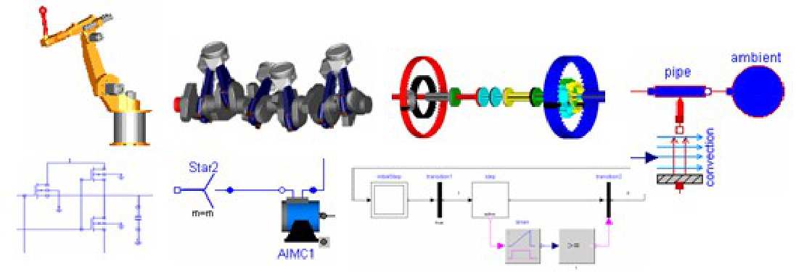

## Modelica Association http://www.Modelica.org

# Page 2

**2**

Copyright  [1998-2008, Modelica Association (http://www.Modelica.org)](http://www.modelica.org/)

Modelica® is a registered trademark of the Modelica Association

This manual can be freely distributed according to the Modelica License (which holds for the source code of
the Modelica Standard Library, including its documentation):

Redistribution and use in source and binary forms, with or without modification are permitted, provided that
the following conditions are met:

1. The author and copyright notices in the source files, these license conditions and the disclaimer below

are (a) retained and (b) reproduced in the documentation provided with the distribution.
2. Modifications of the original source files are allowed, provided that a prominent notice is inserted in each

changed file and the accompanying documentation, stating how and when the file was modified, and
provided that the conditions under (1) are met.
3. It is not allowed to charge a fee for the original version or a modified version of the software, besides a

reasonable fee for distribution and support. Distribution in aggregate with other (possibly commercial)
programs as part of a larger (possibly commercial) software distribution is permitted, provided that it is
not advertised as a product of your own.

**Disclaimer:**

The software (sources, binaries, etc.) in their original or in a modified form are provided "as is" and the
copyright holders assume no responsibility for its contents what so ever. Any express or implied warranties,
including, but not limited to, the implied warranties of merchantability and fitness for a particular purpose are
disclaimed. In no event shall the copyright holders, or any party who modify and/or redistribute the package,
be liable for any direct, indirect, incidental, special, exemplary, or consequential damages, arising in any
way out of the use of this software, even if advised of the possibility of such damage.

**Modelica** is a freely available, object-oriented language for modeling of large, complex, and heterogeneous
physical systems. It is suited for multi-domain modeling, for example, mechatronic models in robotics,
automotive and aerospace applications involving mechanical, electrical, hydraulic and control subsystems,
process oriented applications and generation and distribution of electric power. Models in Modelica are
mathematically described by differential, algebraic and discrete equations. No particular variable needs to
be solved for manually. A Modelica tool will have enough information to decide that automatically. Modelica
is designed such that available, specialized algorithms can be utilized to enable efficient handling of large
models having more than one hundred thousand equations. Modelica is suited and used for hardware-inthe-loop simulations and for embedded control systems.

Modelica is developed by the Modelica Association, a non-profit organization with seat in Linköping,
Sweden. The Modelica Association also develops the **free Modelica Standard Library** containing model
components in many domains that are based on standardized interface definitions. This manual was
automatically produced from the documentation included in the Modelica Standard Library.

The source code of the **Modelica Standard Library**, as well as this manual, is available at
[http://www.Modelica.org/libraries/Modelica](http://www.modelica.org/libraries/Modelica)

Links to other **free** and **commercial Modelica libraries** (utilizing the Modelica Standard Library) are
[available at http://www.Modelica.org/libraries.](http://www.Modelica.org/libraries)

Links and short descriptions of **Modelica modeling and simulation environments** are available at
[http://www.Modelica.org/tools.](http://www.Modelica.org/tools)

Modelica Standard Library 3.0 (February 2008)

# Page 3

**Modelica  43**

**Modelica**

**Modelica Standard Library (Version 3.0)**

**Information**

Package **Modelica** is a **standardized** and **free** package that is developed together with the Modelica
[language from the Modelica Association, see http://www.Modelica.org. It is also called](http://www.Modelica.org/) **Modelica Standard**
**Library** . It provides model components in many domains that are based on standardized interface
definitions. Some typical examples are shown in the next figure:

For an introduction, have especially a look at:

    - Overview provides an overview of the Modelica Standard Library inside the User's Guide.

    - Release Notes summarizes the changes of new versions of this package.

    - Contact lists the contributors of the Modelica Standard Library.

    - ModelicaStandardLibrary.pdf is the complete documentation of the library in pdf format.

    - The **Examples** packages in the various libraries, demonstrate how to use the components of the
corresponding sublibrary.

This version of the Modelica Standard Library consists of

    - **777** models and blocks, and

    - **549** functions

that are directly usable (= number of public, non-partial classes).

Copyright © 1998-2008, Modelica Association.

_This Modelica package is_ _**free**_ _software; it can be redistributed and/or modified under the terms of the_
_**Modelica license**_ _, see the license conditions and the accompanying_ _**disclaimer**_ _here._

**Package Content**

|Name|Description|
|---|---|
|UsersGuide|User's Guide of Modelica library|
|Blocks|Library of basic input/output control blocks (continuous, discrete, logical, table blocks)|
|Constants|Library of mathematical constants and constants of nature (e.g., pi, eps, R, sigma)|
|Electrical|Library of electrical models (analog, digital, machines, multi-phase)|
|Icons|Library of icons|
|Math|Library of mathematical functions (e.g., sin, cos) and of functions operating on vectors and matrices|
|Mechanics|Library of 1-dim. and 3-dim. mechanical components (multi-body, rotational, translational)|

Modelica Standard Library 3.0 (February 2008)

# Page 4

**44  Modelica**

|Media|Library of media property models|
|---|---|
|SIunits|Library of type and unit definitions based on SI units according to ISO 31-1992|
|StateGraph|Library of hierarchical state machine components to model discrete event and reactive systems|
|Thermal|Library of thermal system components to model heat transfer and simple thermo-fluid pipe flow|
|Utilities|Library of utility functions dedicated to scripting (operating on files, streams, strings, system)|

**Modelica** **.UsersGuide**

Package **Modelica** is a **standardized** and **pre-defined** package that is developed together
[with the Modelica language from the Modelica Association, see http://www.Modelica.org. It is](http://www.Modelica.org/)
also called **Modelica Standard Library** . It provides constants, types, connectors, partial
models and model components in various disciplines.

This is a short **User's Guide** for the overall library. Some of the main sublibraries have their own User's
Guides that can be accessed by the following links:

|Digital|Library for digital electrical components based on the VHDL standard (2-,3-,4-,9-valued logic)|
|---|---|
|MultiBody|Library to model 3-dimensional mechanical systems|
|Rotational|Library to model 1-dimensional mechanical systems|
|Media|Property models of media|
|SIunits|Type definitions based on SI units according to ISO 31-1992|
|StateGraph|Library to model discrete event and reactive systems by hierarchical state machines|
|Utilities|Utility functions especially for scripting (Files, Streams, Strings, System)|

**Package Content**

|Name|Description|
|---|---|
|Overview|Overview of Modelica Library|
|Connectors|Connectors|
|Conventions|Conventions|
|ParameterDefaults|Parameter defaults|
|ReleaseNotes|Release notes|
|ModelicaLicense|Modelica License (Version 1.1 of June 30, 2000)|
|Contact|Contact|

|Modelica.UsersGuide.Overview The Modelica Standard Library consists of the following main sub-libraries:|Col2|Col3|
|---|---|---|
|**Library Components**|**Description**|**Description**|
||Analog Analog electric and electronic components, such as resistor, capacitor, transformers, diodes, transistors, transmission lines, switches, sources, sensors.|Analog Analog electric and electronic components, such as resistor, capacitor, transformers, diodes, transistors, transmission lines, switches, sources, sensors.|
||Analog Analog electric and electronic components, such as resistor, capacitor, transformers, diodes, transistors, transmission lines, switches, sources, sensors.||

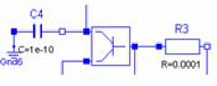

Modelica Standard Library 3.0 (February 2008)

# Page 5

**Modelica.UsersGuide.Overview  45**

|Col1|Digital Digital electrical components based on the VHDL standard, like basic logic blocks with 9-value logic, delays, gates, sources, converters between 2-, 3-, 4-, and 9-valued logic.|
|---|---|
||Machines Electrical asynchronous-, synchronous-, and DC-machines (motors and generators) as well as 3-phase transformers.|
||Translational 1-dim. mechanical, translational systems, e.g., sliding mass, mass with stops, spring, damper.|
||Rotational 1-dim. mechanical, rotational systems, e.g., inertias, gears, planetary gears, convenient definition of speed/torque dependent friction (clutches, brakes, bearings, ..)|
||MultiBody 3-dim. mechanical systems consisting of joints, bodies, force and sensor elements. Joints can be driven by drive trains defined by 1-dim. mechanical system library (Rotational). Every component has a default animation. Components can be arbitrarily connected together.|
||Media Large media library providing models and functions to compute media properties, such as h = h(p,T), d = d(p,T), for the following media: • 1240 gases and mixtures between these gases. • incompressible, table based liquids (h = h(T), etc.). • compressible liquids • dry and moist air • high precision model for water (IF97).|
||FluidHeatFlow, HeatTransfer Simple thermo-fluid pipe flow, especially to model cooling of machines with air or water (pipes, pumps, valves, ambient, sensors, sources) and lumped heat transfer with heat capacitors, thermal conductors, convection, body radiation, sources and sensors.|

Modelica Standard Library 3.0 (February 2008)

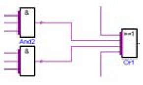

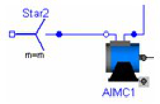

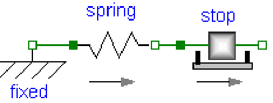

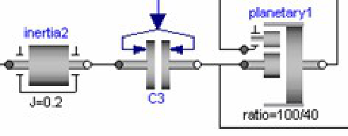

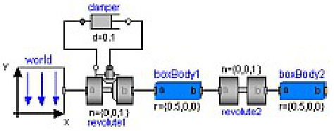

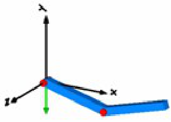

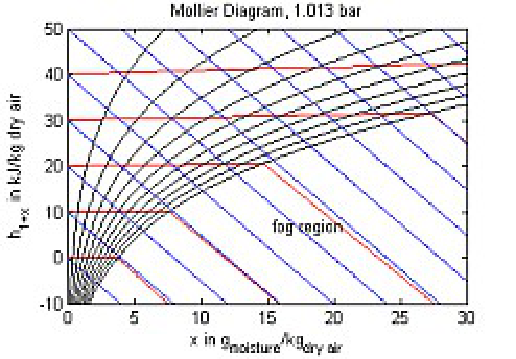

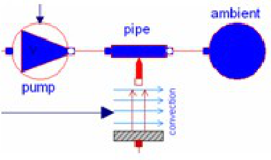

# Page 6

**46  Modelica.UsersGuide.Overview**

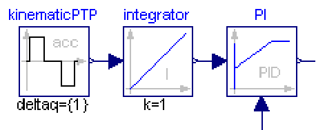

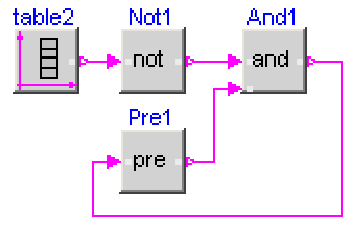

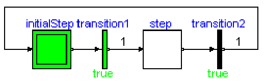

|Col1|Blocks Input/output blocks to model block diagrams and logical networks, e.g., integerator, PI, PID, transfer function, linear state space system, sampler, unit delay, discrete transfer function, and/or blocks, timer, hysteresis, nonlinear and routing blocks, sources, tables.|
|---|---|
||StateGraph Hierarchical state machines with a similar modeling power as Statecharts. Modelica is used as synchronous action language, i.e. deterministic behavior is guaranteed|
|A = [1,2,3;          3,4,5;          2,1,4];     b = {10,22,12};     x = Matrices.solve(A,b);     Matrices.eigenValues(A); |Math, Utilities Functions operating on vectors and matrices, such as for solving linear systems, eigen and singular values etc., and functions operating on strings, streams, files, e.g., to copy and remove a file or sort a vector of strings.|

**Modelica.UsersGuide** **.Connectors**

The Modelica standard library defines the most important **elementary connectors** in various
domains. If any possible, a user should utilize these connectors in order that components from
the Modelica Standard Library and from other libraries can be combined without problems. The
following elementary connectors are defined (potential variables are connector variables
without the flow attribute, flow variables are connector variables that have the flow attribute):

|domain|pot. variables|flow variables|connector definition|icons|
|---|---|---|---|---|
|**electrical** **analog**|electrical potential|electrical current|Modelica.Electrical.Analog.Interfaces  Pin, PositivePin, NegativePin||
|**electrical** **multi-phase**|vector of electrical pins|vector of electrical pins|Modelica.Electrical.MultiPhase.Interfaces  Plug, PositivePlug, NegativePlug||
|**electrical** **sphace** **phasor**|2 electrical potentials|2 electrical currents|Modelica.Electrical.Machines.Interfaces  SpacePhasor||
|**electrical** **digital**|Integer (1..9)|---|Modelica.Electrical.Digital.Interfaces  DigitalSignal, DigitalInput, DigitalOutput||
|**translational**|distance|cut-force|Modelica.Mechanics.Translational.Interfaces  Flange_a, Flange_b||
|**rotational**|angle|cut-torque|Modelica.Mechanics.Rotational.Interfaces  Flange_a, Flange_b||
|**3-dim.** **mechanics**|position vector orientation object|cut-force vector cut-torque vector|Modelica.Mechanics.MultiBody.Interfaces  Frame, Frame_a, Frame_b, Frame_resolve||

Modelica Standard Library 3.0 (February 2008)

# Page 7

**Modelica.Electrical.Analog.Basic  225**

|HeatingResistor|Temperature dependent electrical resistor|
|---|---|
|Conductor|Ideal linear electrical conductor|
|Capacitor|Ideal linear electrical capacitor|
|Inductor|Ideal linear electrical inductor|
|SaturatingInductor|Simple model of an inductor with saturation|
|Transformer|Transformer with two ports|
|Gyrator|Gyrator|
|EMF|Electromotoric force (electric/mechanic transformer)|
|VCV|Linear voltage-controlled voltage source|
|VCC|Linear voltage-controlled current source|
|CCV|Linear current-controlled voltage source|
|CCC|Linear current-controlled current source|
|OpAmp|Simple nonideal model of an OpAmp with limitation|
|VariableResistor|Ideal linear electrical resistor with variable resistance|
|VariableConductor|Ideal linear electrical conductor with variable conductance|
|VariableCapacitor|Ideal linear electrical capacitor with variable capacitance|
|VariableInductor|Ideal linear electrical inductor with variable inductance|

**Modelica.Electrical.Analog.Basic** **.Ground**

**Ground node**

**Information**

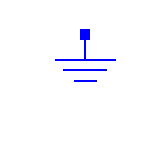

Ground of an electrical circuit. The potential at the ground node is zero. Every electrical circuit has to contain
at least one ground object.

**Connectors**

|Type|Name|Description|
|---|---|---|
|Pin|p||

**Modelica.Electrical.Analog.Basic** **.Resistor**

**Ideal linear electrical resistor**

**Information**

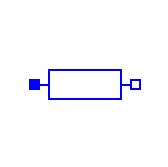

The linear resistor connects the branch voltage _v_ with the branch current _i_ by _i*R = v_ . The Resistance _R_ is
allowed to be positive, zero, or negative.

**Parameters**

Modelica Standard Library 3.0 (February 2008)

# Page 8

**226  Modelica.Electrical.Analog.Basic.Resistor**

**Connectors**

|Type|Name|Description|
|---|---|---|
|PositivePin|p|Positive pin (potential p.v > n.v for positive voltage drop v)|
|NegativePin|n|Negative pin|

**Modelica.Electrical.Analog.Basic** **.HeatingResistor**

**Temperature dependent electrical resistor**

**Information**

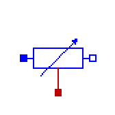

This is a model for an electrical resistor where the generated heat is dissipated to the environment via
connector **heatPort** and where the resistance R is temperature dependent according to the following
equation:

R = R_ref*(1 + alpha*(heatPort.T - T_ref))

**alpha** is the **temperature coefficient of resistance**, which is often abbreviated as **TCR** . In resistor
catalogues, it is usually defined as **X [ppm/K]** (parts per million, similarly to per centage) meaning **X*1.e-6 [1/**
**K]** . Resistors are available for 1 .. 7000 ppm/K, i.e., alpha = 1e-6 .. 7e-3 1/K;

Via parameter **useHeatPort** the heatPort connector can be enabled and disabled (default = enabled). If it is
disabled, the generated heat is transported implicitly to an internal temperature source with a fixed
temperature of T_ref.
If the heatPort connector is enabled, it must be connected.

**Parameters**

|Type|Name|Default|Description|
|---|---|---|---|
|Resistance|R_ref||Resistance at temperature T_ref [Ohm]|
|Temperature|T_ref||Reference temperature [K]|
|LinearTemperatureCoefficient|alpha||Temperature coefficient of resistance (R = R_ref*(1 + alpha*(heatPort.T - T_ref)) [1/K]|

**Connectors**

|Type|Name|Description|
|---|---|---|
|PositivePin|p|Positive pin (potential p.v > n.v for positive voltage drop v)|
|NegativePin|n|Negative pin|
|HeatPort_a|heatPort||

**Modelica.Electrical.Analog.Basic** **.Conductor**

**Ideal linear electrical conductor**

**Information**

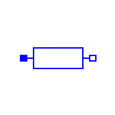

The linear conductor connects the branch voltage _v_ with the branch current _i_ by _i = v*G_ . The Conductance _G_

Modelica Standard Library 3.0 (February 2008)

# Page 9

**Modelica.Electrical.Analog.Basic.Conductor  227**

is allowed to be positive, zero, or negative.

**Parameters**

|Type|Name|Default|Description|
|---|---|---|---|
|Conductance|G||Conductance [S]|

**Connectors**

|Type|Name|Description|
|---|---|---|
|PositivePin|p|Positive pin (potential p.v > n.v for positive voltage drop v)|
|NegativePin|n|Negative pin|

**Modelica.Electrical.Analog.Basic** **.Capacitor**

**Ideal linear electrical capacitor**

**Information**

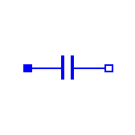

The linear capacitor connects the branch voltage _v_ with the branch current _i_ by _i = C * dv/dt_ . The Capacitance
_C_ is allowed to be positive, zero, or negative.

**Parameters**

|Type|Name|Default|Description|
|---|---|---|---|
|Capacitance|C| |Capacitance [F]|

**Connectors**

|Type|Name|Description|
|---|---|---|
|PositivePin|p|Positive pin (potential p.v > n.v for positive voltage drop v)|
|NegativePin|n|Negative pin|

**Modelica.Electrical.Analog.Basic** **.Inductor**

**Ideal linear electrical inductor**

**Information**

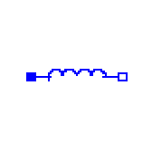

The linear inductor connects the branch voltage _v_ with the branch current _i_ by _v = L * di/dt_ . The Inductance _L_
is allowed to be positive, zero, or negative.

**Parameters**

|Type|Name|Default|Description|
|---|---|---|---|
|Inductance|L||Inductance [H]|

**Connectors**

**Type** **Name** **Description**

Modelica Standard Library 3.0 (February 2008)

# Page 10

**228  Modelica.Electrical.Analog.Basic.Inductor**

|PositivePin|p|Positive pin (potential p.v > n.v for positive voltage drop v)|
|---|---|---|
|NegativePin|n|Negative pin|

**Modelica.Electrical.Analog.Basic** **.SaturatingInductor**

**Simple model of an inductor with saturation**

**Information**

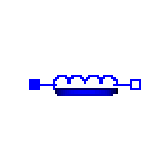

This model approximates the behaviour of an inductor with the influence of saturation, i.e. the value of the
inductance depends on the current flowing through the inductor. The inductance decreases as current
increases.
The parameters are:

    - Inom...nominal current

    - Lnom...nominal inductance at nominal current

    - Lzer...inductance near current = 0; Lzer has to be greater than Lnom

    - Linf...inductance at large currents; Linf has to be less than Lnom

**Parameters**

|Type|Name|Default|Description|
|---|---|---|---|
|Current|Inom||Nominal current [A]|
|Inductance|Lnom||Nominal inductance at Nominal current [H]|
|Inductance|Lzer||Inductance near current=0 [H]|
|Inductance|Linf||Inductance at large currents [H]|

**Connectors**

|Type|Name|Description|
|---|---|---|
|PositivePin|p|Positive pin (potential p.v > n.v for positive voltage drop v)|
|NegativePin|n|Negative pin|

**Modelica.Electrical.Analog.Basic** **.Transformer**

**Transformer with two ports**

**Information**

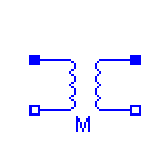

The transformer is a two port. The left port voltage _v1_, left port current _i1_, right port voltage _v2_ and right port
current _i2_ are connected by the following relation:

| v1 |     | L1  M | | i1' |

|  |  =  |     | |   |

| v2 |     | M  L2 | | i2' |

_L1_, _L2_, and _M_ are the primary, secondary, and coupling inductances respectively.

**Parameters**

Modelica Standard Library 3.0 (February 2008)

# Page 11

**Modelica.Electrical.Analog.Basic.Transformer  229**

|Inductance|L1|Col3|Primary inductance [H]|
|---|---|---|---|
|Inductance|L2||Secondary inductance [H]|
|Inductance|M||Coupling inductance [H]|

**Connectors**

|Type|Name|Description|
|---|---|---|
|PositivePin|p1|Positive pin of the left port (potential p1.v > n1.v for positive voltage drop v1)|
|NegativePin|n1|Negative pin of the left port|
|PositivePin|p2|Positive pin of the right port (potential p2.v > n2.v for positive voltage drop v2)|
|NegativePin|n2|Negative pin of the right port|

**Modelica.Electrical.Analog.Basic** **.Gyrator**

**Gyrator**

**Information**

A gyrator is a two-port element defined by the following equations:

i1 = G2 * v2

i2 = -G1 * v1

where the constants _G1_, _G2_ are called the gyration conductance.

**Parameters**

|Type|Name|Default|Description|
|---|---|---|---|
|Conductance|G1||Gyration conductance [S]|
|Conductance|G2||Gyration conductance [S]|

**Connectors**

|Type|Name|Description|
|---|---|---|
|PositivePin|p1|Positive pin of the left port (potential p1.v > n1.v for positive voltage drop v1)|
|NegativePin|n1|Negative pin of the left port|
|PositivePin|p2|Positive pin of the right port (potential p2.v > n2.v for positive voltage drop v2)|
|NegativePin|n2|Negative pin of the right port|

**Modelica.Electrical.Analog.Basic** **.EMF**

**Electromotoric force (electric/mechanic transformer)**

**Information**

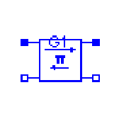

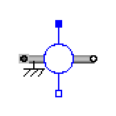

EMF transforms electrical energy into rotational mechanical energy. It is used as basic building block of an
electrical motor. The mechanical connector shaft can be connected to elements of the
Modelica.Mechanics.Rotational library. shaft.tau is the cut-torque, flange.phi is the angle at the rotational
connection.

Modelica Standard Library 3.0 (February 2008)

# Page 12

**230  Modelica.Electrical.Analog.Basic.EMF**

**Parameters**

|Type|Name|Default|Description|
|---|---|---|---|
|Boolean|useSupport|false|= true, if support flange enabled, otherwise implicitly grounded|
|ElectricalTorqueConstant|k||Transformation coefficient [N.m/A]|

**Connectors**

|Type|Name|Description|
|---|---|---|
|PositivePin|p||
|NegativePin|n||
|Flange_b|flange||
|Support|support|Support/housing of emf shaft|

**Modelica.Electrical.Analog.Basic** **.VCV**

**Linear voltage-controlled voltage source**

**Information**

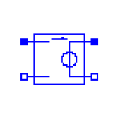

The linear voltage-controlled voltage source is a TwoPort. The right port voltage v2 is controlled by the left
port voltage v1 via

v2 = v1 * gain.

The left port current is zero. Any voltage gain can be chosen.

**Parameters**

|Type|Name|Default|Description|
|---|---|---|---|
|Real|gain||Voltage gain|

**Connectors**

|Type|Name|Description|
|---|---|---|
|PositivePin|p1|Positive pin of the left port (potential p1.v > n1.v for positive voltage drop v1)|
|NegativePin|n1|Negative pin of the left port|
|PositivePin|p2|Positive pin of the right port (potential p2.v > n2.v for positive voltage drop v2)|
|NegativePin|n2|Negative pin of the right port|

**Modelica.Electrical.Analog.Basic** **.VCC**

**Linear voltage-controlled current source**

**Information**

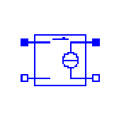

The linear voltage-controlled current source is a TwoPort. The right port current i2 is controlled by the left
port voltage v1 via

i2 = v1 * transConductance.

Modelica Standard Library 3.0 (February 2008)

# Page 13

**Modelica.Electrical.Analog.Basic.VCC  231**

The left port current is zero. Any transConductance can be chosen.

**Parameters**

|Type|Name|Default|Description|
|---|---|---|---|
|Conductance|transConductance||Transconductance [S]|

**Connectors**

|Type|Name|Description|
|---|---|---|
|PositivePin|p1|Positive pin of the left port (potential p1.v > n1.v for positive voltage drop v1)|
|NegativePin|n1|Negative pin of the left port|
|PositivePin|p2|Positive pin of the right port (potential p2.v > n2.v for positive voltage drop v2)|
|NegativePin|n2|Negative pin of the right port|

**Modelica.Electrical.Analog.Basic** **.CCV**

**Linear current-controlled voltage source**

**Information**

The linear current-controlled voltage source is a TwoPort. The right port voltage v2 is controlled by the left
port current i1 via

v2 = i1 * transResistance.

The left port voltage is zero. Any transResistance can be chosen.

**Parameters**

|Type|Name|Default|Description|
|---|---|---|---|
|Resistance|transResistance||Transresistance [Ohm]|

**Connectors**

|Type|Name|Description|
|---|---|---|
|PositivePin|p1|Positive pin of the left port (potential p1.v > n1.v for positive voltage drop v1)|
|NegativePin|n1|Negative pin of the left port|
|PositivePin|p2|Positive pin of the right port (potential p2.v > n2.v for positive voltage drop v2)|
|NegativePin|n2|Negative pin of the right port|

**Modelica.Electrical.Analog.Basic** **.CCC**

**Linear current-controlled current source**

**Information**

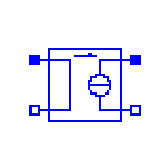

The linear current-controlled current source is a TwoPort. The right port current i2 is controlled by the left port
current i1 via

Modelica Standard Library 3.0 (February 2008)

# Page 14

**232  Modelica.Electrical.Analog.Basic.CCC**

i2 = i1 * gain.

The left port voltage is zero. Any current gain can be chosen.

**Parameters**

|Type|Name|Default|Description|
|---|---|---|---|
|Real|gain||Current gain|

**Connectors**

|Type|Name|Description|
|---|---|---|
|PositivePin|p1|Positive pin of the left port (potential p1.v > n1.v for positive voltage drop v1)|
|NegativePin|n1|Negative pin of the left port|
|PositivePin|p2|Positive pin of the right port (potential p2.v > n2.v for positive voltage drop v2)|
|NegativePin|n2|Negative pin of the right port|

**Modelica.Electrical.Analog.Basic** **.OpAmp**

**Simple nonideal model of an OpAmp with limitation**

**Information**

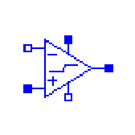

The OpAmp is a simle nonideal model with a smooth out.v = f(vin) characteristic, where "vin = in_p.v in_n.v". The characteristic is limited by VMax.v and VMin.v. Its slope at vin=0 is the parameter Slope, which
must be positive. (Therefore, the absolute value of Slope is taken into calculation.)

**Parameters**

|Type|Name|Default|Description|
|---|---|---|---|
|Real|Slope||Slope of the out.v/vin characteristic at vin=0|

**Connectors**

|Type|Name|Description|
|---|---|---|
|PositivePin|in_p|Positive pin of the input port|
|NegativePin|in_n|Negative pin of the input port|
|PositivePin|out|Output pin|
|PositivePin|VMax|Positive output voltage limitation|
|NegativePin|VMin|Negative output voltage limitation|

**Modelica.Electrical.Analog.Basic** **.VariableResistor**

**Ideal linear electrical resistor with variable resistance**

**Information**

The linear resistor connects the branch voltage _v_ with the branch current _i_ by

_**i*R = v**_

Modelica Standard Library 3.0 (February 2008)

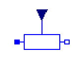

# Page 15

**Modelica.Electrical.Analog.Basic.VariableResistor  233**

The Resistance _R_ is given as input signal.

**Attention!!!**
It is recommended that the R signal should not cross the zero value. Otherwise depending on the
surrounding circuit the probability of singularities is high.

**Connectors**

|Type|Name|Description|
|---|---|---|
|PositivePin|p|Positive pin (potential p.v > n.v for positive voltage drop v)|
|NegativePin|n|Negative pin|
|inputRealInput|R||

**Modelica.Electrical.Analog.Basic** **.VariableConductor**

**Ideal linear electrical conductor with variable conductance**

**Information**

The linear conductor connects the branch voltage _v_ with the branch current _i_ by

_**i = G*v**_

The Conductance _G_ is given as input signal.

**Attention!!!**

It is recommended that the G signal should not cross the zero value. Otherwise depending on the
surrounding circuit the probability of singularities is high.

**Connectors**

|Type|Name|Description|
|---|---|---|
|PositivePin|p|Positive pin (potential p.v > n.v for positive voltage drop v)|
|NegativePin|n|Negative pin|
|inputRealInput|G||

**Modelica.Electrical.Analog.Basic** **.VariableCapacitor**

**Ideal linear electrical capacitor with variable capacitance**

**Information**

The linear capacitor connects the branch voltage _v_ with the branch current _i_ by

_**i = dQ/dt**_ with _**Q = C * v**_ .

The capacitance _C_ is given as input signal.

It is required that C ≥ 0, otherwise an assertion is raised. To avoid a variable index system,

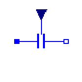
C = Cmin, if 0 ≤ C < Cmin, where Cmin is a parameter with default value Modelica.Constants.eps.

Modelica Standard Library 3.0 (February 2008)

# Page 16

**234  Modelica.Electrical.Analog.Basic.VariableCapacitor**

**Parameters**

|Type|Name|Default|Description|
|---|---|---|---|
|Capacitance|Cmin|Modelica.Constants.eps|lower bound for variable capacitance [F]|

**Connectors**

|Type|Name|Description|
|---|---|---|
|PositivePin|p|Positive pin (potential p.v > n.v for positive voltage drop v)|
|NegativePin|n|Negative pin|
|inputRealInput|C||

**Modelica.Electrical.Analog.Basic** **.VariableInductor**

**Ideal linear electrical inductor with variable inductance**

**Information**

The linear inductor connects the branch voltage _v_ with the branch current _i_ by

_**v = d Psi/dt**_ with _**Psi = L * i**_ .

The inductance _L_ is as input signal.

It is required that L ≥ 0, otherwise an assertion is raised. To avoid a variable index system,

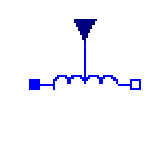
L = Lmin, if 0 ≤ L < Lmin, where Lmin is a parameter with default value Modelica.Constants.eps.

**Parameters**

|Type|Name|Default|Description|
|---|---|---|---|
|Inductance|Lmin|Modelica.Constants.eps|lower bound for variable inductance [H]|

**Connectors**

|Type|Name|Description|
|---|---|---|
|PositivePin|p|Positive pin (potential p.v > n.v for positive voltage drop v)|
|NegativePin|n|Negative pin|
|inputRealInput|L||

**Modelica.Electrical.Analog** **.Ideal**

**Ideal electrical elements such as switches, diode, transformer, operational amplifier**

**Information**

This package contains electrical components with idealized behaviour:

**Package Content**

**Name** **Description**

Modelica Standard Library 3.0 (February 2008)

# Page 17

**Modelica.Electrical.Analog.Sources  265**

**Modelica.Electrical.Analog** **.Sources**

**Time-dependend and controlled voltage and current sources**

**Information**

This package contains time-dependend and controlled voltage and current sources.

**Package Content**

|Name|Description|
|---|---|
|SignalVoltage|Generic voltage source using the input signal as source voltage|
|ConstantVoltage|Source for constant voltage|
|StepVoltage|Step voltage source|
|RampVoltage|Ramp voltage source|
|SineVoltage|Sine voltage source|
|ExpSineVoltage|Exponentially damped sine voltage source|
|ExponentialsVoltage|Rising and falling exponential voltage source|
|PulseVoltage|Pulse voltage source|
|SawToothVoltage|Saw tooth voltage source|
|TrapezoidVoltage|Trapezoidal voltage source|
|TableVoltage|Voltage source by linear interpolation in a table|
|SignalCurrent|Generic current source using the input signal as source current|
|ConstantCurrent|Source for constant current|
|StepCurrent|Step current source|
|RampCurrent|Ramp current source|
|SineCurrent|Sine current source|
|ExpSineCurrent|Exponentially damped sine current source|
|ExponentialsCurrent|Rising and falling exponential current source|
|PulseCurrent|Pulse current source|
|SawToothCurrent|Saw tooth current source|
|TrapezoidCurrent|Trapezoidal current source|
|TableCurrent|Current source by linear interpolation in a table|

**Modelica.Electrical.Analog.Sources** **.SignalVoltage**

**Generic voltage source using the input signal as source voltage**

**Connectors**

|Type|Name|Description|
|---|---|---|
|PositivePin|p||

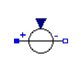

Modelica Standard Library 3.0 (February 2008)

# Page 18

**266  Modelica.Electrical.Analog.Sources.SignalVoltage**

|NegativePin|n|Col3|
|---|---|---|
|inputRealInput|v|Voltage between pin p and n (= p.v - n.v) as input signal|

**Modelica.Electrical.Analog.Sources** **.ConstantVoltage**

**Source for constant voltage**

**Parameters**

|Type|Name|Default|Description|
|---|---|---|---|
|Voltage|V||Value of constant voltage [V]|

**Connectors**

|Type|Name|Description|
|---|---|---|
|PositivePin|p|Positive pin (potential p.v > n.v for positive voltage drop v)|
|NegativePin|n|Negative pin|

**Modelica.Electrical.Analog.Sources** **.StepVoltage**

**Step voltage source**

**Parameters**

|Type|Name|Default|Description|
|---|---|---|---|
|Voltage|V||Height of step [V]|
|Voltage|offset|0|Voltage offset [V]|
|Time|startTime|0|Time offset [s]|

**Connectors**

|Type|Name|Description|
|---|---|---|
|PositivePin|p|Positive pin (potential p.v > n.v for positive voltage drop v)|
|NegativePin|n|Negative pin|

**Modelica.Electrical.Analog.Sources** **.RampVoltage**

**Ramp voltage source**

**Parameters**

|Type|Name|Default|Description|
|---|---|---|---|
|Voltage|V||Height of ramp [V]|
|Time|duration||Duration of ramp [s]|
|Voltage|offset|0|Voltage offset [V]|
|Time|startTime|0|Time offset [s]|

Modelica Standard Library 3.0 (February 2008)

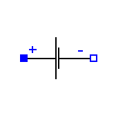

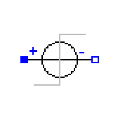

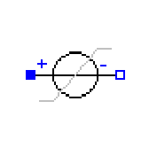

# Page 19

**Modelica.Electrical.Analog.Sources.RampVoltage  267**

**Connectors**

|Type|Name|Description|
|---|---|---|
|PositivePin|p|Positive pin (potential p.v > n.v for positive voltage drop v)|
|NegativePin|n|Negative pin|

**Modelica.Electrical.Analog.Sources** **.SineVoltage**

**Sine voltage source**

**Parameters**

|Type|Name|Default|Description|
|---|---|---|---|
|Voltage|V||Amplitude of sine wave [V]|
|Angle|phase|0|Phase of sine wave [rad]|
|Frequency|freqHz||Frequency of sine wave [Hz]|
|Voltage|offset|0|Voltage offset [V]|
|Time|startTime|0|Time offset [s]|

**Connectors**

|Type|Name|Description|
|---|---|---|
|PositivePin|p|Positive pin (potential p.v > n.v for positive voltage drop v)|
|NegativePin|n|Negative pin|

**Modelica.Electrical.Analog.Sources** **.ExpSineVoltage**

**Exponentially damped sine voltage source**

**Parameters**

|Type|Name|Default|Description|
|---|---|---|---|
|Voltage|V||Amplitude of sine wave [V]|
|Frequency|freqHz||Frequency of sine wave [Hz]|
|Angle|phase|0|Phase of sine wave [rad]|
|Damping|damping||Damping coefficient of sine wave [s-1]|
|Voltage|offset|0|Voltage offset [V]|
|Time|startTime|0|Time offset [s]|

**Connectors**

|Type|Name|Description|
|---|---|---|
|PositivePin|p|Positive pin (potential p.v > n.v for positive voltage drop v)|
|NegativePin|n|Negative pin|

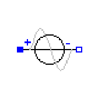

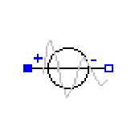

Modelica Standard Library 3.0 (February 2008)

# Page 20

**268  Modelica.Electrical.Analog.Sources.ExponentialsVoltage**

**Modelica.Electrical.Analog.Sources** **.ExponentialsVoltage**

**Rising and falling exponential voltage source**

**Parameters**

|Type|Name|Default|Description|
|---|---|---|---|
|Real|vMax||Upper bound for rising edge|
|Time|riseTime||Rise time [s]|
|Time|riseTimeConst||Rise time constant [s]|
|Time|fallTimeConst||Fall time constant [s]|
|Voltage|offset|0|Voltage offset [V]|
|Time|startTime|0|Time offset [s]|

**Connectors**

|Type|Name|Description|
|---|---|---|
|PositivePin|p|Positive pin (potential p.v > n.v for positive voltage drop v)|
|NegativePin|n|Negative pin|

**Modelica.Electrical.Analog.Sources** **.PulseVoltage**

**Pulse voltage source**

**Parameters**

|Type|Name|Default|Description|
|---|---|---|---|
|Voltage|V||Amplitude of pulse [V]|
|Real|width||Width of pulse in % of period|
|Time|period||Time for one period [s]|
|Voltage|offset|0|Voltage offset [V]|
|Time|startTime|0|Time offset [s]|

**Connectors**

|Type|Name|Description|
|---|---|---|
|PositivePin|p|Positive pin (potential p.v > n.v for positive voltage drop v)|
|NegativePin|n|Negative pin|

**Modelica.Electrical.Analog.Sources** **.SawToothVoltage**

**Saw tooth voltage source**

**Parameters**

|Type|Name|Default|Description|
|---|---|---|---|
|Voltage|V||Amplitude of saw tooth [V]|

Modelica Standard Library 3.0 (February 2008)

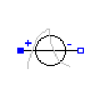

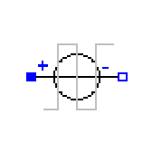

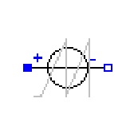

# Page 21

**Modelica.Electrical.Analog.Sources.SawToothVoltage  269**

|Time|period|Col3|Time for one period [s]|
|---|---|---|---|
|Voltage|offset|0|Voltage offset [V]|
|Time|startTime|0|Time offset [s]|

**Connectors**

|Type|Name|Description|
|---|---|---|
|PositivePin|p|Positive pin (potential p.v > n.v for positive voltage drop v)|
|NegativePin|n|Negative pin|

**Modelica.Electrical.Analog.Sources** **.TrapezoidVoltage**

**Trapezoidal voltage source**

**Parameters**

|Type|Name|Default|Description|
|---|---|---|---|
|Voltage|V||Amplitude of trapezoid [V]|
|Time|rising||Rising duration of trapezoid [s]|
|Time|width||Width duration of trapezoid [s]|
|Time|falling||Falling duration of trapezoid [s]|
|Time|period||Time for one period [s]|
|Integer|nperiod||Number of periods (< 0 means infinite number of periods)|
|Voltage|offset|0|Voltage offset [V]|
|Time|startTime|0|Time offset [s]|

**Connectors**

|Type|Name|Description|
|---|---|---|
|PositivePin|p|Positive pin (potential p.v > n.v for positive voltage drop v)|
|NegativePin|n|Negative pin|

**Modelica.Electrical.Analog.Sources** **.TableVoltage**

**Voltage source by linear interpolation in a table**

**Information**

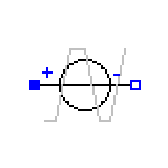

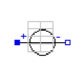

This block generates a voltage source by **linear interpolation** in a table. The time points and voltage values
are stored in a matrix **table[i,j]**, where the first column table[:,1] contains the time points and the second
column contains the voltage to be interpolated. The table interpolation has the following proporties:

    - The time points need to be **monotonically increasing** .

    - **Discontinuities** are allowed, by providing the same time point twice in the table.

    - Values **outside** of the table range, are computed by **extrapolation** through the last or first two points
of the table.

    - If the table has only **one row**, no interpolation is performed and the voltage value is just returned
independantly of the actual time instant, i.e., this is a constant voltage source.

    - Via parameters **startTime** and **offset** the curve defined by the table can be shifted both in time and

Modelica Standard Library 3.0 (February 2008)

# Page 22

**270  Modelica.Electrical.Analog.Sources.TableVoltage**

in the voltage.

    - The table is implemented in a numerically sound way by generating **time events** at interval
boundaries, in order to not integrate over a discontinuous or not differentiable points.

Example:

table = [0 0

1 0

1 1

2 4

3 9

4 16]
If, e.g., time = 1.0, the voltage v = 0.0 (before event), 1.0 (after event)
e.g., time = 1.5, the voltage v = 2.5,
e.g., time = 2.0, the voltage v = 4.0,
e.g., time = 5.0, the voltage v = 23.0 (i.e. extrapolation).

**Parameters**

|Type|Name|Default|Description|
|---|---|---|---|
|Real|table[:, :]|[0, 0; 1, 1; 2, 4]|Table matrix (time = first column, voltage = second column)|
|Voltage|offset|0|Voltage offset [V]|
|Time|startTime|0|Time offset [s]|

**Connectors**

|Type|Name|Description|
|---|---|---|
|PositivePin|p|Positive pin (potential p.v > n.v for positive voltage drop v)|
|NegativePin|n|Negative pin|

**Modelica.Electrical.Analog.Sources** **.SignalCurrent**

**Generic current source using the input signal as source current**

**Connectors**

|Type|Name|Description|
|---|---|---|
|PositivePin|p||
|NegativePin|n||
|inputRealInput|i|Current flowing from pin p to pin n as input signal|

**Modelica.Electrical.Analog.Sources** **.ConstantCurrent**

**Source for constant current**

**Parameters**

|Type|Name|Default|Description|
|---|---|---|---|
|Current|I||Value of constant current [A]|

Modelica Standard Library 3.0 (February 2008)

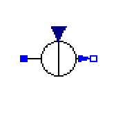

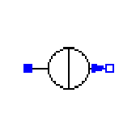

# Page 23

**Modelica.Electrical.Analog.Sources.ConstantCurrent  271**

**Connectors**

|Type|Name|Description|
|---|---|---|
|PositivePin|p|Positive pin (potential p.v > n.v for positive voltage drop v)|
|NegativePin|n|Negative pin|

**Modelica.Electrical.Analog.Sources** **.StepCurrent**

**Step current source**

**Parameters**

|Type|Name|Default|Description|
|---|---|---|---|
|Current|I||Height of step [A]|
|Current|offset|0|Current offset [A]|
|Time|startTime|0|Time offset [s]|

**Connectors**

|Type|Name|Description|
|---|---|---|
|PositivePin|p|Positive pin (potential p.v > n.v for positive voltage drop v)|
|NegativePin|n|Negative pin|

**Modelica.Electrical.Analog.Sources** **.RampCurrent**

**Ramp current source**

**Parameters**

|Type|Name|Default|Description|
|---|---|---|---|
|Current|I||Height of ramp [A]|
|Time|duration||Duration of ramp [s]|
|Current|offset|0|Current offset [A]|
|Time|startTime|0|Time offset [s]|

**Connectors**

|Type|Name|Description|
|---|---|---|
|PositivePin|p|Positive pin (potential p.v > n.v for positive voltage drop v)|
|NegativePin|n|Negative pin|

**Modelica.Electrical.Analog.Sources** **.SineCurrent**

**Sine current source**

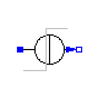

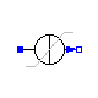

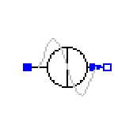

Modelica Standard Library 3.0 (February 2008)

# Page 24

**272  Modelica.Electrical.Analog.Sources.SineCurrent**

**Parameters**

|Type|Name|Default|Description|
|---|---|---|---|
|Current|I||Amplitude of sine wave [A]|
|Angle|phase|0|Phase of sine wave [rad]|
|Frequency|freqHz||Frequency of sine wave [Hz]|
|Current|offset|0|Current offset [A]|
|Time|startTime|0|Time offset [s]|

**Connectors**

|Type|Name|Description|
|---|---|---|
|PositivePin|p|Positive pin (potential p.v > n.v for positive voltage drop v)|
|NegativePin|n|Negative pin|

**Modelica.Electrical.Analog.Sources** **.ExpSineCurrent**

**Exponentially damped sine current source**

**Parameters**

|Type|Name|Default|Description|
|---|---|---|---|
|Real|I||Amplitude of sine wave|
|Frequency|freqHz||Frequency of sine wave [Hz]|
|Angle|phase|0|Phase of sine wave [rad]|
|Damping|damping||Damping coefficient of sine wave [s-1]|
|Current|offset|0|Current offset [A]|
|Time|startTime|0|Time offset [s]|

**Connectors**

|Type|Name|Description|
|---|---|---|
|PositivePin|p|Positive pin (potential p.v > n.v for positive voltage drop v)|
|NegativePin|n|Negative pin|

**Modelica.Electrical.Analog.Sources** **.ExponentialsCurrent**

**Rising and falling exponential current source**

**Parameters**

|Type|Name|Default|Description|
|---|---|---|---|
|Real|iMax||Upper bound for rising edge|
|Time|riseTime||Rise time [s]|
|Time|riseTimeConst||Rise time constant [s]|
|Time|fallTimeConst||Fall time constant [s]|
|Current|offset|0|Current offset [A]|

Modelica Standard Library 3.0 (February 2008)

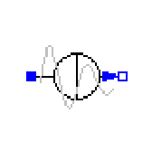

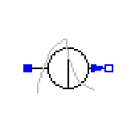

# Page 25

**Modelica.Electrical.Analog.Sources.ExponentialsCurrent  273**

**Connectors**

|Type|Name|Description|
|---|---|---|
|PositivePin|p|Positive pin (potential p.v > n.v for positive voltage drop v)|
|NegativePin|n|Negative pin|

**Modelica.Electrical.Analog.Sources** **.PulseCurrent**

**Pulse current source**

**Parameters**

|Type|Name|Default|Description|
|---|---|---|---|
|Current|I||Amplitude of pulse [A]|
|Real|width||Width of pulse in % of period|
|Time|period||Time for one period [s]|
|Current|offset|0|Current offset [A]|
|Time|startTime|0|Time offset [s]|

**Connectors**

|Type|Name|Description|
|---|---|---|
|PositivePin|p|Positive pin (potential p.v > n.v for positive voltage drop v)|
|NegativePin|n|Negative pin|

**Modelica.Electrical.Analog.Sources** **.SawToothCurrent**

**Saw tooth current source**

**Parameters**

|Type|Name|Default|Description|
|---|---|---|---|
|Current|I||Amplitude of saw tooth [A]|
|Time|period||Time for one period [s]|
|Current|offset|0|Current offset [A]|
|Time|startTime|0|Time offset [s]|

**Connectors**

|Type|Name|Description|
|---|---|---|
|PositivePin|p|Positive pin (potential p.v > n.v for positive voltage drop v)|
|NegativePin|n|Negative pin|

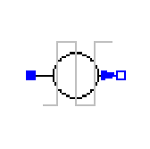

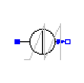

Modelica Standard Library 3.0 (February 2008)

# Page 26

**274  Modelica.Electrical.Analog.Sources.TrapezoidCurrent**

**Modelica.Electrical.Analog.Sources** **.TrapezoidCurrent**

**Trapezoidal current source**

**Parameters**

|Type|Name|Default|Description|
|---|---|---|---|
|Current|I||Amplitude of trapezoid [A]|
|Time|rising||Rising duration of trapezoid [s]|
|Time|width||Width duration of trapezoid [s]|
|Time|falling||Falling duration of trapezoid [s]|
|Time|period||Time for one period [s]|
|Integer|nperiod||Number of periods (< 0 means infinite number of periods)|
|Current|offset|0|Current offset [A]|
|Time|startTime|0|Time offset [s]|

**Connectors**

|Type|Name|Description|
|---|---|---|
|PositivePin|p|Positive pin (potential p.v > n.v for positive voltage drop v)|
|NegativePin|n|Negative pin|

**Modelica.Electrical.Analog.Sources** **.TableCurrent**

**Current source by linear interpolation in a table**

**Information**

This block generates a current source by **linear interpolation** in a table. The time points and current values
are stored in a matrix **table[i,j]**, where the first column table[:,1] contains the time points and the second
column contains the current to be interpolated. The table interpolation has the following proporties:

    - The time points need to be **monotonically increasing** .

    - **Discontinuities** are allowed, by providing the same time point twice in the table.

    - Values **outside** of the table range, are computed by **extrapolation** through the last or first two points
of the table.

    - If the table has only **one row**, no interpolation is performed and the current value is just returned
independantly of the actual time instant, i.e., this is a constant current source.

    - Via parameters **startTime** and **offset** the curve defined by the table can be shifted both in time and
in the current.

    - The table is implemented in a numerically sound way by generating **time events** at interval
boundaries, in order to not integrate over a discontinuous or not differentiable points.

Example:

table = [0 0

1 0

1 1

2 4

3 9

4 16]
If, e.g., time = 1.0, the current i = 0.0 (before event), 1.0 (after event)
e.g., time = 1.5, the current i = 2.5,
e.g., time = 2.0, the current i = 4.0,

Modelica Standard Library 3.0 (February 2008)

# Page 27

**Modelica.Electrical.Analog.Sources.TableCurrent  275**

e.g., time = 5.0, the current i = 23.0 (i.e. extrapolation).

**Parameters**

|Type|Name|Default|Description|
|---|---|---|---|
|Real|table[:, :]|[0, 0; 1, 1; 2, 4]|Table matrix (time = first column, current = second column)|
|Current|offset|0|Current offset [A]|
|Time|startTime|0|Time offset [s]|

**Connectors**

|Type|Name|Description|
|---|---|---|
|PositivePin|p|Positive pin (potential p.v > n.v for positive voltage drop v)|
|NegativePin|n|Negative pin|

**Modelica.Electrical** **.Digital**

**Library for digital electrical components based on the VHDL standard with 9-valued logic and**
**conversion to 2-,3-,4-valued logic**

**Information**

This library contains packages for digital electrical components. Both, type system and models are based on
the VHDL standard (IEEE Std 1076-1987 VHDL, IEEE Std 1076-1993 VHDL, IEEE Std 1164 Multivalue
Logic System):

    - Interfaces: Definition of signals and interfaces

    - Tables: All truth tables needed

    - Delay: Transport and inertial delay

    - Basic: Basic logic without delay

    - Gates: Basic gates composed by basic components and inertial delay

    - Tristate: (not yet available)

    - FlipFlops: (not yet available)

    - Latches: (not yet available)

    - TransferGates: (not yet available)

    - Multiplexers (not yet available)

    - Memory: Ram, Rom, (not yet available)

    - Sources: Time-dependend signal sources

    - Converters

    - Examples

The logic values are coded by integer values. The following code table is necessary for both setting of input
and interpreting the output values.

**Code Table:**

Modelica Standard Library 3.0 (February 2008)

|Logic value|Integer code|Meaning|
|---|---|---|
|'U'|1|Uninitialized|
|'X'|2|Forcing Unknown|
|'0'|3|Forcing 0|
|'1'|4|Forcing 1|
|'Z'|5|High Impedance|
|'W'|6|Weak Unknown|

# Page 28

**Modelica.Mechanics.MultiBody.Visualizers.Advanced.Shape  677**

|"pipe"|extra = outer-diameter / inner-diameter, i.e, extra = 1: cylinder that is completely hollow extra = 0: cylinder without a hole.|
|---|---|
|"gearwheel"|extra is the number of teeth of the gear.|
|"spring"|extra is the number of windings of the spring. Additionally, "height" is**not** the "height" but 2*coil- width.|

Parameter **color** is an Integer vector with 3 elements, {r, g, b}, and specifies the color of the shape. {r,g,b}
are the "red", "green" and "blue" color parts. Note, r g, b are given in the range 0 .. 255. The predefined type
**MultiBody.Types.Color** contains a menu definition of the colors used in the MultiBody library (will be
replaced by a color editor).

The variables under heading **Parameters** below are declared as (time varying) **input** variables. If the default
equation is not appropriate, a corresponding modifier equation has to be provided in the model where a
**Shape** instance is used, e.g., in the form

Visualizers.Advanced.Shape shape(length = sin(time));

**Parameters**

|Type|Name|Default|Description|
|---|---|---|---|
|ShapeType|shapeType|"box"|Type of shape (box, sphere, cylinder, pipecylinder, cone, pipe, beam, gearwheel, spring)|
|Orientation|R|Frames.nullRotation( )|Orientation object to rotate the world frame into the object frame|
|Position|r[3]|{0,0,0}|Position vector from origin of world frame to origin of object frame, resolved in world frame [m]|
|Position|r_shape[3]|{0,0,0}|Position vector from origin of object frame to shape origin, resolved in object frame [m]|
|Real|lengthDirection[3]|{1,0,0}|Vector in length direction, resolved in object frame [1]|
|Real|widthDirection[3]|{0,1,0}|Vector in width direction, resolved in object frame [1]|
|Length|length|0|Length of visual object [m]|
|Length|width|0|Width of visual object [m]|
|Length|height|0|Height of visual object [m]|
|ShapeExtra|extra|0.0|Additional size data for some of the shape types|
|Integer|color[3]|{255,0,0}|Color of shape|
|SpecularCoefficient|specularCoefficient|0.7|Reflection of ambient light (= 0: light is completely absorbed)|

**Modelica.Mechanics** **.Rotational**

**Library to model 1-dimensional, rotational mechanical systems**

**Information**

Library **Rotational** is a **free** Modelica package providing 1-dimensional, rotational mechanical components to
model in a convenient way drive trains with frictional losses. A typical, simple example is shown in the next
figure:

Modelica Standard Library 3.0 (February 2008)

# Page 29

**678  Modelica.Mechanics.Rotational**

For an introduction, have especially a look at:

    - Rotational.UsersGuide discusses the most important aspects how to use this library.

    - Rotational.Examples contains examples that demonstrate the usage of this library.

In version 3.0 of the Modelica Standard Library, the basic design of the library has changed: Previously,
bearing connectors could or could not be connected. In 3.0, the bearing connector is renamed to "support"
and this connector is enabled via parameter "useSupport". If the support connector is enabled, it must be
connected, and if it is not enabled, it must not be connected.

Copyright © 1998-2008, Modelica Association and DLR.

_This Modelica package is_ _**free**_ _software; it can be redistributed and/or modified under the terms of the_
_**Modelica license**_ _, see the license conditions and the accompanying_ _**disclaimer**_ _here._

**Package Content**

|Name|Description|
|---|---|
|UsersGuide|User's Guide of Rotational Library|
|Examples|Demonstration examples of the components of this package|
|Components|Components for 1D rotational mechanical drive trains|
|Sources|Sources to drive 1D rotational mechanical components|
|Sensors|Sensors to measure variables in 1D rotational mechanical components|
|Interfaces|Connectors and partial models for 1D rotational mechanical components|

**Modelica.Mechanics.Rotational** **.UsersGuide**

Library **Rotational** is a **free** Modelica package providing 1-dimensional, rotational mechanical
components to model in a convenient way drive trains with frictional losses.

**Package Content**

|Name|Description|
|---|---|
|Overview|Overview|
|FlangeConnectors|Flange Connectors|
|SupportTorques|Support Torques|
|SignConventions|Sign Conventions|
|UserDefinedComponents|User Defined Components|
|RequirementsForSimulationTool|Requirements for Simulation Tools|
|Contact|Contact|

Modelica Standard Library 3.0 (February 2008)

# Page 30

**Modelica.Mechanics.Rotational.UsersGuide  679**

**Modelica.Mechanics.Rotational.UsersGuide** **.Overview**

This package contains components to model **1-dimensional rotational mechanical** systems,
including different types of gearboxes, shafts with inertia, external torques, spring/damper
elements, frictional elements, backlash, elements to measure angle, angular velocity, angular
acceleration and the cut-torque of a flange. In sublibrary **Examples** several examples are

present to demonstrate the usage of the elements. Just open the corresponding example model and
simulate the model according to the provided description.

A unique feature of this library is the **component-oriented** modeling of **Coulomb friction** elements, such as
friction in bearings, clutches, brakes, and gear efficiency. Even (dynamically) coupled friction elements, e.g.,
as in automatic gearboxes, can be handeled **without** introducing stiffness which leads to fast simulations.
The underlying theory is new and is based on the solution of mixed continuous/discrete systems of
equations, i.e., equations where the **unknowns** are of type **Real**, **Integer** or **Boolean** . Provided appropriate
numerical algorithms for the solution of such types of systems are available in the simulation tool, the
simulation of (dynamically) coupled friction elements of this library is **efficient** and **reliable** .

A simple example of the usage of this library is given in the figure above. This drive consists of a shaft with
inertia J1=0.2 which is connected via an ideal gearbox with gear ratio=5 to a second shaft with inertia J2=5.
The left shaft is driven via an external, sinusoidal torque. The **filled** and **non-filled grey squares** at the left
and right side of a component represent **mechanical flanges** . Drawing a line between such squares means
that the corresponding flanges are **rigidly attached** to each other. By convention in this library, the connector
characterized as a **filled** grey square is called **flange_a** and placed at the left side of the component in the
"design view" and the connector characterized as a **non-filled** grey square is called **flange_b** and placed at
the right side of the component in the "design view". The two connectors are completely **identical**, with the
only exception that the graphical layout is a little bit different in order to distinguish them for easier access of
the connector variables. For example, J1.flange_a.tau is the cut-torque in the connector flange_a of
component J1.

The components of this library can be **connected** together in an **arbitrary** way. E.g., it is possible to connect
two springs or two shafts with inertia directly together, see figure below.

**Modelica.Mechanics.Rotational.UsersGuide** **.FlangeConnectors**

A flange is described by the connector class Interfaces. **Flange_a** or Interfaces. **Flange_b** . As
already noted, the two connector classes are completely identical. There is only a difference in
the icons, in order to easier identify a flange variable in a diagram. Both connector classes

Modelica Standard Library 3.0 (February 2008)

# Page 31

**680  Modelica.Mechanics.Rotational.UsersGuide.FlangeConnectors**

contain the following variables:

Modelica.SIunits.Angle    phi "Absolute rotation angle of flange";
**flow** Modelica.SIunits.Torque tau "Cut-torque in the flange";

If needed, the angular velocity w and the angular acceleration a of a flange connector can be determined by
differentiation of the flange angle phi:

w = **der** (phi);  a = **der** (w);

**Modelica.Mechanics.Rotational.UsersGuide** **.SupportTorques**

The following figure shows examples of components equipped with a support flange (framed
flange in the lower center), which can be used to fix components on the ground or on other
rotating elements or to combine them with force elements. Via Boolean parameter
**useSupport**, the support torque is enabled or disabled. If it is enabled, it must be connected. If

it is disabled, it must not be connected. Enabled support flanges offer, e.g., the possibility to model
gearboxes mounted on the ground via spring-damper-systems (cf. example ElasticBearing).

Depending on the setting of **useSupport**, the icon of the corresponding component is changing, to either
show the support flange or a ground mounting. For example, the two implementations in the following figure
give identical results.

**Modelica.Mechanics.Rotational.UsersGuide** **.SignConventions**

The variables of a component of this library can be accessed in the usual way. However, since
most of these variables are basically elements of **vectors**, i.e., have a direction, the question
arises how the signs of variables shall be interpreted. The basic idea is explained at hand of
the following figure:

Modelica Standard Library 3.0 (February 2008)

# Page 32

**Modelica.Mechanics.Rotational.UsersGuide.SignConventions  681**

In the figure, three identical drive trains are shown. The only difference is that the gear of the middle drive
train and the gear as well as the right inertia of the lower drive train are horizontally flipped with regards to
the upper drive train. The signs of variables are now interpreted in the following way: Due to the 1dimensional nature of the model, all components are basically connected together along one line (more
complicated cases are discussed below). First, one has to define a **positive** direction of this line, called **axis**
**of rotation** . In the top part of the figure this is characterized by an arrow defined as axis of rotation.
The simple rule is now: If a variable of a component is positive and can be interpreted as the element of a
vector (e.g. torque or angular velocity vector), the corresponding vector is directed into the positive direction
of the axis of rotation. In the following figure, the right-most inertias of the figure above are displayed with the
positive vector direction displayed according to this rule:

The cut-torques J2.flange_a.tau, J4.flange_a.tau, J6.flange_b.tau of the right inertias are all
identical and are directed into the direction of rotation if the values are positive. Similiarily, the angular
velocities J2.w, J4.w, J6.w of the right inertias are all identical and are also directed into the direction of
rotation if the values are positive. Some special cases are shown in the next figure:

Modelica Standard Library 3.0 (February 2008)

# Page 33

**682  Modelica.Mechanics.Rotational.UsersGuide.SignConventions**

In the upper part of the figure, two variants of the connection of an external torque and an inertia are shown.
In both cases, a positive signal input into the torque component accelerates the inertias inertia1,
inertia2 into the positive axis of rotation, i.e., the angular accelerations inertia1.a, inertia2.a are
positive and are directed along the "axis of rotation" arrow. In the lower part of the figure the connection of
inertias with a planetary gear is shown. Note, that the three flanges of the planetary gearbox are located
along the axis of rotation and that the axis direction determines the positive rotation along these flanges. As a
result, the positive rotation for inertia4, inertia6 is as indicated with the additional grey arrows.

**Modelica.Mechanics.Rotational.UsersGuide** **.UserDefinedComponents**

In this section some hints are given to define your own 1-dimensional rotational components
which are compatible with the elements of this package. It is convenient to define a new
component by inheritance from one of the following base classes, which are defined in
sublibrary Interfaces:

|Name|Description|
|---|---|
|PartialRigid|Rigid connection of two rotational 1-dim. flanges (used for elements with inertia).|
|PartialCompliant|Compliant connection of two rotational 1-dim. flanges (used for force laws such as a spring or a damper).|
|PartialGear|Partial model for a 1-dim. rotational gear consisting of the flange of an input shaft, the flange of an output shaft and the support.|
|PartialTorque|Partial model of a torque acting at the flange (accelerates the flange).|
|PartialTwoFlanges|General connection of two rotational 1-dim. flanges.|
|PartialAbsoluteSensor|Measure absolute flange variables.|
|PartialRelativeSensor|Measure relative flange variables.|

The difference between these base classes are the auxiliary variables defined in the model and the relations
between the flange variables already defined in the base class. For example, in model **PartialRigid** the
flanges flange_a and flange_b are rigidly connected, i.e., flange_a.phi = flange_b.phi, whereas in model
**PartialCompliant** the cut-torques are the same, i.e., flange_a.tau + flange_b.tau = 0.

The equations of a mechanical component are vector equations, i.e., they need to be expressed in a
common coordinate system. Therefore, for a component a **local axis of rotation** has to be defined. All

Modelica Standard Library 3.0 (February 2008)

# Page 34

**Modelica.Mechanics.Rotational.UsersGuide.UserDefinedComponents  683**

vector quantities, such as cut-torques or angular velocities have to be expressed according to this definition.
Examples for such a definition are given in the following figure for an inertia component and a planetary
gearbox:

As can be seen, all vectors are directed into the direction of the rotation axis. The angles in the flanges are
defined correspondingly. For example, the angle sun.phi in the flange of the sun wheel of the planetary
gearbox is positive, if rotated in mathematical positive direction (= counter clock wise) along the axis of
rotation.

On first view, one may assume that the selected local coordinate system has an influence on the usage of
the component. But this is not the case, as shown in the next figure:

In the figure the **local** axes of rotation of the components are shown. The connection of two inertias in the left
and in the right part of the figure are completely equivalent, i.e., the right part is just a different drawing of the
left part. This is due to the fact, that by a connection, the two local coordinate systems are made identical
and the (automatically) generated connection equations (= angles are identical, cut-torques sum-up to zero)
are also expressed in this common coordinate system. Therefore, even if in the left figure it seems to be that
the angular velocity vector of J2 goes from right to left, in reality it goes from left to right as shown in the right
part of the figure, where the local coordinate systems are drawn such that they are aligned. Note, that the
simple rule stated in section 4 (Sign conventions) also determines that the angular velocity of J2 in the left
part of the figure is directed from left to right.

To summarize, the local coordinate system selected for a component is just necessary, in order that the
equations of this component are expressed correctly. The selection of the coordinate system is arbitrary and
has no influence on the usage of the component. Especially, the actual direction of, e.g., a cut-torque is most
easily determined by the rule of section 4. A more strict determination by aligning coordinate systems and
then using the vector direction of the local coordinate systems, often requires a re-drawing of the diagram
and is therefore less convenient to use.

**Modelica.Mechanics.Rotational.UsersGuide** **.RequirementsForSimulationTool**

This library is designed in a fully object oriented way in order that components can be
connected together in every meaningful combination (e.g. direct connection of two springs or
two inertias). As a consequence, most models lead to a system of differential-algebraic
equations of **index 3** (= constraint equations have to be differentiated twice in order to arrive at

a state space representation) and the Modelica translator or the simulator has to cope with this system
representation. According to our present knowledge, this requires that the Modelica translator is able to

Modelica Standard Library 3.0 (February 2008)

# Page 35

**684  Modelica.Mechanics.Rotational.UsersGuide.RequirementsForSimulationTool**

symbolically differentiate equations (otherwise it is e.g. not possible to provide consistent initial conditions;
even if consistent initial conditions are present, most numerical DAE integrators can cope at most with index
2 DAEs).

The elements of this library can be connected together in an arbitrary way. However, difficulties may occur, if
the elements which can **lock** the **relative motion** between two flanges are connected **rigidly** together such
that essentially the **same relative motion** can be locked. The reason is that the cut-torque in the locked
phase is not uniquely defined if the elements are locked at the same time instant (i.e., there does not exist a
unique solution) and some simulation systems may not be able to handle this situation, since this leads to a
singularity during simulation. Currently, this type of problem can occur with the Coulomb friction elements
**BearingFriction, Clutch, Brake, LossyGear** when the elements become stuck:

In the figure above two typical situations are shown: In the upper part of the figure, the series connection of
rigidly attached BearingFriction and Clutch components are shown. This does not hurt, because the
BearingFriction element can lock the relative motion between the element and the housing, whereas the
clutch element can lock the relative motion between the two connected flanges. Contrary, the drive train in
the lower part of the figure may give rise to simulation problems, because the BearingFriction element and
the Brake element can lock the relative motion between a flange and the housing and these flanges are
rigidly connected together, i.e., essentially the same relative motion can be locked. These difficulties may be
solved by either introducing a compliance between these flanges or by combining the BearingFriction and
Brake element into one component and resolving the ambiguity of the frictional torque in the stuck mode. A
tool may handle this situation also **automatically**, by picking one solution of the infinitely many, e.g., the one
where the difference to the value of the previous time instant is as small as possible.

**Modelica.Mechanics.Rotational.UsersGuide** **.Contact**

**Library Officer**

[Martin Otter](http://www.robotic.dlr.de/Martin.Otter/)
Deutsches Zentrum für Luft und Raumfahrt e.V. (DLR)
Institut für Robotik und Mechatronik (DLR-RM)

Modelica Standard Library 3.0 (February 2008)

# Page 36

**Modelica.Mechanics.Rotational.UsersGuide.Contact  685**

Abteilung Systemdynamik und Regelungstechnik
Postfach 1116
D-82230 Wessling
Germany
[email: Martin.Otter@dlr.de](mailto:Martin.Otter@dlr.de)

**Contributors to this library:**

    - [Martin Otter (DLR-RM)](http://www.robotic.dlr.de/Martin.Otter/)

    - Christian Schweiger (DLR-RM, until 2006).

    - [Anton Haumer](http://www.haumer.at/)
Technical Consulting & Electrical Engineering
A-3423 St.Andrae-Woerdern, Austria
[email: a.haumer@haumer.at](mailto:a.haumer@haumer.at)

**Modelica.Mechanics.Rotational** **.Examples**

**Demonstration examples of the components of this package**

**Information**

This package contains example models to demonstrate the usage of the Modelica.Mechanics.Rotational
package. Open the models and simulate them according to the provided description in the models.

**Package Content**

|Name|Description|
|---|---|
|First|First example: simple drive train|
|FirstGrounded|First example: simple drive train with grounded elments|
|Friction|Drive train with clutch and brake|
|CoupledClutches|Drive train with 3 dynamically coupled clutches|
|LossyGearDemo1|Example to show that gear efficiency may lead to stuck motion|
|LossyGearDemo2|Example to show combination of LossyGear and BearingFriction|
|ElasticBearing|Example to show possible usage of support flange|
|Backlash|Example to demonstrate backlash|
|RollingWheel|Demonstrate coupling Rotational - Translational|

**Modelica.Mechanics.Rotational.Examples** **.First**

**First example: simple drive train**

**Information**

The drive train consists of a motor inertia which is driven by a sine-wave motor torque. Via a gearbox the
rotational energy is transmitted to a load inertia. Elasticity in the gearbox is modeled by a spring element. A
linear damper is used to model the damping in the gearbox bearing.

Note, that a force component (like the damper of this example) which is acting between a shaft and the
housing has to be fixed in the housing on one side via component Fixed.

Modelica Standard Library 3.0 (February 2008)

# Page 37

**686  Modelica.Mechanics.Rotational.Examples.First**

Simulate for 1 second and plot the following variables:
angular velocities of inertias inertia2 and 3: inertia2.w, inertia3.w

**Parameters**

|Type|Name|Default|Description|
|---|---|---|---|
|Torque|amplitude|10|Amplitude of driving torque [N.m]|
|Frequency|freqHz|5|Frequency of driving torque [Hz]|
|Inertia|Jmotor|0.1|Motor inertia [kg.m2]|
|Inertia|Jload|2|Load inertia [kg.m2]|
|Real|ratio|10|Gear ratio|
|Real|damping|10|Damping in bearing of gear|

**Modelica.Mechanics.Rotational.Examples** **.FirstGrounded**

**First example: simple drive train with grounded elments**

**Information**

The drive train consists of a motor inertia which is driven by a sine-wave motor torque. Via a gearbox the
rotational energy is transmitted to a load inertia. Elasticity in the gearbox is modeled by a spring element. A
linear damper is used to model the damping in the gearbox bearing.

Note, that a force component (like the damper of this example) which is acting between a shaft and the
housing has to be fixed in the housing on one side via component Fixed.

Simulate for 1 second and plot the following variables:
angular velocities of inertias inertia2 and 3: inertia2.w, inertia3.w

**Parameters**

|Type|Name|Default|Description|
|---|---|---|---|
|Torque|amplitude|10|Amplitude of driving torque [N.m]|
|Frequency|freqHz|5|Frequency of driving torque [Hz]|
|Inertia|Jmotor|0.1|Motor inertia [kg.m2]|
|Inertia|Jload|2|Load inertia [kg.m2]|
|Real|ratio|10|Gear ratio|
|Real|damping|10|Damping in bearing of gear|

**Modelica.Mechanics.Rotational.Examples** **.Friction**

**Drive train with clutch and brake**

**Information**

This drive train contains a frictional **clutch** and a **brake** . Simulate the system for 1 second using the following
initial values (defined already in the model):

inertia1.w = 90 (or brake.w)

inertia2.w = 90

inertia3.w = 100

Modelica Standard Library 3.0 (February 2008)

# Page 38

**Modelica.Mechanics.Rotational.Examples.Friction  687**

Plot the output signals

tMotor   Torque of motor
tClutch   Torque in clutch
tBrake   Torque in brake
tSpring   Torque in spring

as well as the absolute angular velocities of the three inertia components (inertia1.w, inertia2.w, inertia3.w).

**Parameters**

|Type|Name|Default|Description|
|---|---|---|---|
|Time|startTime|0.5|Start time of step [s]|

**Modelica.Mechanics.Rotational.Examples** **.CoupledClutches**

**Drive train with 3 dynamically coupled clutches**

**Information**

This example demonstrates how variable structure drive trains are handeled. The drive train consists of 4
inertias and 3 clutches, where the clutches are controlled by input signals. The system has 2^3=8 different
configurations and 3^3 = 27 different states (every clutch may be in forward sliding, backward sliding or
locked mode when the relative angular velocity is zero). By invoking the clutches at different time instances,
the switching of the configurations can be studied.

Simulate the system for 1.2 seconds with the following initial values:
J1.w = 10.

Plot the following variables:
angular velocities of inertias (J1.w, J2.w, J3.w, J4.w), frictional torques of clutches (clutchX.tau), frictional
mode of clutches (clutchX.mode) where mode = -1/0/+1 means backward sliding, locked, forward sliding.

**Parameters**

|Type|Name|Default|Description|
|---|---|---|---|
|Frequency|freqHz|0.2|frequency of sine function to invoke clutch1 [Hz]|
|Time|T2|0.4|time when clutch2 is invoked [s]|
|Time|T3|0.9|time when clutch3 is invoked [s]|

**Modelica.Mechanics.Rotational.Examples** **.LossyGearDemo1**

**Example to show that gear efficiency may lead to stuck motion**

**Information**

This model contains two inertias which are connected by an ideal gear where the friction between the teeth
of the gear is modeled in a physical meaningful way (friction may lead to stuck mode which locks the motion
of the gear). The friction is defined by an efficiency factor (= 0.5) for forward and backward driving condition
leading to a torque dependent friction loss. Simulate for about 0.5 seconds. The friction in the gear will take
all modes (forward and backward rolling, as well as stuck).

You may plot:

Inertia1.w,

Modelica Standard Library 3.0 (February 2008)

# Page 39

**688  Modelica.Mechanics.Rotational.Examples.LossyGearDemo1**

Inertia2.w : angular velocities of inertias
powerLoss : power lost in the gear
gear.mode : 1 = forward rolling
0 = stuck (w=0)
-1 = backward rolling

**Modelica.Mechanics.Rotational.Examples** **.LossyGearDemo2**

**Example to show combination of LossyGear and BearingFriction**

**Information**

This model contains bearing friction and gear friction (= efficiency). If both friction models are stuck, there is
no unique solution. Still a reliable Modelica simulator, such as Dymola, should be able to handle this
situation.

Simulate for about 0.5 seconds. The friction elements are in all modes (forward and backward rolling, as well
as stuck).

You may plot:

Inertia1.w,
Inertia2.w     : angular velocities of inertias
powerLoss      : power lost in the gear
bearingFriction.mode: 1 = forward rolling
0 = stuck (w=0)
-1 = backward rolling
gear.mode      : 1 = forward rolling
0 = stuck (w=0)
-1 = backward rolling

Note: This combination of LossyGear and BearingFriction is not recommended to use, as component
LossyGear includes the functionality of component BearingFriction (only _peak_ not supported).

**Modelica.Mechanics.Rotational.Examples** **.ElasticBearing**

**Example to show possible usage of support flange**

**Information**

This model demonstrates the usage of the bearing flange. The gearbox is not connected rigidly to the
ground, but by a spring-damper-system. This allows examination of the gearbox housing dynamics.

Simulate for about 10 seconds and plot the angular velocities of the inertias housing.w, shaft.w and

load.w.

**Modelica.Mechanics.Rotational.Examples** **.Backlash**

**Example to demonstrate backlash**

**Information**

This model demonstrates the effect of a backlash on eigenfrequency, and also that the damping torque does
not lead to unphysical pulling torques (since the ElastoBacklash model takes care of it).

Modelica Standard Library 3.0 (February 2008)

# Page 40

**Modelica.Mechanics.Rotational.Examples.Backlash  689**

**Modelica.Mechanics.Rotational.Examples** **.RollingWheel**

**Demonstrate coupling Rotational - Translational**

**Information**

This model demonstrates the coupling between rotational and translational components:
A torque (step) accelerates both the inertia (of the wheel) and the mass (of the vehicle).

Du to a speed dependent force (like driving resistance), we find an eqilibrium at 5 m/s after approx. 5 s.

**Modelica.Mechanics.Rotational** **.Components**

**Components for 1D rotational mechanical drive trains**

**Information**

This package contains basic components 1D mechanical rotational drive trains.

**Package Content**

|Name|Description|
|---|---|
|Fixed|Flange fixed in housing at a given angle|
|Inertia|1D-rotational component with inertia|
|Disc|1-dim. rotational rigid component without inertia, where right flange is rotated by a fixed angle with respect to left flange|
|Spring|Linear 1D rotational spring|
|Damper|Linear 1D rotational damper|
|SpringDamper|Linear 1D rotational spring and damper in parallel|
|ElastoBacklash|Backlash connected in series to linear spring and damper (backlash is modeled with elasticity)|
|BearingFriction|Coulomb friction in bearings|
|Brake|Brake based on Coulomb friction|
|Clutch|Clutch based on Coulomb friction|
|OneWayClutch|Series connection of freewheel and clutch|
|IdealGear|Ideal gear without inertia|
|LossyGear|Gear with mesh efficiency and bearing friction (stuck/rolling possible)|
|IdealPlanetary|Ideal planetary gear box|
|Gearbox|Realistic model of a gearbox (based on LossyGear)|
|IdealGearR2T|Gearbox transforming rotational into translational motion|
|IdealRollingWheel|Simple 1-dim. model of an ideal rolling wheel without inertia|
|InitializeFlange|Initializes a flange with pre-defined angle, speed and angular acceleration (usually, this is reference data from a control bus)|
|RelativeStates|Definition of relative state variables|

Modelica Standard Library 3.0 (February 2008)

# Page 41

**690  Modelica.Mechanics.Rotational.Components**

**Modelica.Mechanics.Rotational.Components** **.Fixed**

**Flange fixed in housing at a given angle**

**Information**

The **flange** of a 1D rotational mechanical system is **fixed** at an angle phi0 in the **housing** . May be used:

    - to connect a compliant element, such as a spring or a damper, between an inertia or gearbox
component and the housing.

    - to fix a rigid element, such as an inertia, with a specific angle to the housing.

**Parameters**

|Type|Name|Default|Description|
|---|---|---|---|
|Angle|phi0|0|Fixed offset angle of housing [rad]|

**Connectors**

|Type|Name|Description|
|---|---|---|
|Flange_b|flange|(right) flange fixed in housing|

**Modelica.Mechanics.Rotational.Components** **.Inertia**

**1D-rotational component with inertia**

**Information**

Rotational component with **inertia** and two rigidly connected flanges.

**Parameters**

|Type|Name|Default|Description|
|---|---|---|---|
|Inertia|J||Moment of inertia [kg.m2]|
|Initialization|Initialization|Initialization|Initialization|
|Angle|phi.start||Absolute rotation angle of component [rad]|
|AngularVelocity|w.start||Absolute angular velocity of component (= der(phi)) [rad/s]|
|AngularAcceleration|a.start||Absolute angular acceleration of component (= der(w)) [rad/s2]|
|**Advanced**|**Advanced**|**Advanced**|**Advanced**|
|StateSelect|stateSelect|StateSelect.default|Priority to use phi and w as states|

**Connectors**

|Type|Name|Description|
|---|---|---|
|Flange_a|flange_a|Left flange of shaft|
|Flange_b|flange_b|Right flange of shaft|

Modelica Standard Library 3.0 (February 2008)

# Page 42

**Modelica.Mechanics.Rotational.Components.Disc  691**

**Modelica.Mechanics.Rotational.Components** **.Disc**

**1-dim. rotational rigid component without inertia, where right flange is rotated by a fixed**
**angle with respect to left flange**

**Information**

Rotational component with two rigidly connected flanges without **inertia** . The right flange is rotated by the
fixed angle "deltaPhi" with respect to the left flange.

**Parameters**

|Type|Name|Default|Description|
|---|---|---|---|
|Angle|deltaPhi|0|Fixed rotation of left flange with respect to right flange (= flange_b.phi - flange_a.phi) [rad]|

**Connectors**

|Type|Name|Description|
|---|---|---|
|Flange_a|flange_a|Flange of left shaft|
|Flange_b|flange_b|Flange of right shaft|

**Modelica.Mechanics.Rotational.Components** **.Spring**

**Linear 1D rotational spring**

**Information**

A **linear 1D rotational spring** . The component can be connected either between two inertias/gears to
describe the shaft elasticity, or between a inertia/gear and the housing (component Fixed), to describe a
coupling of the element with the housing via a spring.

**Parameters**

|Type|Name|Default|Description|
|---|---|---|---|
|RotationalSpringConstant|c||Spring constant [N.m/rad]|
|Angle|phi_rel0|0|Unstretched spring angle [rad]|
|Initialization|Initialization|Initialization|Initialization|
|Angle|phi_rel.start|0|Relative rotation angle (= flange_b.phi - flange_a.phi) [rad]|

**Connectors**

|Type|Name|Description|
|---|---|---|
|Flange_a|flange_a|Left flange of compliant 1-dim. rotational component|
|Flange_b|flange_b|Right flange of compliant 1-dim. rotational component|

**Modelica.Mechanics.Rotational.Components** **.Damper**

**Linear 1D rotational damper**

Modelica Standard Library 3.0 (February 2008)

# Page 43

**692  Modelica.Mechanics.Rotational.Components.Damper**

**Information**

**Linear, velocity dependent damper** element. It can be either connected between an inertia or gear and the
housing (component Fixed), or between two inertia/gear elements.

**Parameters**

|Type|Name|Default|Description|
|---|---|---|---|
|RotationalDampingConstant|d||Damping constant [N.m.s/rad]|
|Initialization|Initialization|Initialization|Initialization|
|Angle|phi_rel.start|0|Relative rotation angle (= flange_b.phi - flange_a.phi) [rad]|
|AngularVelocity|w_rel.start|0|Relative angular velocity (= der(phi_rel)) [rad/s]|
|AngularAcceleration|a_rel.start|0|Relative angular acceleration (= der(w_rel)) [rad/s2]|
|**Advanced**|**Advanced**|**Advanced**|**Advanced**|
|Angle|phi_nominal|1e-4|Nominal value of phi_rel (used for scaling) [rad]|
|StateSelect|stateSelect|StateSelect.prefer|Priority to use phi_rel and w_rel as states|

**Connectors**

|Type|Name|Description|
|---|---|---|
|Flange_a|flange_a|Left flange of compliant 1-dim. rotational component|
|Flange_b|flange_b|Right flange of compliant 1-dim. rotational component|

**Modelica.Mechanics.Rotational.Components** **.SpringDamper**

**Linear 1D rotational spring and damper in parallel**

**Information**

A **spring** and **damper** element **connected in parallel** . The component can be connected either between two
inertias/gears to describe the shaft elasticity and damping, or between an inertia/gear and the housing
(component Fixed), to describe a coupling of the element with the housing via a spring/damper.

**Parameters**

|Type|Name|Default|Description|
|---|---|---|---|
|RotationalSpringConstant|c||Spring constant [N.m/rad]|
|RotationalDampingConstant|d||Damping constant [N.m.s/rad]|
|Angle|phi_rel0|0|Unstretched spring angle [rad]|
|Initialization|Initialization|Initialization|Initialization|
|Angle|phi_rel.start|0|Relative rotation angle (= flange_b.phi - flange_a.phi) [rad]|
|AngularVelocity|w_rel.start|0|Relative angular velocity (= der(phi_rel)) [rad/s]|
|AngularAcceleration|a_rel.start|0|Relative angular acceleration (= der(w_rel)) [rad/s2]|

Modelica Standard Library 3.0 (February 2008)

# Page 44

**Modelica.Mechanics.Rotational.Components.SpringDamper  693**

|Advanced|Col2|Col3|Col4|
|---|---|---|---|
|Angle|phi_nominal|1e-4|Nominal value of phi_rel (used for scaling) [rad]|
|StateSelect|stateSelect|StateSelect.prefer|Priority to use phi_rel and w_rel as states|

**Connectors**

|Type|Name|Description|
|---|---|---|
|Flange_a|flange_a|Left flange of compliant 1-dim. rotational component|
|Flange_b|flange_b|Right flange of compliant 1-dim. rotational component|

**Modelica.Mechanics.Rotational.Components** **.ElastoBacklash**

**Backlash connected in series to linear spring and damper (backlash is modeled with**
**elasticity)**

**Information**

This element consists of a **backlash** element **connected in series** to a **spring** and **damper** element which
are **connected in parallel** . The spring constant shall be non-zero, otherwise the component cannot be used.

In combination with components IdealGear, the ElastoBacklash model can be used to model a gear box with
backlash, elasticity and damping.

During initialization, the backlash characteristic is replaced by a continuous approximation in the backlash
region, in order to reduce problems during initialization, especially for inverse models.

If the backlash b is smaller as 1e-10 rad (especially, if b=0), then the backlash is ignored and the component
reduces to a spring/damper element in parallel.

In the backlash region (-b/2 ≤ flange_b.phi - flange_a.phi - phi_rel0 ≤ b/2) no torque is exerted (flange_b.tau
= 0). Outside of this region, contact is present and the contact torque is basically computed with a linear
spring/damper characteristic:

desiredContactTorque = c*phi_contact + d* **der** (phi_contact) phi_contact = phi_rel - phi_rel0 - b/2 **if** phi_rel phi_rel0 > b/2 = phi_rel - phi_rel0 + b/2 **if** phi_rel - phi_rel0 < -b/2 phi_rel = flange_b.phi - flange_a.phi;

This torque characteristic leads to the following difficulties:

1. If the damper torque becomes larger as the spring torque and with opposite sign, the contact torque

would be "pulling/sticking" which is unphysical, since during contact only pushing torques can occur.
2. When contact occurs with a non-zero relative speed (which is the usual situation), the damping

torque has a non-zero value and therefore the contact torque changes discontinuously at phi_rel =
phi_rel0. Again, this is not physical because the torque can only change continuously. (Note, this
component is not an idealized model where a steep characteristic is approximated by a discontinuity,
but it shall model the steep characteristic.)

In the literature there are several proposals to fix problem (2). However, there seems to be no proposal to
avoid sticking. For this reason, the most simple approach is used in the ElastoBacklash model, to fix both
problems by slight changes to the linear spring/damper characteristic:

// Torque characteristic when phi_rel > phi_rel0
**if** phi_rel - phi_rel0 < b/2 **then**
tau_c = 0;     // spring torque
tau_d = 0;     // damper torque
flange_b.tau = 0;
**else**
tau_c = c*(phi_rel - phi_rel0);  // spring torque
tau_d = d* **der** (phi_rel);      // damper torque
flange_b.tau = **if** tau_c + tau_d ≤ 0 **then** 0 **else** tau_c + **min** ( tau_c, tau_d

Modelica Standard Library 3.0 (February 2008)

# Page 45

**694  Modelica.Mechanics.Rotational.Components.ElastoBacklash**

);

**end if** ;

Note, when sticking would occur (tau_c + tau_d ≤ 0), then the contact torque is explicitly set to zero. The
"min(tau_c, tau_d)" part in the if-expression, limits the damping torque when it is pushing. This means that at
the start of the contact (phi_rel - phi_rel0 = b/2), the damping torque is zero and is continuous. The effect of
both modifications is that the absolute value of the damping torque is always limited by the absolute value of
the spring torque: |tau_d| ≤ |tau_c|.

In the next figure, a typical simulation with the ElastoBacklash model is shown (Examples.Backlash) where
the different effects are visualized:

1. Curve 1 (elastoBacklash1.tau) is the unmodified contact torque, i.e., the linear spring/damper

characteristic. A pulling/sticking torque is present at the end of the contact.
2. Curve 2 (elastoBacklash2.tau) is the contact torque, where the torque is explicitly set to zero when

pulling/sticking occurs. The contact torque is discontinuous at begin of contact.
3. Curve 3 (elastoBacklash3.tau) is the ElastoBacklash model of this library. No discontinuity and no

pulling/sticking occurs.

**Parameters**

|Type|Name|Default|Description|
|---|---|---|---|
|RotationalSpringConstant|c||Spring constant (c > 0 required) [N.m/rad]|
|RotationalDampingConstant|d||Damping constant [N.m.s/rad]|
|Angle|b|0|Total backlash [rad]|
|Angle|phi_rel0|0|Unstretched spring angle [rad]|
|Initialization|Initialization|Initialization|Initialization|
|Angle|phi_rel.start|0|Relative rotation angle (= flange_b.phi - flange_a.phi) [rad]|
|AngularVelocity|w_rel.start|0|Relative angular velocity (= der(phi_rel)) [rad/s]|
|AngularAcceleration|a_rel.start|0|Relative angular acceleration (= der(w_rel)) [rad/s2]|
|**Advanced**|**Advanced**|**Advanced**|**Advanced**|

Modelica Standard Library 3.0 (February 2008)

# Page 46

**Modelica.Mechanics.Rotational.Components.ElastoBacklash  695**

|Angle|phi_nominal|1e-4|Nominal value of phi_rel (used for scaling) [rad]|
|---|---|---|---|
|StateSelect|stateSelect|StateSelect.prefer|Priority to use phi_rel and w_rel as states|

**Connectors**

|Type|Name|Description|
|---|---|---|
|Flange_a|flange_a|Left flange of compliant 1-dim. rotational component|
|Flange_b|flange_b|Right flange of compliant 1-dim. rotational component|

**Modelica.Mechanics.Rotational.Components** **.BearingFriction**

**Coulomb friction in bearings**

**Information**

This element describes **Coulomb friction** in **bearings**, i.e., a frictional torque acting between a flange and
the housing. The positive sliding friction torque "tau" has to be defined by table "tau_pos" as function of the
absolute angular velocity "w". E.g.

w | tau

---+----
0 |  0

1 |  2
2 |  5

3 |  8

gives the following table:

tau_pos = [0, 0; 1, 2; 2, 5; 3, 8];

Currently, only linear interpolation in the table is supported. Outside of the table, extrapolation through the
last two table entries is used. It is assumed that the negative sliding friction force has the same characteristic
with negative values. Friction is modelled in the following way:

When the absolute angular velocity "w" is not zero, the friction torque is a function of w and of a constant
normal force. This dependency is defined via table tau_pos and can be determined by measurements, e.g.
by driving the gear with constant velocity and measuring the needed motor torque (= friction torque).

When the absolute angular velocity becomes zero, the elements connected by the friction element become
stuck, i.e., the absolute angle remains constant. In this phase the friction torque is calculated from a torque
balance due to the requirement, that the absolute acceleration shall be zero. The elements begin to slide
when the friction torque exceeds a threshold value, called the maximum static friction torque, computed via:

maximum_static_friction = **peak** - sliding_friction(w=0) ( **peak** >= 1)

This procedure is implemented in a "clean" way by state events and leads to continuous/discrete systems of
equations if friction elements are dynamically coupled which have to be solved by appropriate numerical
methods. The method is described in:

Otter M., Elmqvist H., and Mattsson S.E. (1999):

**Hybrid Modeling in Modelica based on the Synchronous Data Flow Principle** . CACSD'99, Aug.
22.-26, Hawaii.

More precise friction models take into account the elasticity of the material when the two elements are
"stuck", as well as other effects, like hysteresis. This has the advantage that the friction element can be
completely described by a differential equation without events. The drawback is that the system becomes

Modelica Standard Library 3.0 (February 2008)

# Page 47

**696  Modelica.Mechanics.Rotational.Components.BearingFriction**

stiff (about 10-20 times slower simulation) and that more material constants have to be supplied which
requires more sophisticated identification. For more details, see the following references, especially
(Armstrong and Canudas de Witt 1996):

Armstrong B. (1991):

**Control of Machines with Friction** . Kluwer Academic Press, Boston MA.

Armstrong B., and Canudas de Wit C. (1996):

**Friction Modeling and Compensation.** The Control Handbook, edited by W.S.Levine, CRC Press,
pp. 1369-1382.

Canudas de Wit C., Olsson H., Astroem K.J., and Lischinsky P. (1995):

**A new model for control of systems with friction.** IEEE Transactions on Automatic Control, Vol. 40,
No. 3, pp. 419-425.

**Parameters**

|Type|Name|Default|Description|
|---|---|---|---|
|Boolean|useSupport|false|= true, if support flange enabled, otherwise implicitly grounded|
|Real|tau_pos[:, 2]|[0, 1]|[w,tau] Positive sliding friction characteristic (w>=0)|
|Real|peak|1|peak*tau_pos[1,2] = Maximum friction torque for w==0|
|Initialization|Initialization|Initialization|Initialization|
|Boolean|startForward.start|**false**|true, if w_rel=0 and start of forward sliding|
|Boolean|startBackward.start|**false**|true, if w_rel=0 and start of backward sliding|
|Boolean|locked.start|false|true, if w_rel=0 and not sliding|
|**Advanced**|**Advanced**|**Advanced**|**Advanced**|
|AngularVelocity|w_small|1.0e10|Relative angular velocity near to zero if jumps due to a reinit(..) of the velocity can occur (set to low value only if such impulses can occur) [rad/s]|

**Connectors**

|Type|Name|Description|
|---|---|---|
|Flange_a|flange_a|Flange of left shaft|
|Flange_b|flange_b|Flange of right shaft|
|Support|support|Support/housing of component|

**Modelica.Mechanics.Rotational.Components** **.Brake**

**Brake based on Coulomb friction**

**Information**

This component models a **brake**, i.e., a component where a frictional torque is acting between the housing
and a flange and a controlled normal force presses the flange to the housing in order to increase friction. The
normal force fn has to be provided as input signal f_normalized in a normalized form (0 ≤ f_normalized ≤ 1),
fn = fn_max*f_normalized, where fn_max has to be provided as parameter. Friction in the brake is modelled
in the following way:

When the absolute angular velocity "w" is not zero, the friction torque is a function of the velocity dependent
friction coefficient mue(w), of the normal force "fn", and of a geometry constant "cgeo" which takes into
account the geometry of the device and the assumptions on the friction distributions:

Modelica Standard Library 3.0 (February 2008)

# Page 48

**Modelica.Mechanics.Rotational.Components.Brake  697**

frictional_torque = **cgeo** - **mue** (w) * **fn**

Typical values of coefficients of friction:

dry operation  : **mue** = 0.2 .. 0.4
operating in oil: **mue** = 0.05 .. 0.1

When plates are pressed together, where **ri** is the inner radius, **ro** is the outer radius and **N** is the number of
friction interfaces, the geometry constant is calculated in the following way under the assumption of a uniform
rate of wear at the interfaces:

**cgeo** = **N** *( **r0** + **ri** )/2

The positive part of the friction characteristic **mue** (w), w >= 0, is defined via table mue_pos (first column = w,
second column = mue). Currently, only linear interpolation in the table is supported.

When the absolute angular velocity becomes zero, the elements connected by the friction element become
stuck, i.e., the absolute angle remains constant. In this phase the friction torque is calculated from a torque
balance due to the requirement, that the absolute acceleration shall be zero. The elements begin to slide
when the friction torque exceeds a threshold value, called the maximum static friction torque, computed via:

frictional_torque = **peak** - **cgeo** - **mue** (w=0) * **fn** ( **peak** >= 1)

This procedure is implemented in a "clean" way by state events and leads to continuous/discrete systems of
equations if friction elements are dynamically coupled. The method is described in:

Otter M., Elmqvist H., and Mattsson S.E. (1999):

**Hybrid Modeling in Modelica based on the Synchronous Data Flow Principle** . CACSD'99, Aug.
22.-26, Hawaii.

More precise friction models take into account the elasticity of the material when the two elements are
"stuck", as well as other effects, like hysteresis. This has the advantage that the friction element can be
completely described by a differential equation without events. The drawback is that the system becomes
stiff (about 10-20 times slower simulation) and that more material constants have to be supplied which
requires more sophisticated identification. For more details, see the following references, especially
(Armstrong and Canudas de Witt 1996):

Armstrong B. (1991):

**Control of Machines with Friction** . Kluwer Academic Press, Boston MA.

Armstrong B., and Canudas de Wit C. (1996):

**Friction Modeling and Compensation.** The Control Handbook, edited by W.S.Levine, CRC Press,
pp. 1369-1382.

Canudas de Wit C., Olsson H., Astroem K.J., and Lischinsky P. (1995):

**A new model for control of systems with friction.** IEEE Transactions on Automatic Control, Vol. 40,
No. 3, pp. 419-425.

**Parameters**

|Type|Name|Default|Description|
|---|---|---|---|
|Boolean|useSupport|false|= true, if support flange enabled, otherwise implicitly grounded|
|Real|mue_pos[:, 2]|[0, 0.5]|[w,mue] positive sliding friction coefficient (w_rel>=0)|
|Real|peak|1|peak*mue_pos[1,2] = maximum value of mue for w_rel==0|
|Real|cgeo|1|Geometry constant containing friction distribution assumption|
|Force|fn_max||Maximum normal force [N]|

Modelica Standard Library 3.0 (February 2008)

# Page 49

**698  Modelica.Mechanics.Rotational.Components.Brake**

|Initialization|Col2|Col3|Col4|
|---|---|---|---|
|Boolean|startForward.start|**false**|true, if w_rel=0 and start of forward sliding|
|Boolean|startBackward.start|**false**|true, if w_rel=0 and start of backward sliding|
|Boolean|locked.start|false|true, if w_rel=0 and not sliding|
|**Advanced**|**Advanced**|**Advanced**|**Advanced**|
|AngularVelocity|w_small|1.0e10|Relative angular velocity near to zero if jumps due to a reinit(..) of the velocity can occur (set to low value only if such impulses can occur) [rad/s]|

**Connectors**

|Type|Name|Description|
|---|---|---|
|Flange_a|flange_a|Flange of left shaft|
|Flange_b|flange_b|Flange of right shaft|
|Support|support|Support/housing of component|
|input RealInput|f_normalize d|Normalized force signal 0..1 (normal force = fn_max*f_normalized; brake is active if > 0)|

**Modelica.Mechanics.Rotational.Components** **.Clutch**

**Clutch based on Coulomb friction**

**Information**

This component models a **clutch**, i.e., a component with two flanges where friction is present between the
two flanges and these flanges are pressed together via a normal force. The normal force fn has to be
provided as input signal f_normalized in a normalized form (0 ≤ f_normalized ≤ 1), fn = fn_max*f_normalized,
where fn_max has to be provided as parameter. Friction in the clutch is modelled in the following way:

When the relative angular velocity is not zero, the friction torque is a function of the velocity dependent
friction coefficient mue(w_rel), of the normal force "fn", and of a geometry constant "cgeo" which takes into
account the geometry of the device and the assumptions on the friction distributions:

frictional_torque = **cgeo** - **mue** (w_rel) * **fn**

Typical values of coefficients of friction:

dry operation  : **mue** = 0.2 .. 0.4
operating in oil: **mue** = 0.05 .. 0.1

When plates are pressed together, where **ri** is the inner radius, **ro** is the outer radius and **N** is the number of
friction interfaces, the geometry constant is calculated in the following way under the assumption of a uniform
rate of wear at the interfaces:

**cgeo** = **N** *( **r0** + **ri** )/2

The positive part of the friction characteristic **mue** (w_rel), w_rel >= 0, is defined via table mue_pos (first
column = w_rel, second column = mue). Currently, only linear interpolation in the table is supported.

When the relative angular velocity becomes zero, the elements connected by the friction element become
stuck, i.e., the relative angle remains constant. In this phase the friction torque is calculated from a torque
balance due to the requirement, that the relative acceleration shall be zero. The elements begin to slide
when the friction torque exceeds a threshold value, called the maximum static friction torque, computed via:

frictional_torque = **peak** - **cgeo** - **mue** (w_rel=0) * **fn** ( **peak** >= 1)

Modelica Standard Library 3.0 (February 2008)

# Page 50

**Modelica.Mechanics.Rotational.Components.Clutch  699**

This procedure is implemented in a "clean" way by state events and leads to continuous/discrete systems of
equations if friction elements are dynamically coupled. The method is described in:

Otter M., Elmqvist H., and Mattsson S.E. (1999):

**Hybrid Modeling in Modelica based on the Synchronous Data Flow Principle** . CACSD'99, Aug.
22.-26, Hawaii.

More precise friction models take into account the elasticity of the material when the two elements are
"stuck", as well as other effects, like hysteresis. This has the advantage that the friction element can be
completely described by a differential equation without events. The drawback is that the system becomes
stiff (about 10-20 times slower simulation) and that more material constants have to be supplied which
requires more sophisticated identification. For more details, see the following references, especially
(Armstrong and Canudas de Witt 1996):

Armstrong B. (1991):

**Control of Machines with Friction** . Kluwer Academic Press, Boston MA.

Armstrong B., and Canudas de Wit C. (1996):

**Friction Modeling and Compensation.** The Control Handbook, edited by W.S.Levine, CRC Press,
pp. 1369-1382.

Canudas de Wit C., Olsson H., Astroem K.J., and Lischinsky P. (1995):

**A new model for control of systems with friction.** IEEE Transactions on Automatic Control, Vol. 40,
No. 3, pp. 419-425.

**Parameters**

|Type|Name|Default|Description|
|---|---|---|---|
|Real|mue_pos[:, 2]|[0, 0.5]|[w,mue] positive sliding friction coefficient (w_rel>=0)|
|Real|peak|1|peak*mue_pos[1,2] = maximum value of mue for w_rel==0|
|Real|cgeo|1|Geometry constant containing friction distribution assumption|
|Force|fn_max||Maximum normal force [N]|
|Initialization|Initialization|Initialization|Initialization|
|Angle|phi_rel.start|0|Relative rotation angle (= flange_b.phi - flange_a.phi) [rad]|
|AngularVelocity|w_rel.start|0|Relative angular velocity (= der(phi_rel)) [rad/s]|
|AngularAcceleration|a_rel.start|0|Relative angular acceleration (= der(w_rel)) [rad/s2]|
|Boolean|startForward.start|**false**|true, if w_rel=0 and start of forward sliding|
|Boolean|startBackward.start|**false**|true, if w_rel=0 and start of backward sliding|
|Boolean|locked.start|false|true, if w_rel=0 and not sliding|
|**Advanced**|**Advanced**|**Advanced**|**Advanced**|
|Angle|phi_nominal|1e-4|Nominal value of phi_rel (used for scaling) [rad]|
|StateSelect|stateSelect|StateSelect.prefer|Priority to use phi_rel and w_rel as states|
|AngularVelocity|w_small|1.0e10|Relative angular velocity near to zero if jumps due to a reinit(..) of the velocity can occur (set to low value only if such impulses can occur)|

Modelica Standard Library 3.0 (February 2008)

# Page 51

**700  Modelica.Mechanics.Rotational.Components.Clutch**

[rad/s]

**Connectors**

|Type|Name|Description|
|---|---|---|
|Flange_a|flange_a|Left flange of compliant 1-dim. rotational component|
|Flange_b|flange_b|Right flange of compliant 1-dim. rotational component|
|input RealInput|f_normalize d|Normalized force signal 0..1 (normal force = fn_max*f_normalized; clutch is engaged if > 0)|

**Modelica.Mechanics.Rotational.Components** **.OneWayClutch**

**Series connection of freewheel and clutch**

**Information**

This component models a **one-way clutch**, i.e., a component with two flanges where friction is present
between the two flanges and these flanges are pressed together via a normal force. These flanges maybe
sliding with respect to each other Parallel connection of ClutchCombi and of FreeWheel. The element is
introduced to resolve the ambiguity of the constraint torques of the elements.

A one-way-clutch is an element where a clutch is connected in parallel to a free wheel. This special element
is provided, because such a parallel connection introduces an ambiguity into the model (the constraint
torques are not uniquely defined when both elements are stuck) and this element resolves it by introducing
**one** constraint torque and not two.

Note, initial values have to be chosen for the model, such that the relative speed of the one-way-clutch >= 0.
Otherwise, the configuration is physically not possible and an error occurs.

The normal force fn has to be provided as input signal f_normalized in a normalized form (0 ≤ f_normalized ≤
1), fn = fn_max*f_normalized, where fn_max has to be provided as parameter. Friction in the clutch is
modelled in the following way:

When the relative angular velocity is positive, the friction torque is a function of the velocity dependent friction
coefficient mue(w_rel), of the normal force "fn", and of a geometry constant "cgeo" which takes into account
the geometry of the device and the assumptions on the friction distributions:

frictional_torque = **cgeo** - **mue** (w_rel) * **fn**

Typical values of coefficients of friction:

dry operation  : **mue** = 0.2 .. 0.4
operating in oil: **mue** = 0.05 .. 0.1

When plates are pressed together, where **ri** is the inner radius, **ro** is the outer radius and **N** is the number of
friction interfaces, the geometry constant is calculated in the following way under the assumption of a uniform
rate of wear at the interfaces:

**cgeo** = **N** *( **r0** + **ri** )/2

The positive part of the friction characteristic **mue** (w_rel), w_rel >= 0, is defined via table mue_pos (first
column = w_rel, second column = mue). Currently, only linear interpolation in the table is supported.

When the relative angular velocity becomes zero, the elements connected by the friction element become
stuck, i.e., the relative angle remains constant. In this phase the friction torque is calculated from a torque
balance due to the requirement, that the relative acceleration shall be zero. The elements begin to slide
when the friction torque exceeds a threshold value, called the maximum static friction torque, computed via:

frictional_torque = **peak** - **cgeo** - **mue** (w_rel=0) * **fn** ( **peak** >= 1)

Modelica Standard Library 3.0 (February 2008)

# Page 52

**Modelica.Mechanics.Rotational.Components.OneWayClutch  701**

This procedure is implemented in a "clean" way by state events and leads to continuous/discrete systems of
equations if friction elements are dynamically coupled. The method is described in:

Otter M., Elmqvist H., and Mattsson S.E. (1999):

**Hybrid Modeling in Modelica based on the Synchronous Data Flow Principle** . CACSD'99, Aug.
22.-26, Hawaii.

**Parameters**

|Type|Name|Default|Description|
|---|---|---|---|
|Real|mue_pos[:, 2]|[0, 0.5]|[w,mue] positive sliding friction coefficient (w_rel>=0)|
|Real|peak|1|peak*mue_pos[1,2] = maximum value of mue for w_rel==0|
|Real|cgeo|1|Geometry constant containing friction distribution assumption|
|Force|fn_max||Maximum normal force [N]|
|Initialization|Initialization|Initialization|Initialization|
|Angle|phi_rel.start|0|Relative rotation angle (= flange_b.phi - flange_a.phi) [rad]|
|AngularVelocity|w_rel.start|0|Relative angular velocity (= der(phi_rel)) [rad/s]|
|AngularAcceleration|a_rel.start|0|Relative angular acceleration (= der(w_rel)) [rad/s2]|
|**Advanced**|**Advanced**|**Advanced**|**Advanced**|
|Angle|phi_nominal|1e-4|Nominal value of phi_rel (used for scaling) [rad]|
|StateSelect|stateSelect|StateSelect.prefer|Priority to use phi_rel and w_rel as states|
|AngularVelocity|w_small|1e10|Relative angular velocity near to zero if jumps due to a reinit(..) of the velocity can occur (set to low value only if such impulses can occur) [rad/s]|

**Connectors**

|Type|Name|Description|
|---|---|---|
|Flange_a|flange_a|Left flange of compliant 1-dim. rotational component|
|Flange_b|flange_b|Right flange of compliant 1-dim. rotational component|
|input RealInput|f_normalize d|Normalized force signal 0..1 (normal force = fn_max*f_normalized; clutch is engaged if > 0)|

**Modelica.Mechanics.Rotational.Components** **.IdealGear**

**Ideal gear without inertia**

**Information**

This element characterices any type of gear box which is fixed in the ground and which has one driving shaft
and one driven shaft. The gear is **ideal**, i.e., it does not have inertia, elasticity, damping or backlash. If these
effects have to be considered, the gear has to be connected to other elements in an appropriate way.

**Parameters**

**Type** **Name** **Default** **Description**

Modelica Standard Library 3.0 (February 2008)

# Page 53

**702  Modelica.Mechanics.Rotational.Components.IdealGear**

|Boolean|useSupport|false|= true, if support flange enabled, otherwise implicitly grounded|
|---|---|---|---|
|Real |ratio||Transmission ratio (flange_a.phi/flange_b.phi)|

**Connectors**

|Type|Name|Description|
|---|---|---|
|Flange_a|flange_a|Flange of left shaft|
|Flange_b|flange_b|Flange of right shaft|
|Support|support|Support/housing of component|

**Modelica.Mechanics.Rotational.Components** **.LossyGear**

**Gear with mesh efficiency and bearing friction (stuck/rolling possible)**

**Information**

This component models the gear ratio and the **losses** of a standard gear box in a **reliable** way including the
stuck phases that may occur at zero speed. The gear boxes that can be handeled are fixed in the ground,
have one input and one output shaft, and are essentially described by the equations:

flange_a.phi = i*flange_b.phi
(-flange_b.tau) = i*(eta_mf*flange_a.tau - tau_bf)

where

    - **i** is the constant **gear ratio**,

    - **eta_mf** = eta_mf(w) is the **mesh efficiency** due to the friction between the teeth of the gear wheels,

    - **tau_bf** = tau_bf(w) is the **bearing friction torque**, and

    - **w_a** = der(flange_a.phi) is the speed of flange_a

The loss terms "eta_mf" and "tau_bf" are functions of the _absolute value_ of the input shaft speed w_a and of
the energy flow direction. They are defined by parameter **lossTable[:,5]** where the columns of this table
have the following meaning:

||w_a||eta_mf1|eta_mf2||tau_bf1|||tau_bf2||
|---|---|---|---|---|
|...|...|...|...|...|
|...|...|...|...|...|

|with|Col2|
|---|---|
||w_a||Absolute value of angular velocity of input shaft flange_a|
|eta_mf1|Mesh efficiency in case of input shaft driving|
|eta_mf2|Mesh efficiency in case of output shaft driving|
||tau_bf1||Absolute bearing friction torque in case of input shaft driving|
||tau_bf2||Absolute bearing friction torque in case of output shaft driving|

With these variables, the mesh efficiency and the bearing friction are formally defined as:

**if** flange_a.tau*w_a > 0 **or** flange_a.tau==0 **and** w_a > 0 **then**
eta_mf := eta_mf1
tau_bf := tau_bf1
**elseif** flange_a.tau*w_a < 0 **or** flange_a.tau==0 **and** w_a < 0 **then**
eta_mf := 1/eta_mf2
tau_bf := tau_bf2
**else** // w_a == 0
eta_mf and tau_bf are computed such that **der** (w_a) = 0
**end if** ;

Modelica Standard Library 3.0 (February 2008)

# Page 54

**Modelica.Mechanics.Rotational.Components.LossyGear  703**

Note, that the losses are modeled in a physically meaningful way taking into account that at zero speed the
movement may be locked due to the friction in the gear teeth and/or in the bearings. Due to this important
property, this component can be used in situations where the combination of the components
Modelica.Mechanics.Rotational.IdealGear and Modelica.Mechanics.Rotational.GearEfficiency will fail
because, e.g., chattering occurs when using the Modelica.Mechanics.Rotational.GearEfficiency model.

**Acknowledgement:** The essential idea to model efficiency in this way is from Christoph Pelchen, ZF
Friedrichshafen.

**For detailed information:**

[Pelchen C., Schweiger C., and Otter M.: "Modeling and Simulating the Efficiency of Gearboxes and of](http://www.modelica.org/Conference2002/papers/p33_Pelchen.pdf)
[Planetary Gearboxes," in](http://www.modelica.org/Conference2002/papers/p33_Pelchen.pdf) _Proceedings of the 2nd International Modelica Conference, Oberpfaffenhofen,_
_Germany,_ pp. 257-266, The Modelica Association and Institute of Robotics and Mechatronics, Deutsches
Zentrum für Luft- und Raumfahrt e. V., March 18-19, 2002.

**Parameters**

|Type|Name|Default|Description|
|---|---|---|---|
|Boolean|useSupport|false|= true, if support flange enabled, otherwise implicitly grounded|
|Real|ratio||Transmission ratio (flange_a.phi/flange_b.phi)|
|Real|lossTable[:, 5]|[0, 1, 1, 0, 0]|Array for mesh efficiencies and bearing friction depending on speed|

**Connectors**

|Type|Name|Description|
|---|---|---|
|Flange_a|flange_a|Flange of left shaft|
|Flange_b|flange_b|Flange of right shaft|
|Support|support|Support/housing of component|

**Modelica.Mechanics.Rotational.Components** **.IdealPlanetary**

**Ideal planetary gear box**

**Information**

The IdealPlanetary gear box is an ideal gear without inertia, elasticity, damping or backlash consisting of an
inner **sun** wheel, an outer **ring** wheel and a **planet** wheel located between sun and ring wheel. The bearing
of the planet wheel shaft is fixed in the planet **carrier** . The component can be connected to other elements at
the sun, ring and/or carrier flanges. It is not possible to connect to the planet wheel. If inertia shall not be
neglected, the sun, ring and carrier inertias can be easily added by attaching inertias (= model Inertia) to the
corresponding connectors. The inertias of the planet wheels are always neglected.

The icon of the planetary gear signals that the sun and carrier flanges are on the left side and the ring flange
is on the right side of the gear box. However, this component is generic and is valid independantly how the
flanges are actually placed (e.g. sun wheel may be placed on the right side instead on the left side in reality).

The ideal planetary gearbox is uniquely defined by the ratio of the number of ring teeth zr with respect to the
number of sun teeth zs. For example, if there are 100 ring teeth and 50 sun teeth then ratio = zr/zs = 2. The
number of planet teeth zp has to fulfill the following relationship:

**zp := (zr - zs) / 2**

Therefore, in the above example zp = 25 is required.

According to the overall convention, the positive direction of all vectors, especially the absolute angular
velocities and cut-torques in the flanges, are along the axis vector displayed in the icon.

Modelica Standard Library 3.0 (February 2008)

# Page 55

**704  Modelica.Mechanics.Rotational.Components.IdealPlanetary**

**Parameters**

|Type|Name|Default|Description|
|---|---|---|---|
|Real|ratio||number of ring_teeth/sun_teeth (e.g. ratio=100/50)|

**Connectors**

|Type|Name|Description|
|---|---|---|
|Flange_a|sun|Flange of sun shaft|
|Flange_a|carrier|Flange of carrier shaft|
|Flange_b|ring|Flange of ring shaft|

**Modelica.Mechanics.Rotational.Components** **.Gearbox**

**Realistic model of a gearbox (based on LossyGear)**

**Information**

This component models the essential effects of a gearbox, in particular

    - in component **lossyGear**

         - gear **efficiency** due to friction between the teeth

         - **bearing friction**

    - in component **elastoBacklash**

         - gear **elasticity**

         - **damping**

         - **backlash**

The inertia of the gear wheels is not modeled. If necessary, inertia has to be taken into account by
connecting components of model Inertia to the left and/or the right flange of component Gearbox.

**Parameters**

|Type|Name|Default|Description|
|---|---|---|---|
|Boolean|useSupport|false|= true, if support flange enabled, otherwise implicitly grounded|
|Real|ratio||transmission ratio (flange_a.phi/flange_b.phi)|
|Real|lossTable[:, 5]|[0, 1, 1, 0, 0]|Array for mesh efficiencies and bearing friction depending on speed (see docu of LossyGear)|
|RotationalSpringConstant|c||Gear elasticity (spring constant) [N.m/rad]|
|RotationalDampingConstant|d||(relative) gear damping [N.m.s/rad]|
|Angle|b|0|Total backlash [rad]|
|**Advanced**|**Advanced**|**Advanced**|**Advanced**|
|StateSelect|stateSelect|StateSelect.prefer|Priority to use phi_rel and w_rel as states|

**Connectors**

|Type|Name|Description|
|---|---|---|
|Flange_a|flange_a|Flange of left shaft|
|Flange_b|flange_b|Flange of right shaft|
|Support|support|Support/housing of component|

Modelica Standard Library 3.0 (February 2008)

# Page 56

**Modelica.Mechanics.Rotational.Components.Gearbox  705**

**Modelica.Mechanics.Rotational.Components** **.IdealGearR2T**

**Gearbox transforming rotational into translational motion**

**Information**

This is an ideal mass- and inertialess gearbox which transforms a 1D-rotational into a 1D-translational
motion. If elasticity, damping or backlash has to be considered, this ideal gearbox has to be connected with
corresponding elements. This component defines the kinematic constraint:

(flangeR.phi - internalSupportR.phi) = ratio*(flangeT.s - internalSupportT.s);

**Parameters**

|Type|Name|Default|Description|
|---|---|---|---|
|Boolean|useSupportR|false|= true, if rotational support flange enabled, otherwise implicitly grounded|
|Boolean|useSupportT|false|= true, if translational support flange enabled, otherwise implicitly grounded|
|Real |ratio||Transmission ratio (flange_a.phi/flange_b.s) [rad/m]|

**Connectors**

|Type|Name|Description|
|---|---|---|
|Flange_a|flangeR|Flange of rotational shaft|
|Flange_b|flangeT|Flange of translational rod|
|Support|supportR|Rotational support/housing of component|
|Support|supportT|Translational support/housing of component|

**Modelica.Mechanics.Rotational.Components** **.IdealRollingWheel**

**Simple 1-dim. model of an ideal rolling wheel without inertia**

**Information**

A simple kinematic model of a rolling wheel which has no inertia and no rolling resistance. This component
defines the kinematic constraint:

(flangeR.phi - internalSupportR.phi)*wheelRadius = (flangeT.s internalSupportT.s);

**Parameters**

|Type|Name|Default|Description|
|---|---|---|---|
|Boolean|useSupportR|false|= true, if rotational support flange enabled, otherwise implicitly grounded|
|Boolean|useSupportT|false|= true, if translational support flange enabled, otherwise implicitly grounded|
|Distance|radius||Wheel radius [m]|

**Connectors**

|Type|Name|Description|
|---|---|---|
|Flange_a|flangeR|Flange of rotational shaft|

Modelica Standard Library 3.0 (February 2008)

# Page 57

**706  Modelica.Mechanics.Rotational.Components.IdealRollingWheel**

|Flange_b|flangeT|Flange of translational rod|
|---|---|---|
|Support|supportR|Rotational support/housing of component|
|Support|supportT|Translational support/housing of component|

**Modelica.Mechanics.Rotational.Components** **.InitializeFlange**

**Initializes a flange with pre-defined angle, speed and angular acceleration (usually, this**
**is reference data from a control bus)**

**Information**

This component is used to optionally initialize the angle, speed, and/or angular acceleration of the flange to
which this component is connected. Via parameters use_phi_start, use_w_start, use_a_start the
corresponding input signals phi_start, w_start, a_start are conditionally activated. If an input is activated, the
corresponding flange property is initialized with the input value at start time.

For example, if "use_phi_start = true", then flange.phi is initialized with the value of the input signal
"phi_start" at the start time.

Additionally, it is optionally possible to define the "StateSelect" attribute of the flange angle and the flange
speed via paramater "stateSelection".

This component is especially useful when the initial values of a flange shall be set according to reference
signals of a controller that are provided via a signal bus.

**Parameters**

|Type|Name|Default|Description|
|---|---|---|---|
|Boolean|use_phi_star t|true|= true, if initial angle is defined by input phi_start, otherwise not initialized|
|Boolean|use_w_start|true|= true, if initial speed is defined by input w_start, otherwise not initialized|
|Boolean|use_a_start|true|= true, if initial angular acceleration is defined by input a_start, otherwise not initialized|
|StateSelect|stateSelect|StateSelect.default|Priority to use flange angle and speed as states|

**Connectors**

|Type|Name|Description|
|---|---|---|
|inputRealInput|phi_start|Initial angle of flange|
|inputRealInput|w_start|Initial speed of flange|
|inputRealInput|a_start|Initial angular acceleration of flange|
|Flange_b|flange|Flange that is initialized|

**Modelica.Mechanics.Rotational.Components** **.RelativeStates**

**Definition of relative state variables**

**Information**

Usually, the absolute angle and the absolute angular velocity of Modelica.Mechanics.Rotational.Inertia
models are used as state variables. In some circumstances, relative quantities are better suited, e.g.,
because it may be easier to supply initial values. In such cases, model **RelativeStates** allows the definition

Modelica Standard Library 3.0 (February 2008)

# Page 58

**Modelica.Mechanics.Rotational.Components.RelativeStates  707**

of state variables in the following way:

    - Connect an instance of this model between two flange connectors.

    - The **relative rotation angle** and the **relative angular velocity** between the two connectors are used
as **state variables** .

An example is given in the next figure

Here, the relative angle and the relative angular velocity between the two inertias are used as state
variables. Additionally, the simulator selects either the absolute angle and absolute angular velocity of model
inertia1 or of model inertia2 as state variables.

**Parameters**

|Type|Name|Default|Description|
|---|---|---|---|
|StateSelect|stateSelect|StateSelect.prefer|Priority to use the relative angle and relative speed as states|

**Connectors**

|Type|Name|Description|
|---|---|---|
|Flange_a|flange_a|Flange of left shaft|
|Flange_b|flange_b|Flange of right shaft|

**Modelica.Mechanics.Rotational** **.Sources**

**Sources to drive 1D rotational mechanical components**

**Information**

This package contains ideal sources to drive 1D mechanical rotational drive trains.

**Package Content**

|Name|Description|
|---|---|
|Position|Forced movement of a flange according to a reference angle signal|
|Speed|Forced movement of a flange according to a reference angular velocity signal|
|Accelerate|Forced movement of a flange according to an acceleration signal|
|Move|Forced movement of a flange according to an angle, speed and angular acceleration signal|

Modelica Standard Library 3.0 (February 2008)

# Page 59

**708  Modelica.Mechanics.Rotational.Sources**

|Torque|Input signal acting as external torque on a flange|
|---|---|
|Torque2|Input signal acting as torque on two flanges|
|LinearSpeedDependentTorque|Linear dependency of torque versus speed|
|QuadraticSpeedDependentTorque|Quadratic dependency of torque versus speed|
|ConstantTorque|Constant torque, not dependent on speed|
|ConstantSpeed|Constant speed, not dependent on torque|
|TorqueStep|Constant torque, not dependent on speed|

**Modelica.Mechanics.Rotational.Sources** **.Position**

**Forced movement of a flange according to a reference angle signal**

**Information**

The input signal **phi_ref** defines the **reference angle** in [rad]. Flange **flange** is **forced** to move according to
this reference motion relative to flange support. According to parameter **exact** (default = **false** ), this is done
in the following way:

1. **exact=true**

The reference angle is treated **exactly** . This is only possible, if the input signal is defined by an
analytical function which can be differentiated at least twice. If this prerequisite is fulfilled, the
Modelica translator will differentiate the input signal twice in order to compute the reference
acceleration of the flange.
2. **exact=false**

The reference angle is **filtered** and the second derivative of the filtered curve is used to compute the
reference acceleration of the flange. This second derivative is **not** computed by numerical
differentiation but by an appropriate realization of the filter. For filtering, a second order Bessel filter
is used. The critical frequency (also called cut-off frequency) of the filter is defined via parameter
**f_crit** in [Hz]. This value should be selected in such a way that it is higher as the essential low
frequencies in the signal.

The input signal can be provided from one of the signal generator blocks of the block library
Modelica.Blocks.Sources.

**Parameters**

|Type|Name|Default|Description|
|---|---|---|---|
|Boolean|useSupport|false|= true, if support flange enabled, otherwise implicitly grounded|
|Boolean|exact|false|true/false exact treatment/filtering the input signal|
|Frequency|f_crit|50|if exact=false, critical frequency of filter to filter input signal [Hz]|

**Connectors**

|Type|Name|Description|
|---|---|---|
|Flange_b|flange|Flange of shaft|
|Support|support|Support/housing of component|
|inputRealInput|phi_ref|Reference angle of flange with respect to support as input signal [rad]|

Modelica Standard Library 3.0 (February 2008)

# Page 60

**Modelica.Mechanics.Rotational.Sources.Speed  709**

**Modelica.Mechanics.Rotational.Sources** **.Speed**

**Forced movement of a flange according to a reference angular velocity signal**

**Information**

The input signal **w_ref** defines the **reference speed** in [rad/s]. Flange **flange** is **forced** to move relative to
flange support according to this reference motion. According to parameter **exact** (default = **false** ), this is
done in the following way:

1. **exact=true**

The reference speed is treated **exactly** . This is only possible, if the input signal is defined by an
analytical function which can be differentiated at least once. If this prerequisite is fulfilled, the
Modelica translator will differentiate the input signal once in order to compute the reference
acceleration of the flange.
2. **exact=false**

The reference angle is **filtered** and the second derivative of the filtered curve is used to compute the
reference acceleration of the flange. This second derivative is **not** computed by numerical
differentiation but by an appropriate realization of the filter. For filtering, a first order filter is used. The
critical frequency (also called cut-off frequency) of the filter is defined via parameter **f_crit** in [Hz].
This value should be selected in such a way that it is higher as the essential low frequencies in the
signal.

The input signal can be provided from one of the signal generator blocks of the block library
Modelica.Blocks.Sources.

**Parameters**

|Type|Name|Default|Description|
|---|---|---|---|
|Boolean|useSupport|false|= true, if support flange enabled, otherwise implicitly grounded|
|Boolean|exact|false|true/false exact treatment/filtering the input signal|
|Frequency|f_crit|50|if exact=false, critical frequency of filter to filter input signal [Hz]|

**Connectors**

|Type|Name|Description|
|---|---|---|
|Flange_b|flange|Flange of shaft|
|Support|support|Support/housing of component|
|inputRealInput|w_ref|Reference angular velocity of flange with respect to support as input signal|

**Modelica.Mechanics.Rotational.Sources** **.Accelerate**

**Forced movement of a flange according to an acceleration signal**

**Information**

The input signal **a** defines an **angular acceleration** in [rad/s2]. Flange **flange** is **forced** to move relative to
flange support with this acceleration. The angular velocity **w** and the rotation angle **phi** of the flange are
automatically determined by integration of the acceleration.

The input signal can be provided from one of the signal generator blocks of the block library
Modelica.Blocks.Sources.

Modelica Standard Library 3.0 (February 2008)

# Page 61

**710  Modelica.Mechanics.Rotational.Sources.Accelerate**

**Parameters**

|Type|Name|Default|Description|
|---|---|---|---|
|Boolean|useSupport|false|= true, if support flange enabled, otherwise implicitly grounded|

**Connectors**

|Type|Name|Description|
|---|---|---|
|Flange_b|flange|Flange of shaft|
|Support|support|Support/housing of component|
|inputRealInput|a_ref|Absolute angular acceleration of flange with respect to support as input signal|

**Modelica.Mechanics.Rotational.Sources** **.Move**

**Forced movement of a flange according to an angle, speed and angular acceleration**
**signal**

**Information**

Flange **flange** is **forced** to move relative to flange support with a predefined motion according to the input
signals:

u[1]: angle of flange
u[2]: angular velocity of flange
u[3]: angular acceleration of flange

The user has to guarantee that the input signals are consistent to each other, i.e., that u[2] is the derivative of
u[1] and that u[3] is the derivative of u[2]. There are, however, also applications where by purpose these
conditions do not hold. For example, if only the position dependent terms of a mechanical system shall be
calculated, one may provide angle = angle(t) and set the angular velocity and the angular acceleration to

zero.

The input signals can be provided from one of the signal generator blocks of the block library
Modelica.Blocks.Sources.

**Parameters**

|Type|Name|Default|Description|
|---|---|---|---|
|Boolean|useSupport|false|= true, if support flange enabled, otherwise implicitly grounded|

**Connectors**

|Type|Name|Description|
|---|---|---|
|Flange_b|flange|Flange of shaft|
|Support|support|Support/housing of component|
|input RealInput|u[3]|Angle, angular velocity and angular acceleration of flange with respect to support as input signals|

**Modelica.Mechanics.Rotational.Sources** **.Torque**

**Input signal acting as external torque on a flange**

Modelica Standard Library 3.0 (February 2008)

# Page 62

**Modelica.Mechanics.Rotational.Sources.Torque  711**

**Information**

The input signal **tau** defines an external torque in [Nm] which acts (with negative sign) at a flange connector,
i.e., the component connected to this flange is driven by torque **tau** .

The input signal can be provided from one of the signal generator blocks of Modelica.Blocks.Sources.

**Parameters**

|Type|Name|Default|Description|
|---|---|---|---|
|Boolean|useSupport|false|= true, if support flange enabled, otherwise implicitly grounded|

**Connectors**

|Type|Name|Description|
|---|---|---|
|Flange_b|flange|Flange of shaft|
|Support|support|Support/housing of component|
|inputRealInput|tau|Accelerating torque acting at flange (= -flange.tau)|

**Modelica.Mechanics.Rotational.Sources** **.Torque2**

**Input signal acting as torque on two flanges**

**Information**

The input signal **tau** defines an external torque in [Nm] which acts at both flange connectors, i.e., the
components connected to these flanges are driven by torque **tau** .

The input signal can be provided from one of the signal generator blocks of Modelica.Blocks.Sources.

**Connectors**

|Type|Name|Description|
|---|---|---|
|Flange_a|flange_a|Flange of left shaft|
|Flange_b|flange_b|Flange of right shaft|
|inputRealInput|tau|Torque driving the two flanges (a positive value accelerates the flange)|

**Modelica.Mechanics.Rotational.Sources** **.LinearSpeedDependentTorque**

**Linear dependency of torque versus speed**

**Information**

Model of torque, linearly dependent on angular velocity of flange.

Parameter TorqueDirection chooses whether direction of torque is the same in both directions of rotation or
not.

**Parameters**

|Type|Name|Default|Description|
|---|---|---|---|
|Boolean|useSupport|false|= true, if support flange enabled, otherwise implicitly grounded|
|Torque|tau_nominal||Nominal torque (if negative, torque is acting as load) [N.m]|

Modelica Standard Library 3.0 (February 2008)

# Page 63

**712  Modelica.Mechanics.Rotational.Sources.LinearSpeedDependentTorque**

|Boolean|TorqueDirection|true|Same direction of torque in both directions of rotation|
|---|---|---|---|
|AngularVelocity|w_nominal||Nominal speed [rad/s]|

**Connectors**

|Type|Name|Description|
|---|---|---|
|Flange_b|flange|Flange of shaft|
|Support|support|Support/housing of component|

**Modelica.Mechanics.Rotational.Sources** **.QuadraticSpeedDependentTorque**

**Quadratic dependency of torque versus speed**

**Information**

Model of torque, quadratic dependent on angular velocity of flange.

Parameter TorqueDirection chooses whether direction of torque is the same in both directions of rotation or
not.

**Parameters**

|Type|Name|Default|Description|
|---|---|---|---|
|Boolean|useSupport|false|= true, if support flange enabled, otherwise implicitly grounded|
|Torque|tau_nominal||Nominal torque (if negative, torque is acting as load) [N.m]|
|Boolean|TorqueDirection|true|Same direction of torque in both directions of rotation|
|AngularVelocity|w_nominal||Nominal speed [rad/s]|

**Connectors**

|Type|Name|Description|
|---|---|---|
|Flange_b|flange|Flange of shaft|
|Support|support|Support/housing of component|

**Modelica.Mechanics.Rotational.Sources** **.ConstantTorque**

**Constant torque, not dependent on speed**

**Information**

Model of constant torque, not dependent on angular velocity of flange.
Positive torque acts accelerating.

**Parameters**

|Type|Name|Default|Description|
|---|---|---|---|
|Boolean|useSupport|false|= true, if support flange enabled, otherwise implicitly grounded|
|Torque|tau_constant||Constant torque (if negative, torque is acting as load) [N.m]|

**Connectors**

Modelica Standard Library 3.0 (February 2008)

# Page 64

**Modelica.Mechanics.Rotational.Sources.ConstantTorque  713**

|Flange_b|flange|Flange of shaft|
|---|---|---|
|Support|support|Support/housing of component|

**Modelica.Mechanics.Rotational.Sources** **.ConstantSpeed**

**Constant speed, not dependent on torque**

**Information**

Model of **fixed** angular verlocity of flange, not dependent on torque.

**Parameters**

|Type|Name|Default|Description|
|---|---|---|---|
|Boolean|useSupport|false|= true, if support flange enabled, otherwise implicitly grounded|
|AngularVelocity|w_fixed||Fixed speed [rad/s]|

**Connectors**

|Type|Name|Description|
|---|---|---|
|Flange_b|flange|Flange of shaft|
|Support|support|Support/housing of component|

**Modelica.Mechanics.Rotational.Sources** **.TorqueStep**

**Constant torque, not dependent on speed**

**Information**

Model of a torque step at time .
Positive torque acts accelerating.

**Parameters**

|Type|Name|Default|Description|
|---|---|---|---|
|Boolean|useSupport|false|= true, if support flange enabled, otherwise implicitly grounded|
|Torque|stepTorque||Height of torque step (if negative, torque is acting as load) [N.m]|
|Torque|offsetTorque||Offset of torque [N.m]|
|Time|startTime|0|Torque = offset for time < startTime [s]|

**Connectors**

|Type|Name|Description|
|---|---|---|
|Flange_b|flange|Flange of shaft|
|Support|support|Support/housing of component|

**Modelica.Mechanics.Rotational** **.Sensors**

**Sensors to measure variables in 1D rotational mechanical components**

Modelica Standard Library 3.0 (February 2008)

# Page 65

**714  Modelica.Mechanics.Rotational.Sensors**

**Information**

This package contains ideal sensor components that provide the connector variables as signals for further
processing with the Modelica.Blocks library.

**Package Content**

|Name|Description|
|---|---|
|AngleSensor|Ideal sensor to measure the absolute flange angle|
|SpeedSensor|Ideal sensor to measure the absolute flange angular velocity|
|AccSensor|Ideal sensor to measure the absolute flange angular acceleration|
|RelAngleSensor|Ideal sensor to measure the relative angle between two flanges|
|RelSpeedSensor|Ideal sensor to measure the relative angular velocity between two flanges|
|RelAccSensor|Ideal sensor to measure the relative angular acceleration between two flanges|
|TorqueSensor|Ideal sensor to measure the torque between two flanges (= flange_a.tau)|
|PowerSensor|Ideal sensor to measure the power between two flanges (= flange_a.tau*der(flange_a.phi))|

**Modelica.Mechanics.Rotational.Sensors** **.AngleSensor**

**Ideal sensor to measure the absolute flange angle**

**Information**

Measures the **absolute angle phi** of a flange in an ideal way and provides the result as output signal **phi** (to
be further processed with blocks of the Modelica.Blocks library).

**Connectors**

|Type|Name|Description|
|---|---|---|
|Flange_a|flange|Flange of shaft from which sensor information shall be measured|
|outputRealOutput|phi|Absolute angle of flange|

**Modelica.Mechanics.Rotational.Sensors** **.SpeedSensor**

**Ideal sensor to measure the absolute flange angular velocity**

**Information**

Measures the **absolute angular velocity w** of a flange in an ideal way and provides the result as output
signal **w** (to be further processed with blocks of the Modelica.Blocks library).

**Connectors**

|Type|Name|Description|
|---|---|---|
|Flange_a|flange|Flange of shaft from which sensor information shall be measured|
|outputRealOutput|w|Absolute angular velocity of flange|

Modelica Standard Library 3.0 (February 2008)

# Page 66

**Modelica.Mechanics.Rotational.Sensors.AccSensor  715**

**Modelica.Mechanics.Rotational.Sensors** **.AccSensor**

**Ideal sensor to measure the absolute flange angular acceleration**

**Information**

Measures the **absolute angular acceleration a** of a flange in an ideal way and provides the result as output
signal **a** (to be further processed with blocks of the Modelica.Blocks library).

**Connectors**

|Type|Name|Description|
|---|---|---|
|Flange_a|flange|Flange of shaft from which sensor information shall be measured|
|outputRealOutput|a|Absolute angular acceleration of flange|

**Modelica.Mechanics.Rotational.Sensors** **.RelAngleSensor**

**Ideal sensor to measure the relative angle between two flanges**

**Information**

Measures the **relative angle phi_rel** between two flanges in an ideal way and provides the result as output
signal **phi_rel** (to be further processed with blocks of the Modelica.Blocks library).

**Connectors**

|Type|Name|Description|
|---|---|---|
|Flange_a|flange_a|Left flange of shaft|
|Flange_b|flange_b|Right flange of shaft|
|outputRealOutput|phi_rel|Relative angle between two flanges (= flange_b.phi - flange_a.phi)|

**Modelica.Mechanics.Rotational.Sensors** **.RelSpeedSensor**

**Ideal sensor to measure the relative angular velocity between two flanges**

**Information**

Measures the **relative angular velocity w_rel** between two flanges in an ideal way and provides the result
as output signal **w_rel** (to be further processed with blocks of the Modelica.Blocks library).

**Connectors**

|Type|Name|Description|
|---|---|---|
|Flange_a |flange_a|Left flange of shaft|
|Flange_b |flange_b|Right flange of shaft|
|output RealOutput |w_rel|Relative angular velocity between two flanges (= der(flange_b.phi) - der(flange_a.phi))|

Modelica Standard Library 3.0 (February 2008)

# Page 67

**716  Modelica.Mechanics.Rotational.Sensors.RelAccSensor**

**Modelica.Mechanics.Rotational.Sensors** **.RelAccSensor**

**Ideal sensor to measure the relative angular acceleration between two flanges**

**Information**

Measures the **relative angular acceleration a_rel** between two flanges in an ideal way and provides the
result as output signal **a_rel** (to be further processed with blocks of the Modelica.Blocks library).

**Connectors**

|Type|Name|Description|
|---|---|---|
|Flange_a|flange_a|Left flange of shaft|
|Flange_b|flange_b|Right flange of shaft|
|outputRealOutput|a_rel|Relative angular acceleration between two flanges|

**Modelica.Mechanics.Rotational.Sensors** **.TorqueSensor**

**Ideal sensor to measure the torque between two flanges (= flange_a.tau)**

**Information**

Measures the **cut-torque between two flanges** in an ideal way and provides the result as output signal **tau**
(to be further processed with blocks of the Modelica.Blocks library).

**Connectors**

|Type|Name|Description|
|---|---|---|
|Flange_a|flange_a|Left flange of shaft|
|Flange_b|flange_b|Right flange of shaft|
|outputRealOutput|tau|Torque in flange flange_a and flange_b (tau = flange_a.tau = -flange_b.tau)|

**Modelica.Mechanics.Rotational.Sensors** **.PowerSensor**

**Ideal sensor to measure the power between two flanges (=**
**flange_a.tau*der(flange_a.phi))**

**Information**

Measures the **power between two flanges** in an ideal way and provides the result as output signal **power**
(to be further processed with blocks of the Modelica.Blocks library).

**Connectors**

|Type|Name|Description|
|---|---|---|
|Flange_a|flange_a|Left flange of shaft|
|Flange_b|flange_b|Right flange of shaft|
|outputRealOutput|power|Power in flange flange_a|

Modelica Standard Library 3.0 (February 2008)

# Page 68

**Modelica.Mechanics.Rotational.Interfaces  717**

**Modelica.Mechanics.Rotational** **.Interfaces**

**Connectors and partial models for 1D rotational mechanical components**

**Information**

This package contains connectors and partial models for 1-dim. rotational mechanical components. The
components of this package can only be used as basic building elements for models.

**Package Content**

|Name|Description|
|---|---|
|Flange_a|1-dim. rotational flange of a shaft (filled square icon)|
|Flange_b|1-dim. rotational flange of a shaft (non-filled square icon)|
|Support|Support/housing of a 1-dim. rotational shaft|
|InternalSupport|Adapter model to utilize conditional support connector|
|PartialTwoFlanges|Partial model for a component with two rotational 1-dim. shaft flanges|
|PartialOneFlangeAndSupport|Partial model for a component with one rotational 1-dim. shaft flange and a support used for graphical modeling, i.e., the model is build up by drag-and-drop from elementary components|
|PartialTwoFlangesAndSupport|Partial model for a component with two rotational 1-dim. shaft flanges and a support used for graphical modeling, i.e., the model is build up by drag-and-drop from elementary components|
|PartialCompliant|Partial model for the compliant connection of two rotational 1-dim. shaft flanges|
|PartialCompliantWithRelativeStates|Partial model for the compliant connection of two rotational 1-dim. shaft flanges where the relative angle and speed are used as preferred states|
|PartialElementaryOneFlangeAndSupport|Partial model for a component with one rotational 1-dim. shaft flange and a support used for textual modeling, i.e., for elementary models|
|PartialElementaryTwoFlangesAndSupport|Partial model for a component with two rotational 1-dim. shaft flanges and a support used for textual modeling, i.e., for elementary models|
|PartialElementaryRotationalToTranslational|Partial model to transform rotational into translational motion|
|PartialTorque|Partial model of a torque acting at the flange (accelerates the flange)|
|PartialAbsoluteSensor|Partial model to measure a single absolute flange variable|
|PartialRelativeSensor|Partial model to measure a single relative variable between two flanges|
|PartialFriction|Partial model of Coulomb friction elements|

Modelica Standard Library 3.0 (February 2008)

# Page 69

**718  Modelica.Mechanics.Rotational.Interfaces.Flange_a**

**Information**

This is a connector for 1-dim. rotational mechanical systems and models the mechanical flange of a shaft.
The following variables are defined in this connector:

|phi|Absolute rotation angle of theshaft flange in [rad]|
|---|---|
|**tau**|Cut-torque in the shaft flange in [Nm]|

There is a second connector for flanges: Flange_b. The connectors Flange_a and Flange_b are completely
identical. There is only a difference in the icons, in order to easier identify a flange variable in a diagram. For
a discussion on the actual direction of the cut-torque tau and of the rotation angle, see section Sign
Conventions in the user's guide of Rotational.

If needed, the absolute angular velocity w and the absolute angular acceleration a of the flange can be
determined by differentiation of the flange angle phi:

w = der(phi);  a = der(w)

**Contents**

|Type|Name|Description|
|---|---|---|
|Angle|phi|Absolute rotation angle of flange [rad]|
|flowTorque|tau|Cut torque in the flange [N.m]|

**Modelica.Mechanics.Rotational.Interfaces** **.Flange_b**

**1-dim. rotational flange of a shaft (non-filled square icon)**

**Information**

This is a connector for 1-dim. rotational mechanical systems and models the mechanical flange of a shaft.
The following variables are defined in this connector:

|phi|Absolute rotation angle of the shaft flange in [rad]|
|---|---|
|**tau**|Cut-torque in the shaft flange in [Nm]|

There is a second connector for flanges: Flange_a. The connectors Flange_a and Flange_b are completely
identical. There is only a difference in the icons, in order to easier identify a flange variable in a diagram. For
a discussion on the actual direction of the cut-torque tau and of the rotation angle, see section Sign
Conventions in the user's guide of Rotational.

If needed, the absolute angular velocity w and the absolute angular acceleration a of the flange can be
determined by differentiation of the flange angle phi:

w = der(phi);  a = der(w)

**Contents**

|Type|Name|Description|
|---|---|---|
|Angle|phi|Absolute rotation angle of flange [rad]|
|flowTorque|tau|Cut torque in the flange [N.m]|

Modelica Standard Library 3.0 (February 2008)

# Page 70

**Modelica.Mechanics.Rotational.Interfaces.Support  719**

**Information**

This is a connector for 1-dim. rotational mechanical systems and models the support or housing of a shaft.
The following variables are defined in this connector:

|phi|Absolute rotation angle of the support/housing in [rad]|
|---|---|
|**tau**|Reaction torque in the support/housing in [Nm]|

The support connector is usually defined as conditional connector. It is most convenient to utilize it

    - For models to be build graphically (i.e. the model is build up by drag-and-drop from elementary
components):
PartialOneFlangeAndSupport,
PartialTwoFlangesAndSupport,

    - For models to be build textually (i.e. elementary models):
PartialElementaryOneFlangeAndSupport,
PartialElementaryTwoFlangesAndSupport,
PartialElementaryRotationalToTranslational.

**Contents**

|Type|Name|Description|
|---|---|---|
|Angle|phi|Absolute rotation angle of the support/housing [rad]|
|flowTorque|tau|Reaction torque in the support/housing [N.m]|

**Modelica.Mechanics.Rotational.Interfaces** **.InternalSupport**

**Adapter model to utilize conditional support connector**

**Information**

This is an adapter model to utilize a conditional support connector in an elementary component, i.e., where
the component equations are defined textually:

    - If _useSupport = true_, the flange has to be connected to the conditional support connector.

    - If _useSupport = false_, the flange has to be connected to the conditional fixed model.

Variable **tau** is defined as **input** and must be provided when using this component as a modifier (computed
via a torque balance in the model where InternalSupport is used). Usually, model InternalSupport is utilized
via the partial models:

PartialElementaryOneFlangeAndSupport,
PartialElementaryTwoFlangesAndSupport,
PartialElementaryRotationalToTranslational.

Note, the support angle can always be accessed as internalSupport.phi, and the support torque can always
be accessed as internalSupport.tau.

**Connectors**

|Type|Name|Description|
|---|---|---|
|Flange_ a|flange|Internal support flange (must be connected to the conditional support connector for useSupport=true and to conditional fixed model for useSupport=false)|

Modelica Standard Library 3.0 (February 2008)

# Page 71

**720  Modelica.Mechanics.Rotational.Interfaces.PartialTwoFlanges**

**Modelica.Mechanics.Rotational.Interfaces** **.PartialTwoFlanges**

**Partial model for a component with two rotational 1-dim. shaft flanges**

**Information**

This is a 1-dim. rotational component with two flanges. It is used e.g. to build up parts of a drive train
consisting of several components.

**Connectors**

|Type|Name|Description|
|---|---|---|
|Flange_a|flange_a|Flange of left shaft|
|Flange_b|flange_b|Flange of right shaft|

**Modelica.Mechanics.Rotational.Interfaces** **.PartialOneFlangeAndSupport**

**Partial model for a component with one rotational 1-dim. shaft flange and a support**
**used for graphical modeling, i.e., the model is build up by drag-and-drop from**
**elementary components**

**Information**

This is a 1-dim. rotational component with one flange and a support/housing. It is used e.g. to build up parts
of a drive train graphically consisting of several components.

If _useSupport=true_, the support connector is conditionally enabled and needs to be connected.
If _useSupport=false_, the support connector is conditionally disabled and instead the component is internally
fixed to ground.

**Parameters**

|Type|Name|Default|Description|
|---|---|---|---|
|Boolean|useSupport|false|= true, if support flange enabled, otherwise implicitly grounded|

**Connectors**

|Type|Name|Description|
|---|---|---|
|Flange_b|flange|Flange of shaft|
|Support|support|Support/housing of component|

**Modelica.Mechanics.Rotational.Interfaces** **.PartialTwoFlangesAndSupport**

**Partial model for a component with two rotational 1-dim. shaft flanges and a support**
**used for graphical modeling, i.e., the model is build up by drag-and-drop from**
**elementary components**

**Information**

This is a 1-dim. rotational component with two flanges and a support/housing. It is used e.g. to build up parts
of a drive train graphically consisting of several components.

If _useSupport=true_, the support connector is conditionally enabled and needs to be connected.
If _useSupport=false_, the support connector is conditionally disabled and instead the component is internally

Modelica Standard Library 3.0 (February 2008)

# Page 72

**Modelica.Mechanics.Rotational.Interfaces.PartialTwoFlangesAndSupport  721**

fixed to ground.

**Parameters**

|Type|Name|Default|Description|
|---|---|---|---|
|Boolean|useSupport|false|= true, if support flange enabled, otherwise implicitly grounded|

**Connectors**

|Type|Name|Description|
|---|---|---|
|Flange_a|flange_a|Flange of left shaft|
|Flange_b|flange_b|Flange of right shaft|
|Support|support|Support/housing of component|

**Modelica.Mechanics.Rotational.Interfaces** **.PartialCompliant**

**Partial model for the compliant connection of two rotational 1-dim. shaft flanges**

**Information**

This is a 1-dim. rotational component with a compliant connection of two rotational 1-dim. flanges where
inertial effects between the two flanges are neglected. The basic assumption is that the cut-torques of the
two flanges sum-up to zero, i.e., they have the same absolute value but opposite sign: flange_a.tau +
flange_b.tau = 0. This base class is used to built up force elements such as springs, dampers, friction.

**Connectors**

|Type|Name|Description|
|---|---|---|
|Flange_a|flange_a|Left flange of compliant 1-dim. rotational component|
|Flange_b|flange_b|Right flange of compliant 1-dim. rotational component|

**Modelica.Mechanics.Rotational.Interfaces** **.PartialCompliantWithRelativeStates**

**Partial model for the compliant connection of two rotational 1-dim. shaft flanges where**
**the relative angle and speed are used as preferred states**

**Information**

This is a 1-dim. rotational component with a compliant connection of two rotational 1-dim. flanges where
inertial effects between the two flanges are neglected. The basic assumption is that the cut-torques of the
two flanges sum-up to zero, i.e., they have the same absolute value but opposite sign: flange_a.tau +
flange_b.tau = 0. This base class is used to built up force elements such as springs, dampers, friction.

The relative angle and the relative speed are defined as preferred states. The reason is that for some drive
trains, such as drive trains in vehicles, the absolute angle is quickly increasing during operation. Numerically,
it is better to use relative angles between drive train components because they remain in a limited size. For
this reason, StateSelect.prefer is set for the relative angle of this component.

In order to improve the numerics, a nominal value for the relative angle can be provided via parameter
**phi_nominal** in the Advanced menu. The default ist 1e-4 rad since relative angles are usually in this order
and the step size control of an integrator would be practically switched off, if a default of 1 rad would be
used. This nominal value might also be computed from other values, such as "phi_nominal = tau_nominal /
c" for a rotational spring, if tau_nominal and c are more meaningful for the user.

Modelica Standard Library 3.0 (February 2008)

# Page 73

**722  Modelica.Mechanics.Rotational.Interfaces.PartialCompliantWithRelativeStates**

**Parameters**

|Type|Name|Default|Description|
|---|---|---|---|
|**Advanced**|**Advanced**|**Advanced**|**Advanced**|
|Angle|phi_nominal|1e-4|Nominal value of phi_rel (used for scaling) [rad]|
|StateSelect|stateSelect|StateSelect.prefer|Priority to use phi_rel and w_rel as states|

**Connectors**

|Type|Name|Description|
|---|---|---|
|Flange_a|flange_a|Left flange of compliant 1-dim. rotational component|
|Flange_b|flange_b|Right flange of compliant 1-dim. rotational component|

**Modelica.Mechanics.Rotational.Interfaces** **.PartialElementaryOneFlangeAndSupp**
**ort**

**Partial model for a component with one rotational 1-dim. shaft flange and a support**
**used for textual modeling, i.e., for elementary models**

**Information**

This is a 1-dim. rotational component with one flange and a support/housing. It is used to build up
elementary components of a drive train with equations in the text layer.

If _useSupport=true_, the support connector is conditionally enabled and needs to be connected.
If _useSupport=false_, the support connector is conditionally disabled and instead the component is internally
fixed to ground.

**Parameters**

|Type|Name|Default|Description|
|---|---|---|---|
|Boolean|useSupport|false|= true, if support flange enabled, otherwise implicitly grounded|

**Connectors**

|Type|Name|Description|
|---|---|---|
|Flange_b|flange|Flange of shaft|
|Support|support|Support/housing of component|

**Modelica.Mechanics.Rotational.Interfaces** **.PartialElementaryTwoFlangesAndSup**
**port**

**Partial model for a component with two rotational 1-dim. shaft flanges and a support**
**used for textual modeling, i.e., for elementary models**

**Information**

This is a 1-dim. rotational component with two flanges and a support/housing. It is used to build up
elementary components of a drive train with equations in the text layer.

If _useSupport=true_, the support connector is conditionally enabled and needs to be connected.
If _useSupport=false_, the support connector is conditionally disabled and instead the component is internally
fixed to ground.

Modelica Standard Library 3.0 (February 2008)

# Page 74

**Modelica.Mechanics.Rotational.Interfaces.PartialElementaryTwoFlangesAndSupport  723**

**Parameters**

|Type|Name|Default|Description|
|---|---|---|---|
|Boolean|useSupport|false|= true, if support flange enabled, otherwise implicitly grounded|

**Connectors**

|Type|Name|Description|
|---|---|---|
|Flange_a|flange_a|Flange of left shaft|
|Flange_b|flange_b|Flange of right shaft|
|Support|support |Support/housing of component|

**Modelica.Mechanics.Rotational.Interfaces** **.PartialElementaryRotationalToTransla**
**tional**

**Partial model to transform rotational into translational motion**

**Information**

This is a 1-dim. rotational component with

    - one rotational flange,

    - one rotational support/housing,

    - one translational flange, and

    - one translatinal support/housing

This model is used to build up elementary components of a drive train transforming rotational into
translational motion with equations in the text layer.

If _useSupportR=true_, the rotational support connector is conditionally enabled and needs to be connected.
If _useSupportR=false_, the rotational support connector is conditionally disabled and instead the rotational
part is internally fixed to ground.
If _useSupportT=true_, the translational support connector is conditionally enabled and needs to be connected.
If _useSupportT=false_, the translational support connector is conditionally disabled and instead the
translational part is internally fixed to ground.

**Parameters**

|Type|Name|Default|Description|
|---|---|---|---|
|Boolean|useSupportR|false|= true, if rotational support flange enabled, otherwise implicitly grounded|
|Boolean|useSupportT|false|= true, if translational support flange enabled, otherwise implicitly grounded|

**Connectors**

|Type|Name|Description|
|---|---|---|
|Flange_a|flangeR|Flange of rotational shaft|
|Flange_b|flangeT|Flange of translational rod|
|Support|supportR|Rotational support/housing of component|
|Support|supportT|Translational support/housing of component|

Modelica Standard Library 3.0 (F ~~ebruary 2008)~~

|Modelica.Mechanics.Rotational.Interfaces.PartialTorque Partial model of a torque acting at the flange (accelerates the flange)|Col2|
|---|---|
|Modelica Standard Library 3.0 (|~~ebruary 2008~~|

# Page 75

**724  Modelica.Mechanics.Rotational.Interfaces.PartialTorque**

**Information**

Partial model of torque that accelerates the flange.

If _useSupport=true_, the support connector is conditionally enabled and needs to be connected.
If _useSupport=false_, the support connector is conditionally disabled and instead the component is internally
fixed to ground.

**Parameters**

|Type|Name|Default|Description|
|---|---|---|---|
|Boolean|useSupport|false|= true, if support flange enabled, otherwise implicitly grounded|

**Connectors**

|Type|Name|Description|
|---|---|---|
|Flange_b|flange|Flange of shaft|
|Support|support|Support/housing of component|

**Modelica.Mechanics.Rotational.Interfaces** **.PartialAbsoluteSensor**

**Partial model to measure a single absolute flange variable**

**Information**

This is a partial model of a 1-dim. rotational component with one flange of a shaft in order to measure an
absolute kinematic quantity in the flange and to provide the measured signal as output signal for further
processing with the blocks of package Modelica.Blocks.

**Connectors**

|Type|Name|Description|
|---|---|---|
|Flange_a|flange|Flange of shaft from which sensor information shall be measured|

**Modelica.Mechanics.Rotational.Interfaces** **.PartialRelativeSensor**

**Partial model to measure a single relative variable between two flanges**

**Information**

This is a partial model for 1-dim. rotational components with two rigidly connected flanges in order to
measure relative kinematic quantities between the two flanges or the cut-torque in the flange and to provide
the measured signal as output signal for further processing with the blocks of package Modelica.Blocks.

**Connectors**

|Type|Name|Description|
|---|---|---|
|Flange_a|flange_a|Left flange of shaft|
|Flange_b|flange_b|Right flange of shaft|

Modelica Standard Library 3.0 (February 2008)

# Page 76

**Modelica.Mechanics.Rotational.Interfaces.PartialFriction  725**

**Modelica.Mechanics.Rotational.Interfaces** **.PartialFriction**

**Partial model of Coulomb friction elements**

**Information**

Basic model for Coulomb friction that models the stuck phase in a reliable way.

|Parameters|Col2|Col3|Col4|
|---|---|---|---|
|**Type**|**Name**|**Default**|**Description**|
|**Advanced**|**Advanced**|**Advanced**|**Advanced**|
|AngularVelocity|w_sma ll|1.0e10|Relative angular velocity near to zero if jumps due to a reinit(..) of the velocity can occur (set to low value only if such impulses can occur) [rad/s]|

**Modelica.Mechanics** **.Translational**

**Library to model 1-dimensional, translational mechanical systems**

**Information**

This package contains components to model _1-dimensional translational mechanical_ systems.

The _filled_ and _non-filled green squares_ at the left and right side of a component represent _mechanical_
_flanges_ . Drawing a line between such squares means that the corresponding flanges are _rigidly attached_ to
each other. The components of this library can be usually connected together in an arbitrary way. E.g. it is
possible to connect two springs or two sliding masses with inertia directly together.

The only _connection restriction_ is that the Coulomb friction elements (e.g. MassWithStopAndFriction) should
be only connected together provided a compliant element, such as a spring, is in between. The reason is that
otherwise the frictional force is not uniquely defined if the elements are stuck at the same time instant (i.e.,
there does not exist a unique solution) and some simulation systems may not be able to handle this situation,
since this leads to a singularity during simulation. It can only be resolved in a "clean way" by combining the
two connected friction elements into one component and resolving the ambiguity of the frictional force in the
stuck mode.

Another restriction arises if the hard stops in model MassWithStopAndFriction are used, i. e. the movement
of the mass is limited by a stop at smax or smin. **This requires the states Stop.s and Stop.v** . If these
states are eliminated during the index reduction the model will not work. To avoid this any inertias should be
connected via springs to the Stop element, other sliding masses, dampers or hydraulic chambers must be
avoided.

In the _icon_ of every component an _arrow_ is displayed in grey color. This arrow characterizes the coordinate
system in which the vectors of the component are resolved. It is directed into the positive translational
direction (in the mathematical sense). In the flanges of a component, a coordinate system is rigidly attached
to the flange. It is called _flange frame_ and is directed in parallel to the component coordinate system. As a
result, e.g., the positive cut-force of a "left" flange (flange_a) is directed into the flange, whereas the positive
cut-force of a "right" flange (flange_b) is directed out of the flange. A flange is described by a Modelica
connector containing the following variables:

Modelica.SIunits.Position s  "Absolute position of flange";
**flow** Modelica.SIunits.Force f "Cut-force in the flange";

This library is designed in a fully object oriented way in order that components can be connected together in
every meaningful combination (e.g. direct connection of two springs or two shafts with inertia). As a
consequence, most models lead to a system of differential-algebraic equations of _index 3_ (= constraint
equations have to be differentiated twice in order to arrive at a state space representation) and the Modelica
translator or the simulator has to cope with this system representation. According to our present knowledge,

Modelica Standard Library 3.0 (February 2008)

# Page 77

**726  Modelica.Mechanics.Translational**

this requires that the Modelica translator is able to symbolically differentiate equations (otherwise it is e.g. not
possible to provide consistent initial conditions; even if consistent initial conditions are present, most
numerical DAE integrators can cope at most with index 2 DAEs).

**Library Officer**

[Martin Otter](http://www.robotic.dlr.de/Martin.Otter/)
Deutsches Zentrum für Luft und Raumfahrt e.V. (DLR)
Institut für Robotik und Mechatronik (DLR-RM)
Abteilung Systemdynamik und Regelungstechnik
Postfach 1116
D-82230 Wessling
Germany
[email: Martin.Otter@dlr.de](mailto:Martin.Otter@dlr.de)

**Contributors to this library:**

    - Main author until 2006:

Peter Beater
Universität Paderborn, Abteilung Soest
Fachbereich Maschinenbau/Automatisierungstechnik
Lübecker Ring 2
D 59494 Soest
Germany
[email: Beater@mailso.uni-paderborn.de](mailto:Beater@mailso.uni-paderborn.de)

    - [Anton Haumer](http://www.haumer.at/)
Technical Consulting & Electrical Engineering
A-3423 St.Andrae-Woerdern, Austria
[email: a.haumer@haumer.at](mailto:a.haumer@haumer.at)

    - [Martin Otter (DLR-RM)](http://www.robotic.dlr.de/Martin.Otter/)

Copyright © 1998-2008, Modelica Association, Anton Haumer and Universität Paderborn, FB 12.

_This Modelica package is_ _**free**_ _software; it can be redistributed and/or modified under the terms of the_
_**Modelica license**_ _, see the license conditions and the accompanying_ _**disclaimer**_ _here._

**Package Content**

|Name|Description|
|---|---|
|Examples|Demonstration examples of the components of this package|
|Components|Components for 1D translational mechanical drive trains|
|Sources|Sources to drive 1D translational mechanical components|
|Sensors|Sensors for 1-dim. translational mechanical quantities|
|Interfaces|Interfaces for 1-dim. translational mechanical components|

**Modelica.Mechanics.Translational** **.Examples**

**Demonstration examples of the components of this package**

**Information**

This package contains example models to demonstrate the usage of the Translational package. Open the
models and simulate them according to the provided description in the models.

Modelica Standard Library 3.0 (February 2008)

# Page 78

**Modelica.Mechanics.Translational.Examples  727**

**Package Content**

|Name|Description|
|---|---|
|SignConvention|Examples for the used sign conventions.|
|InitialConditions|Setting of initial conditions|
|WhyArrows|Use of arrows in Mechanics.Translational|
|Accelerate|Use of model accelerate.|
|Damper|Use of damper models.|
|Oscillator|Oscillator demonstrates the use of initial conditions.|
|Sensors|Sensors for translational systems.|
|Friction|Use of model Stop|
|PreLoad|Preload of a spool using ElastoGap models.|
|ElastoGap|Demonstrate usgae of ElastoGap|

**Modelica.Mechanics.Translational.Examples** **.SignConvention**

**Examples for the used sign conventions.**

**Information**

If all arrows point in the same direction a positive force results in a positive acceleration a, velocity v and
position s.

For a force of 1 N and a mass of 1 Kg this leads to

a = 1 m/s2
v = 1 m/s after 1 s (SlidingMass1.v)
s = 0.5 m after 1 s (SlidingMass1.s)

The acceleration is not available for plotting.

System 1) and 2) are equivalent. It doesn't matter whether the force pushes at flange_a in system 1 or pulls
at flange_b in system 2.

It is of course possible to ignore the arrows and connect the models in an arbitrary way. But then it is hard
see in what direction the force acts.

In the third system the two arrows are opposed which means that the force acts in the opposite direction (in
the same direction as in the two other examples).

**Modelica.Mechanics.Translational.Examples** **.InitialConditions**

**Setting of initial conditions**

**Information**

There are several ways to set initial conditions. In the first system the position of the mass m3 was defined
by using the modifier s(start=4.5), the position of m4 by s(start=12.5). These positions were chosen such that
the system is a rest. To calculate these values start at the left (Fixed1) with a value of 1 m. The spring has an
unstreched length of 2 m and m3 an length of 3 m, which leads to

1  m (fixed1)

Modelica Standard Library 3.0 (February 2008)

# Page 79

**728  Modelica.Mechanics.Translational.Examples.InitialConditions**

+ 2  m (spring s2)
+ 3/2 m (half of the length of mass m3)

------
4,5 m = s(start = 4.5) for m3
+ 3/2 m (half of the length of mass m3)
+ 4  m (springDamper 2)
+ 5/2 m (half of length of mass m4)

------
12,5 m = s(start = 12.5) for m4

This selection of initial conditions has the effect that Dymola selects those variables (m3.s and m4.s) as state
variables. In the second example the length of the springs are given as start values but they cannot be used
as state for pure springs (only for the spring/damper combination). In this case the system is not at rest.

**Modelica.Mechanics.Translational.Examples** **.WhyArrows**

**Use of arrows in Mechanics.Translational**

**Information**

When using the models of the translational sublibrary it is recommended to make sure that all arrows point in
the same direction because then all component have the same reference system. In the example the
distance from flange_a of Rod1 to flange_b of Rod2 is 2 m. The distance from flange_a of Rod1 to flange_b
of Rod3 is also 2 m though it is difficult to see that. Without the arrows it would be almost impossible to
notice. That all arrows point in the same direction is a sufficient condition for an easy use of the library. There
are cases where horizontally flipped models can be used without problems.

**Modelica.Mechanics.Translational.Examples** **.Accelerate**

**Use of model accelerate.**

**Information**

Demonstrate usage of component Sources.Accelerate by moving a massing with a predefined acceleration.

**Modelica.Mechanics.Translational.Examples** **.Damper**

**Use of damper models.**

**Information**

Demonstrate usage of damper components in different variants.

**Modelica.Mechanics.Translational.Examples** **.Oscillator**

**Oscillator demonstrates the use of initial conditions.**

Modelica Standard Library 3.0 (February 2008)

# Page 80

**Modelica.Mechanics.Translational.Examples.Oscillator  729**

**Information**

A spring - mass system is a mechanical oscillator. If no damping is included and the system is excited at
resonance frequency infinite amplitudes will result. The resonant frequency is given by omega_res = sqrt(c /
m) with:

c spring stiffness

m mass

To make sure that the system is initially at rest the initial conditions s(start=0) and v(start=0) for the
SlindingMass are set. If damping is added the amplitudes are bounded.

**Modelica.Mechanics.Translational.Examples** **.Sensors**

**Sensors for translational systems.**

**Information**

These sensors measure

force f in N

position s in m
velocity v in m/s
acceleration a in m/s2

Dhe measured velocity and acceleration is independent on the flange the sensor is connected to. The
position depends on the flange (flange_a or flange_b) and the length L of the component. Plot
PositionSensor1.s, PositionSensor2.s and SlidingMass1.s to see the difference.

**Modelica.Mechanics.Translational.Examples** **.Friction**

**Use of model Stop**

**Information**

1. Simulate and then plot Stop1.f as a function of Stop1.v This gives the Stribeck curve.

2. This model gives an example for a hard stop. However there can arise some problems with the used

modeling approach (use of Reinit, convergence problems). In this case use the ElastoGap to model
a stop (see example Preload).

**Modelica.Mechanics.Translational.Examples** **.PreLoad**

**Preload of a spool using ElastoGap models.**

**Information**

When designing hydraulic valves it is often necessary to hold the spool in a certain position as long as an
external force is below a threshold value. If this force exceeds the treshold value a linear relation between

Modelica Standard Library 3.0 (February 2008)

# Page 81

**730  Modelica.Mechanics.Translational.Examples.PreLoad**

force and position is desired. There are designs that need only one spring to accomplish this task. Using the
ElastoGap elements this design can be modelled easily. Drawing of spool.

<

Spool position s as a function of working force f.

**Modelica.Mechanics.Translational.Examples** **.ElastoGap**

**Demonstrate usgae of ElastoGap**

**Information**

This model demonstrates the effect of ElastoGaps on eigenfrequency:
Plot mass1.s and mass2.s as well as mass1.v and mass2.v

mass1 is moved by both spring forces all the time.

Since elastoGap1 lifts off at s > -0.5 m and elastoGap2 lifts off s < +0.5 m, mass2 moves freely as long as
-0.5 m < s < +0.5 m.

**Parameters**

|Type|Name|Default|Description|
|---|---|---|---|
|TranslationalDampingConstant|d|1.5|damping constant [N.s/m]|

**Modelica.Mechanics.Translational** **.Components**

**Components for 1D translational mechanical drive trains**

**Information**

This package contains basic components 1D mechanical translational drive trains.

**Package Content**

|Name|Description|
|---|---|
|Fixed|Fixed flange|
|Mass|Sliding mass with inertia|
|Rod|Rod without inertia|

Modelica Standard Library 3.0 (February 2008)

# Page 82

**Modelica.Mechanics.Translational.Components  731**

|Spring|Linear 1D translational spring|
|---|---|
|Damper|Linear 1D translational damper|
|SpringDamper|Linear 1D translational spring and damper in parallel|
|ElastoGap|1D translational spring damper combination with gap|
|SupportFriction|Coulomb friction in support|
|Brake|Brake basend on Coulomb friction|
|IdealGearR2T|Gearbox transforming rotational into translational motion"|
|IdealRollingWheel|Simple 1-dim. model of an ideal rolling wheel without inertia|
|InitializeFlange|Initializes a flange with pre-defined position, speed and acceleration (usually, this is reference data from a control bus)|
|MassWithStopAndFriction|Sliding mass with hard stop and Stribeck friction|
|RelativeStates|Definition of relative state variables|

**Modelica.Mechanics.Translational.Components** **.Fixed**

**Fixed flange**

**Information**

The _flange_ of a 1D translational mechanical system _fixed_ at an position s0 in the _housing_ . May be used:

    - to connect a compliant element, such as a spring or a damper, between a sliding mass and the
housing.

    - to fix a rigid element, such as a sliding mass, at a specific position.

**Parameters**

|Type|Name|Default|Description|
|---|---|---|---|
|Position|s0|0|fixed offset position of housing [m]|

**Connectors**

|Type|Name|Description|
|---|---|---|
|Flange_b|flange||

**Modelica.Mechanics.Translational.Components** **.Mass**

**Sliding mass with inertia**

**Information**

Sliding mass with _inertia, without friction_ and two rigidly connected flanges.

The sliding mass has the length L, the position coordinate s is in the middle. Sign convention: A positive force
at flange flange_a moves the sliding mass in the positive direction. A negative force at flange flange_a moves
the sliding mass to the negative direction.

Modelica Standard Library 3.0 (February 2008)

# Page 83

**732  Modelica.Mechanics.Translational.Components.Mass**

**Parameters**

|Type|Name|Default|Description|
|---|---|---|---|
|Mass|m||mass of the sliding mass [kg]|
|Length|L|0|Length of component, from left flange to right flange (= flange_b.s - flange_a.s) [m]|
|**Advanced**|**Advanced**|**Advanced**|**Advanced**|
|StateSelect|stateSelect|StateSelect.default|Priority to use s and v as states|

**Connectors**

|Type|Name|Description|
|---|---|---|
|Flange_a|flange_a|Left flange of translational component|
|Flange_b|flange_b|Right flange of translational component|

**Modelica.Mechanics.Translational.Components** **.Rod**

**Rod without inertia**

**Information**

Rod _without inertia_ and two rigidly connected flanges.

**Parameters**

|Type|Name|Default|Description|
|---|---|---|---|
|Length|L||Length of component, from left flange to right flange (= flange_b.s - flange_a.s) [m]|

**Connectors**

|Type|Name|Description|
|---|---|---|
|Flange_a|flange_a|Left flange of translational component|
|Flange_b|flange_b|Right flange of translational component|

**Modelica.Mechanics.Translational.Components** **.Spring**

**Linear 1D translational spring**

**Information**

A _linear 1D translational spring_ . The component can be connected either between two sliding masses, or
between a sliding mass and the housing (model Fixed), to describe a coupling of the sliding mass with the
housing via a spring.

**Parameters**

|Type|Name|Default|Description|
|---|---|---|---|
|TranslationalSpringConstant|c||spring constant [N/m]|
|Distance|s_rel0|0|unstretched spring length [m]|
|Initialization|Initialization|Initialization|Initialization|

Modelica Standard Library 3.0 (February 2008)

# Page 84

**Modelica.Mechanics.Translational.Components.Spring  733**

Distance s_rel.start 0 relative distance (= flange_b.s - flange_a.s) [m]

**Connectors**

|Type|Name|Description|
|---|---|---|
|Flange_a|flange_a|Left flange of compliant 1-dim. translational component|
|Flange_b|flange_b|Right flange of compliant 1-dim. translational component|

**Modelica.Mechanics.Translational.Components** **.Damper**

**Linear 1D translational damper**

**Information**

_Linear, velocity dependent damper_ element. It can be either connected between a sliding mass and the
housing (model Fixed), or between two sliding masses.

**Parameters**

|Type|Name|Default|Description|
|---|---|---|---|
|TranslationalDampingConstant|d||damping constant [N.s/m]|
|Initialization|Initialization|Initialization|Initialization|
|Distance|s_rel.start|0|Relative distance (= flange_b.s - flange_a.s) [m]|
|Velocity|v_rel.start|0|Relative velocity (= der(s_rel)) [m/s]|
|**Advanced**|**Advanced**|**Advanced**|**Advanced**|
|StateSelect|stateSelect|StateSelect.prefer|Priority to use phi_rel and w_rel as states|
|Distance|s_nominal|1e-4|Nominal value of s_rel (used for scaling) [m]|

**Connectors**

|Type|Name|Description|
|---|---|---|
|Flange_a|flange_a|Left flange of compliant 1-dim. translational component|
|Flange_b|flange_b|Right flange of compliant 1-dim. transational component|

**Modelica.Mechanics.Translational.Components** **.SpringDamper**

**Linear 1D translational spring and damper in parallel**

**Information**

A _spring and damper element connected in parallel_ . The component can be connected either between two
sliding masses to describe the elasticity and damping, or between a sliding mass and the housing (model
Fixed), to describe a coupling of the sliding mass with the housing via a spring/damper.

**Parameters**

|Type|Name|Default|Description|
|---|---|---|---|
|TranslationalSpringConstant|c||spring constant [N/m]|
|TranslationalDampingConstant|d||damping constant [N.s/m]|

Modelica Standard Library 3.0 (February 2008)

# Page 85

**734  Modelica.Mechanics.Translational.Components.SpringDamper**

|Position|s_rel0|0|unstretched spring length [m]|
|---|---|---|---|
|Initialization|Initialization|Initialization|Initialization|
|Distance|s_rel.start|0|Relative distance (= flange_b.s - flange_a.s) [m]|
|Velocity|v_rel.start|0|Relative velocity (= der(s_rel)) [m/s]|
|**Advanced**|**Advanced**|**Advanced**|**Advanced**|
|StateSelect|stateSelect|StateSelect.prefer|Priority to use phi_rel and w_rel as states|
|Distance|s_nominal|1e-4|Nominal value of s_rel (used for scaling) [m]|

**Connectors**

|Type|Name|Description|
|---|---|---|
|Flange_a|flange_a|Left flange of compliant 1-dim. translational component|
|Flange_b|flange_b|Right flange of compliant 1-dim. transational component|

**Modelica.Mechanics.Translational.Components** **.ElastoGap**

**1D translational spring damper combination with gap**

**Information**

A linear spring damper combination that can lift off. The component can be connected between a sliding
mass and the housing (model Fixed), to describe the contact of a sliding mass with the housing.

As long as s_rel > s_rel0, no force is exerted (s_rel = flange_b.s - flange_a.s). If s_rel ≤ s_rel0, the contact
force is basically computed with a linear spring/damper characteristic:

desiredContactForce = c*(s_rel - s_rel0) + d* **der** (s_rel)

This force law leads to the following difficulties:

1. If the damper force becomes larger as the spring force and with opposite sign, the contact force

would be "pulling/sticking" which is unphysical, since during contact only pushing forces can occur.
2. When contact occurs with a non-zero relative speed (which is the usual situation), the damping force

has a non-zero value and therefore the contact force changes discontinuously at s_rel = s_rel0.
Again, this is not physical because the force can only change continuously. (Note, this component is
not an idealized model where a steep characteristic is approximated by a discontinuity, but it shall
model the steep characteristic.)

In the literature there are several proposals to fix problem (2). However, there seems to be no proposal to
avoid sticking. For this reason, the most simple approach is used in the ElastoGap model, to fix both
problems by slight changes to the linear spring/damper characteristic:

**if** s_rel > s_rel0 **then**
f_c = 0;     // spring force
f_d = 0;     // damper force
flange_b.f = 0;
**else**
f_c = c*(s_rel - s_rel0);  // spring force
f_d = d* **der** (s_rel);     // damper force
flange_b.f = **if** f_c + f_d ≥ 0 **then** 0 **else** f_c + **max** ( f_c, f_d );
**end if** ;

Note, when sticking would occur (f_c + f_d ≥ 0), then the contact force is explicitly set to zero. The "max(f_c,
f_d)" part in the if-expression, limits the damping force when it is pushing. This means that at the start of the
contact (s_rel = s_rel0), the damping force is zero and is continuous. The effect of both modifications is that
the absolute value of the damping force is always limited by the absolute value of the spring force: |f_d| ≤ |

Modelica Standard Library 3.0 (February 2008)

# Page 86

**Modelica.Mechanics.Translational.Components.ElastoGap  735**

f_c|.

In the next figure, a typical simulation with the ElastoGap model is shown (Examples.ElastoGap) where the
different effects are visualized:

1. Curve 1 (elastoGap1.f) is the unmodified contact force, i.e., the linear spring/damper characteristic. A

pulling/sticking force is present at the end of the contact.
2. Curve 2 (elastoGap2.f) is the contact force, where the force is explicitly set to zero when

pulling/sticking occurs. The contact force is discontinuous at being of the contact.
3. Curve 3 (elastoGap3.f) is the ElastoGap model of this library. No discontinuity and no pulling/sticking

occurs.

**Parameters**

|Type|Name|Default|Description|
|---|---|---|---|
|TranslationalSpringConstant|c||Spring constant [N/m]|
|TranslationalDampingConstant|d||Damping constant [N.s/m]|
|Position|s_rel0|0|Unstretched spring length [m]|
|Initialization|Initialization|Initialization|Initialization|
|Distance|s_rel.start|0|Relative distance (= flange_b.s - flange_a.s) [m]|
|Velocity|v_rel.start|0|Relative velocity (= der(s_rel)) [m/s]|
|**Advanced**|**Advanced**|**Advanced**|**Advanced**|
|StateSelect|stateSelect|StateSelect.prefer|Priority to use phi_rel and w_rel as states|
|Distance|s_nominal|1e-4|Nominal value of s_rel (used for scaling) [m]|

**Connectors**

|Type|Name|Description|
|---|---|---|
|Flange_a|flange_a|Left flange of compliant 1-dim. translational component|
|Flange_b|flange_b|Right flange of compliant 1-dim. transational component|

**Modelica.Mechanics.Translational.Components** **.SupportFriction**

**Coulomb friction in support**

**Information**

This element describes **Coulomb friction** in **support**, i.e., a frictional force acting between a flange and the
housing. The positive sliding friction force "f" has to be defined by table "f_pos" as function of the absolute
velocity "v". E.g.

v |  f

---+----
0 |  0
1 |  2

2 |  5
3 |  8

gives the following table:

Modelica Standard Library 3.0 (February 2008)

# Page 87

**736  Modelica.Mechanics.Translational.Components.SupportFriction**

f_pos = [0, 0; 1, 2; 2, 5; 3, 8];

Currently, only linear interpolation in the table is supported. Outside of the table, extrapolation through the
last two table entries is used. It is assumed that the negative sliding friction force has the same characteristic
with negative values. Friction is modelled in the following way:

When the absolute velocity "v" is not zero, the friction force is a function of v and of a constant normal force.
This dependency is defined via table f_pos and can be determined by measurements, e.g. by driving the
gear with constant velocity and measuring the needed driving force (= friction force).

When the absolute velocity becomes zero, the elements connected by the friction element become stuck,
i.e., the absolute position remains constant. In this phase the friction force is calculated from a force balance
due to the requirement, that the absolute acceleration shall be zero. The elements begin to slide when the
friction force exceeds a threshold value, called the maximum static friction force, computed via:

maximum_static_friction = **peak** - sliding_friction(v=0) ( **peak** >= 1)

This procedure is implemented in a "clean" way by state events and leads to continuous/discrete systems of
equations if friction elements are dynamically coupled which have to be solved by appropriate numerical
methods. The method is described in:

Otter M., Elmqvist H., and Mattsson S.E. (1999):

**Hybrid Modeling in Modelica based on the Synchronous Data Flow Principle** . CACSD'99, Aug.
22.-26, Hawaii.

More precise friction models take into account the elasticity of the material when the two elements are
"stuck", as well as other effects, like hysteresis. This has the advantage that the friction element can be
completely described by a differential equation without events. The drawback is that the system becomes
stiff (about 10-20 times slower simulation) and that more material constants have to be supplied which
requires more sophisticated identification. For more details, see the following references, especially
(Armstrong and Canudas de Witt 1996):

Armstrong B. (1991):

**Control of Machines with Friction** . Kluwer Academic Press, Boston MA.

Armstrong B., and Canudas de Wit C. (1996):

**Friction Modeling and Compensation.** The Control Handbook, edited by W.S.Levine, CRC Press,
pp. 1369-1382.

Canudas de Wit C., Olsson H., Astroem K.J., and Lischinsky P. (1995):

**A new model for control of systems with friction.** IEEE Transactions on Automatic Control, Vol. 40,
No. 3, pp. 419-425.

**Parameters**

|Type|Name|Default|Description|
|---|---|---|---|
|Boolean|useSupport|false|= true, if support flange enabled, otherwise implicitly grounded|
|Real|f_pos[:, 2]|[0, 1]|[v, f] Positive sliding friction characteristic (v>=0)|
|Real|peak|1|peak*f_pos[1,2] = Maximum friction force for v==0|
|Initialization|Initialization|Initialization|Initialization|
|Boolean|startForward.start|**false**|true, if v_rel=0 and start of forward sliding|
|Boolean|startBackward.start|**false**|true, if v_rel=0 and start of backward sliding|
|Boolean|locked.start|false|true, if v_rel=0 and not sliding|
|**Advanced**|**Advanced**|**Advanced**|**Advanced**|
|Velocity|v_small|1e-3|Relative velocity near to zero (see model info text) [m/s]|

Modelica Standard Library 3.0 (February 2008)

# Page 88

**Modelica.Mechanics.Translational.Components.SupportFriction  737**

**Connectors**

|Type|Name|Description|
|---|---|---|
|Flange_a|flange_a|Flange of left shaft|
|Flange_b|flange_b|Flange of right shaft|
|Support|support|Support/housing of component|

**Modelica.Mechanics.Translational.Components** **.Brake**

**Brake basend on Coulomb friction**

**Information**

This component models a **brake**, i.e., a component where a frictional force is acting between the housing
and a flange and a controlled normal force presses the flange to the housing in order to increase friction. The
normal force fn has to be provided as input signal f_normalized in a normalized form (0 ≤ f_normalized ≤ 1),
fn = fn_max*f_normalized, where fn_max has to be provided as parameter. Friction in the brake is modelled
in the following way:

When the absolute velocity "v" is not zero, the friction force is a function of the velocity dependent friction
coefficient mue(v), of the normal force "fn", and of a geometry constant "cgeo" which takes into account the
geometry of the device and the assumptions on the friction distributions:

frictional_force = **cgeo** - **mue** (v) * **fn**

Typical values of coefficients of friction:

dry operation  : **mue** = 0.2 .. 0.4
operating in oil: **mue** = 0.05 .. 0.1

The positive part of the friction characteristic **mue** (v), v >= 0, is defined via table mue_pos (first column = v,
second column = mue). Currently, only linear interpolation in the table is supported.

When the absolute velocity becomes zero, the elements connected by the friction element become stuck,
i.e., the absolute position remains constant. In this phase the friction force is calculated from a force balance
due to the requirement, that the absolute acceleration shall be zero. The elements begin to slide when the
friction force exceeds a threshold value, called the maximum static friction force, computed via:

frictional_force = **peak** - **cgeo** - **mue** (w=0) * **fn** ( **peak** >= 1)

This procedure is implemented in a "clean" way by state events and leads to continuous/discrete systems of
equations if friction elements are dynamically coupled. The method is described in:

Otter M., Elmqvist H., and Mattsson S.E. (1999):

**Hybrid Modeling in Modelica based on the Synchronous Data Flow Principle** . CACSD'99, Aug.
22.-26, Hawaii.

More precise friction models take into account the elasticity of the material when the two elements are
"stuck", as well as other effects, like hysteresis. This has the advantage that the friction element can be
completely described by a differential equation without events. The drawback is that the system becomes
stiff (about 10-20 times slower simulation) and that more material constants have to be supplied which
requires more sophisticated identification. For more details, see the following references, especially
(Armstrong and Canudas de Witt 1996):

Armstrong B. (1991):

**Control of Machines with Friction** . Kluwer Academic Press, Boston MA.

Armstrong B., and Canudas de Wit C. (1996):

Modelica Standard Library 3.0 (February 2008)

# Page 89

**738  Modelica.Mechanics.Translational.Components.Brake**

**Friction Modeling and Compensation.** The Control Handbook, edited by W.S.Levine, CRC Press,
pp. 1369-1382.

Canudas de Wit C., Olsson H., Astroem K.J., and Lischinsky P. (1995):

**A new model for control of systems with friction.** IEEE Transactions on Automatic Control, Vol. 40,
No. 3, pp. 419-425.

**Parameters**

|Type|Name|Default|Description|
|---|---|---|---|
|Boolean|useSupport|false|= true, if support flange enabled, otherwise implicitly grounded|
|Real|mue_pos[:, 2]|[0, 0.5]|[v, f] Positive sliding friction characteristic (v>=0)|
|Real|peak|1|peak*mue_pos[1,2] = Maximum friction force for v==0|
|Real|cgeo|1|Geometry constant containing friction distribution assumption|
|Force|fn_max||Maximum normal force [N]|
|Initialization|Initialization|Initialization|Initialization|
|Boolean|startForward.start|**false**|true, if v_rel=0 and start of forward sliding|
|Boolean|startBackward.start|**false**|true, if v_rel=0 and start of backward sliding|
|Boolean|locked.start|false|true, if v_rel=0 and not sliding|
|**Advanced**|**Advanced**|**Advanced**|**Advanced**|
|Velocity|v_small|1e-3|Relative velocity near to zero (see model info text) [m/s]|

**Connectors**

|Type|Name|Description|
|---|---|---|
|Flange_a|flange_a |Flange of left shaft|
|Flange_b|flange_b |Flange of right shaft|
|Support|support |Support/housing of component|
|input RealInput|f_normalize d  |Normalized force signal 0..1 (normal force = fn_max*f_normalized; brake is active if > 0)|

**Modelica.Mechanics.Translational.Components** **.IdealGearR2T**

**Gearbox transforming rotational into translational motion"**

**Parameters**

|Type|Name|Default|Description|
|---|---|---|---|
|Boolean|useSupportR|false|= true, if rotational support flange enabled, otherwise implicitly grounded|
|Boolean|useSupportT|false|= true, if translational support flange enabled, otherwise implicitly grounded|
|Real|ratio||Transmission ratio (flange_a.phi/flange_b.s) [rad/m]|

**Connectors**

|Type|Name|Description|
|---|---|---|
|Flange_a|flangeR|Flange of rotational shaft|
|Flange_b|flangeT|Flange of translational rod|

Modelica Standard Library 3.0 (February 2008)

# Page 90

**Modelica.Mechanics.Translational.Components.IdealGearR2T  739**

|Support|supportR|Rotational support/housing of component|
|---|---|---|
|Support|supportT|Translational support/housing of component|

**Modelica.Mechanics.Translational.Components** **.IdealRollingWheel**

**Simple 1-dim. model of an ideal rolling wheel without inertia**

**Parameters**

|Type|Name|Default|Description|
|---|---|---|---|
|Boolean|useSupportR|false|= true, if rotational support flange enabled, otherwise implicitly grounded|
|Boolean|useSupportT|false|= true, if translational support flange enabled, otherwise implicitly grounded|
|Distance|radius||Wheel radius [m]|

**Connectors**

|Type|Name|Description|
|---|---|---|
|Flange_a|flangeR|Flange of rotational shaft|
|Flange_b|flangeT|Flange of translational rod|
|Support|supportR|Rotational support/housing of component|
|Support|supportT|Translational support/housing of component|

**Modelica.Mechanics.Translational.Components** **.InitializeFlange**

**Initializes a flange with pre-defined position, speed and acceleration (usually, this is**
**reference data from a control bus)**

**Information**

This component is used to optionally initialize the position, speed, and/or acceleration of the flange to which
this component is connected. Via parameters use_s_start, use_v_start, use_a_start the corresponding input
signals s_start, v_start, a_start are conditionally activated. If an input is activated, the corresponding flange
property is initialized with the input value at start time.

For example, if "use_s_start = true", then flange.s is initialized with the value of the input signal "s_start" at
the start time.

Additionally, it is optionally possible to define the "StateSelect" attribute of the flange position and the flange
speed via paramater "stateSelection".

This component is especially useful when the initial values of a flange shall be set according to reference
signals of a controller that are provided via a signal bus.

**Parameters**

|Type|Name|Default|Description|
|---|---|---|---|
|Boolean|use_s_start|true|= true, if initial position is defined by input s_start, otherwise not initialized|
|Boolean|use_v_start|true|= true, if initial speed is defined by input v_start, otherwise not initialized|

Modelica Standard Library 3.0 (February 2008)

# Page 91

**740  Modelica.Mechanics.Translational.Components.InitializeFlange**

|Boolean|use_a_start|true|= true, if initial acceleration is defined by input a_start, otherwise not initialized|
|---|---|---|---|
|StateSelect|stateSelect|StateSelect.default|Priority to use flange angle and speed as states|

**Connectors**

|Type|Name|Description|
|---|---|---|
|inputRealInput|s_start|Initial position of flange|
|inputRealInput|v_start|Initial speed of flange|
|inputRealInput|a_start|Initial angular acceleration of flange|
|Flange_b|flange|Flange that is initialized|

**Modelica.Mechanics.Translational.Components** **.MassWithStopAndFriction**

**Sliding mass with hard stop and Stribeck friction**

**Information**

This element describes the _Stribeck friction characteristics_ of a sliding mass, i. e. the frictional force acting
between the sliding mass and the support. Included is a _hard stop_ for the position.
The surface is fixed and there is friction between sliding mass and surface. The frictional force f is given for
positive velocity v by:

_f = F_Coulomb + F_prop * v + F_Stribeck * exp (-fexp * v)_

Modelica Standard Library 3.0 (February 2008)

# Page 92

**Modelica.Mechanics.Translational.Components.MassWithStopAndFriction  741**

The distance between the left and the right connector is given by parameter L. The position of the center of
gravity, coordinate s, is in the middle between the two flanges.

There are hard stops at smax and smin, i. e. if

_flange_a.s >= smin_

_and_
_flange_b.s <= xmax_

the sliding mass can move freely.

When the absolute velocity becomes zero, the sliding mass becomes stuck, i.e., the absolute position
remains constant. In this phase the friction force is calculated from a force balance due to the requirement
that the absolute acceleration shall be zero. The elements begin to slide when the friction force exceeds a
threshold value, called the maximum static friction force, computed via:

_maximum_static_friction = F_Coulomb + F_Stribeck_

**This requires the states Stop.s and Stop.v** . If these states are eliminated during the index reduction the
model will not work. To avoid this any inertias should be connected via springs to the Stop element, other
sliding masses, dampers or hydraulic chambers must be avoided.

For more details of the used friction model see the following reference:

Beater P. (1999):

[Entwurf hydraulischer Maschinen. Springer Verlag Berlin Heidelberg New York.](http://www.springer.de/cgi-bin/search_book.pl?isbn=3-540-65444-5)

Modelica Standard Library 3.0 (February 2008)

# Page 93

**742  Modelica.Mechanics.Translational.Components.MassWithStopAndFriction**

The friction model is implemented in a "clean" way by state events and leads to continuous/discrete systems
of equations which have to be solved by appropriate numerical methods. The method is described in:

Otter M., Elmqvist H., and Mattsson S.E. (1999):

_Hybrid Modeling in Modelica based on the Synchronous Data Flow Principle_ . CACSD'99, Aug. 22.-26,
Hawaii.

More precise friction models take into account the elasticity of the material when the two elements are
"stuck", as well as other effects, like hysteresis. This has the advantage that the friction element can be
completely described by a differential equation without events. The drawback is that the system becomes
stiff (about 10-20 times slower simulation) and that more material constants have to be supplied which
requires more sophisticated identification. For more details, see the following references, especially
(Armstrong and Canudas de Witt 1996):

Armstrong B. (1991):

_Control of Machines with Friction_ . Kluwer Academic Press, Boston MA.
Armstrong B., and Canudas de Wit C. (1996):

_Friction Modeling and Compensation._ The Control Handbook, edited by W.S.Levine, CRC Press, pp.
1369-1382.
Canudas de Wit C., Olsson H., Astroem K.J., and Lischinsky P. (1995):

A _new model for control of systems with friction._ IEEE Transactions on Automatic Control, Vol. 40, No.
3, pp. 419-425.

**Parameters**

|Type|Name|Default|Description|
|---|---|---|---|
|Position|smax||Right stop for (right end of) sliding mass [m]|
|Position|smin||Left stop for (left end of) sliding mass [m]|
|Length|L||Length of component, from left flange to right flange (= flange_b.s - flange_a.s) [m]|
|Mass|m||mass [kg]|
|Real|F_prop||Velocity dependent friction [N.s/m]|
|Force|F_Coulomb||Constant friction: Coulomb force [N]|
|Force|F_Stribeck||Stribeck effect [N]|
|Real|fexp||Exponential decay [s/m]|
|Initialization|Initialization|Initialization|Initialization|
|Boolean|startForward.start|**false**|= true, if v_rel=0 and start of forward sliding or v_rel > v_small|
|Boolean|startBackward.start|**false**|= true, if v_rel=0 and start of backward sliding or v_rel < -v_small|
|Boolean|locked.start|false|true, if v_rel=0 and not sliding|
|Position|s.start|0|Absolute position of center of component (s = flange_a.s + L/2 = flange_b.s - L/2) [m]|
|**Advanced**|**Advanced**|**Advanced**|**Advanced**|
|Velocity|v_small|1e-3|Relative velocity near to zero (see model info text) [m/s]|

**Connectors**

|Type|Name|Description|
|---|---|---|
|Flange_a|flange_a|Left flange of translational component|
|Flange_b|flange_b|Right flange of translational component|

Modelica Standard Library 3.0 (February 2008)

# Page 94

**Modelica.Mechanics.Translational.Components.RelativeStates  743**

**Modelica.Mechanics.Translational.Components** **.RelativeStates**

**Definition of relative state variables**

**Information**

Usually, the absolute position and the absolute velocity of Modelica.Mechanics.Translational.Inertia models
are used as state variables. In some circumstances, relative quantities are better suited, e.g., because it may
be easier to supply initial values. In such cases, model **RelativeStates** allows the definition of state variables
in the following way:

    - Connect an instance of this model between two flange connectors.

    - The **relative position** and the **relative velocity** between the two connectors are used as **state**
**variables** .

An example is given in the next figure

Here, the relative position and the relative velocity between the two masses are used as state variables.
Additionally, the simulator selects either the absolute position and absolute velocity of model mass1 or of
model mass2 as state variables.

**Parameters**

|Type|Name|Default|Description|
|---|---|---|---|
|StateSelect|stateSelect|StateSelect.prefer|Priority to use the relative angle and relative speed as states|

**Connectors**

|Type|Name|Description|
|---|---|---|
|Flange_a|flange_a|(left) driving flange (flange axis directed in to cut plane, e. g. from left to right)|
|Flange_b|flange_b|(right) driven flange (flange axis directed out of cut plane)|

**Modelica.Mechanics.Translational** **.Sources**

**Sources to drive 1D translational mechanical components**

**Information**

This package contains ideal sources to drive 1D mechanical translational drive trains.

**Package Content**

**Name** **Description**

Modelica Standard Library 3.0 (February 2008)

# Page 95

**744  Modelica.Mechanics.Translational.Sources**

|Position|Forced movement of a flange according to a reference position|
|---|---|
|Speed|Forced movement of a flange according to a reference speed|
|Accelerate|Forced movement of a flange according to an acceleration signal|
|Move|Forced movement of a flange according to a position, velocity and acceleration signal|
|Force|External force acting on a drive train element as input signal|
|Force2|Input signal acting as torque on two flanges|
|LinearSpeedDependentForce|Linear dependency of force versus speed|
|QuadraticSpeedDependentForce|Quadratic dependency of force versus speed|
|ConstantForce|Constant force, not dependent on speed|
|ConstantSpeed|Constant speed, not dependent on force|
|ForceStep|Constant force, not dependent on speed|

**Modelica.Mechanics.Translational.Sources** **.Position**

**Forced movement of a flange according to a reference position**

**Information**

The input signal **s_ref** defines the **reference position** in [m]. Flange **flange_b** is **forced** to move relative to
the support connector according to this reference motion. According to parameter **exact** (default = **false** ),
this is done in the following way:

1. **exact=true**

The reference position is treated **exactly** . This is only possible, if the input signal is defined by an
analytical function which can be differentiated at least twice. If this prerequisite is fulfilled, the
Modelica translator will differentiate the input signal twice in order to compute the reference
acceleration of the flange.
2. **exact=false**

The reference position is **filtered** and the second derivative of the filtered curve is used to compute
the reference acceleration of the flange. This second derivative is **not** computed by numerical
differentiation but by an appropriate realization of the filter. For filtering, a second order Bessel filter
is used. The critical frequency (also called cut-off frequency) of the filter is defined via parameter
**f_crit** in [Hz]. This value should be selected in such a way that it is higher as the essential low
frequencies in the signal.

The input signal can be provided from one of the signal generator blocks of the block library
Modelica.Blocks.Sources.

**Parameters**

|Type|Name|Default|Description|
|---|---|---|---|
|Boolean|useSupport|false|= true, if support flange enabled, otherwise implicitly grounded|
|Boolean|exact|false|true/false exact treatment/filtering the input signal|
|Frequency|f_crit|50|if exact=false, critical frequency of filter to filter input signal [Hz]|

**Connectors**

Modelica Standard Library 3.0 (February 2008)

# Page 96

**Modelica.Mechanics.Translational.Sources.Position  745**

|Flange_b|flange|Flange of component|
|---|---|---|
|Support|support|Support/housing of component|
|inputRealInput|s_ref|reference position of flange as input signal|

**Modelica.Mechanics.Translational.Sources** **.Speed**

**Forced movement of a flange according to a reference speed**

**Information**

The input signal **v_ref** defines the **reference speed** in [m/s]. Flange **flange_b** is **forced** to move relative to
the support connector according to this reference motion. According to parameter **exact** (default = **false** ),
this is done in the following way:

1. **exact=true**

The reference speed is treated **exactly** . This is only possible, if the input signal is defined by an
analytical function which can be differentiated at least once. If this prerequisite is fulfilled, the
Modelica translator will differentiate the input signal once in order to compute the reference
acceleration of the flange.
2. **exact=false**

The reference speed is **filtered** and the first derivative of the filtered curve is used to compute the
reference acceleration of the flange. This first derivative is **not** computed by numerical differentiation
but by an appropriate realization of the filter. For filtering, a first order filter is used. The critical
frequency (also called cut-off frequency) of the filter is defined via parameter **f_crit** in [Hz]. This value
should be selected in such a way that it is higher as the essential low frequencies in the signal.

The input signal can be provided from one of the signal generator blocks of the block library
Modelica.Blocks.Sources.

**Parameters**

|Type|Name|Default|Description|
|---|---|---|---|
|Boolean|useSupport|false|= true, if support flange enabled, otherwise implicitly grounded|
|Boolean|exact|false|true/false exact treatment/filtering the input signal|
|Frequency|f_crit|50|if exact=false, critical frequency of filter to filter input signal [Hz]|

**Connectors**

|Type|Name|Description|
|---|---|---|
|Flange_b|flange|Flange of component|
|Support|support|Support/housing of component|
|inputRealInput|v_ref|reference speed of flange as input signal|

**Modelica.Mechanics.Translational.Sources** **.Accelerate**

**Forced movement of a flange according to an acceleration signal**

**Information**

The input signal **a** in [m/s2] moves the 1D translational flange connector flange_b with a predefined
_acceleration_, i.e., the flange is _forced_ to move relative to the support connector with this acceleration. The
velocity and the position of the flange are also predefined and are determined by integration of the
acceleration.

Modelica Standard Library 3.0 (February 2008)

# Page 97

**746  Modelica.Mechanics.Translational.Sources.Accelerate**

The acceleration "a(t)" can be provided from one of the signal generator blocks of the block library
Modelica.Blocks.Source.

**Parameters**

|Type|Name|Default|Description|
|---|---|---|---|
|Boolean|useSupport|false|= true, if support flange enabled, otherwise implicitly grounded|

**Connectors**

|Type|Name|Description|
|---|---|---|
|Flange_b|flange|Flange of component|
|Support|support|Support/housing of component|
|inputRealInput|a_ref|absolute acceleration of flange as input signal|

**Modelica.Mechanics.Translational.Sources** **.Move**

**Forced movement of a flange according to a position, velocity and acceleration signal**

**Information**

Flange **flange_b** is **forced** to move relative to the support connector with a predefined motion according to
the input signals:

u[1]: position of flange
u[2]: velocity of flange
u[3]: acceleration of flange

The user has to guarantee that the input signals are consistent to each other, i.e., that u[2] is the derivative of
u[1] and that u[3] is the derivative of u. There are, however, also applications where by purpose these
conditions do not hold. For example, if only the position dependent terms of a mechanical system shall be
calculated, one may provide position = position(t) and set the velocity and the acceleration to zero.

The input signals can be provided from one of the signal generator blocks of the block library
Modelica.Blocks.Sources.

**Parameters**

|Type|Name|Default|Description|
|---|---|---|---|
|Boolean|useSupport|false|= true, if support flange enabled, otherwise implicitly grounded|

**Connectors**

|Type|Name|Description|
|---|---|---|
|Flange_b|flange|Flange of component|
|Support|support|Support/housing of component|
|inputRealInput|u[3]|position, velocity and acceleration of flange as input signals|

**Modelica.Mechanics.Translational.Sources** **.Force**

**External force acting on a drive train element as input signal**

Modelica Standard Library 3.0 (February 2008)

# Page 98

**Modelica.Mechanics.Translational.Sources.Force  747**

**Information**

The input signal "f" in [N] characterizes an _external force_ which acts (with positive sign) at a flange, i.e., the
component connected to the flange is driven by force f.

Input signal f can be provided from one of the signal generator blocks of Modelica.Blocks.Source.

**Parameters**

|Type|Name|Default|Description|
|---|---|---|---|
|Boolean|useSupport|false|= true, if support flange enabled, otherwise implicitly grounded|

**Connectors**

|Type|Name|Description|
|---|---|---|
|Flange_b|flange|Flange of component|
|Support|support|Support/housing of component|
|inputRealInput|f|driving force as input signal|

**Modelica.Mechanics.Translational.Sources** **.Force2**

**Input signal acting as torque on two flanges**

**Information**

The input signal "f" in [N] characterizes an _external force_ which acts (with positive sign) at both flanges, i.e.,
the components connected to these flanges are driven by force f.

Input signal s can be provided from one of the signal generator blocks of Modelica.Blocks.Source.

**Connectors**

|Type|Name|Description|
|---|---|---|
|Flange_a|flange_a|(left) driving flange (flange axis directed in to cut plane, e. g. from left to right)|
|Flange_b|flange_b|(right) driven flange (flange axis directed out of cut plane)|
|inputRealInput|f|driving force as input signal|

**Modelica.Mechanics.Translational.Sources** **.LinearSpeedDependentForce**

**Linear dependency of force versus speed**

**Information**

Model of force, linearly dependent on velocity of flange.

Parameter ForceDirection chooses whether direction of force is the same in both directions of movement or

not.

**Parameters**

|Type|Name|Default|Description|
|---|---|---|---|
|Boolean|useSupport|false|= true, if support flange enabled, otherwise implicitly grounded|
|Force|f_nominal||Nominal force (if negative, force is acting as load) [N]|

Modelica Standard Library 3.0 (February 2008)

# Page 99

**748  Modelica.Mechanics.Translational.Sources.LinearSpeedDependentForce**

|Boolean|ForceDirection|true|Same direction of force in both directions of movement|
|---|---|---|---|
|Velocity|v_nominal||Nominal speed [m/s]|

**Connectors**

|Type|Name|Description|
|---|---|---|
|Flange_b|flange|Flange of component|
|Support|support|Support/housing of component|

**Modelica.Mechanics.Translational.Sources** **.QuadraticSpeedDependentForce**

**Quadratic dependency of force versus speed**

**Information**

Model of force, quadratic dependent on velocity of flange.

Parameter ForceDirection chooses whether direction of force is the same in both directions of movement or

not.

**Parameters**

|Type|Name|Default|Description|
|---|---|---|---|
|Boolean|useSupport|false|= true, if support flange enabled, otherwise implicitly grounded|
|Force|f_nominal||Nominal force (if negative, force is acting as load) [N]|
|Boolean|ForceDirection|true|Same direction of force in both directions of movement|
|Velocity|v_nominal||Nominal speed [m/s]|

**Connectors**

|Type|Name|Description|
|---|---|---|
|Flange_b|flange|Flange of component|
|Support|support|Support/housing of component|

**Modelica.Mechanics.Translational.Sources** **.ConstantForce**

**Constant force, not dependent on speed**

**Information**

Model of constant force, not dependent on velocity of flange.
Positive force acts accelerating.

**Parameters**

|Type|Name|Default|Description|
|---|---|---|---|
|Boolean|useSupport|false|= true, if support flange enabled, otherwise implicitly grounded|
|Force|f_constant||Nominal force (if negative, force is acting as load) [N]|

**Connectors**

Modelica Standard Library 3.0 (February 2008)

# Page 100

**Modelica.Mechanics.Translational.Sources.ConstantForce  749**

|Flange_b|flange|Flange of component|
|---|---|---|
|Support|support|Support/housing of component|

**Modelica.Mechanics.Translational.Sources** **.ConstantSpeed**

**Constant speed, not dependent on force**

**Information**

Model of **fixed** verlocity of flange, not dependent on force.

**Parameters**

|Type|Name|Default|Description|
|---|---|---|---|
|Boolean|useSupport|false|= true, if support flange enabled, otherwise implicitly grounded|
|Velocity|v_fixed||Fixed speed (if negative, force is acting as load) [m/s]|

**Connectors**

|Type|Name|Description|
|---|---|---|
|Flange_b|flange|Flange of component|
|Support|support|Support/housing of component|

**Modelica.Mechanics.Translational.Sources** **.ForceStep**

**Constant force, not dependent on speed**

**Information**

Model of a force step at time .
Positive force acts accelerating.

**Parameters**

|Type|Name|Default|Description|
|---|---|---|---|
|Boolean|useSupport|false|= true, if support flange enabled, otherwise implicitly grounded|
|Force|stepForce||Height of force step (if negative, force is acting as load) [N]|
|Force|offsetForce||Offset of force [N]|
|Time|startTime|0|Force = offset for time < startTime [s]|

**Connectors**

|Type|Name|Description|
|---|---|---|
|Flange_b|flange|Flange of component|
|Support|support|Support/housing of component|

**Modelica.Mechanics.Translational** **.Sensors**

**Sensors for 1-dim. translational mechanical quantities**

Modelica Standard Library 3.0 (February 2008)

# Page 101

**750  Modelica.Mechanics.Translational.Sensors**

**Information**

This package contains ideal sensor components that provide the connector variables as signals for further
processing with the Modelica.Blocks library.

**Package Content**

|Name|Description|
|---|---|
|PositionSensor|Ideal sensor to measure the absolute position|
|SpeedSensor|Ideal sensor to measure the absolute velocity|
|AccSensor|Ideal sensor to measure the absolute acceleration|
|RelPositionSensor|Ideal sensor to measure the relative position|
|RelSpeedSensor|Ideal sensor to measure the relative speed|
|RelAccSensor|Ideal sensor to measure the relative acceleration|
|ForceSensor|Ideal sensor to measure the force between two flanges|
|PowerSensor|Ideal sensor to measure the power between two flanges (= flange_a.f*der(flange_a.s))|

**Modelica.Mechanics.Translational.Sensors** **.PositionSensor**

**Ideal sensor to measure the absolute position**

**Information**

Measures the _absolute position s_ of a flange in an ideal way and provides the result as output signals (to be
further processed with blocks of the Modelica.Blocks library).

**Connectors**

|Type|Name|Description|
|---|---|---|
|Flange_a|flange|flange to be measured (flange axis directed in to cut plane, e. g. from left to right)|
|outputRealOutput|s|Absolute position of flange|

**Modelica.Mechanics.Translational.Sensors** **.SpeedSensor**

**Ideal sensor to measure the absolute velocity**

**Information**

Measures the _absolute velocity v_ of a flange in an ideal way and provides the result as output signals (to be
further processed with blocks of the Modelica.Blocks library).

**Connectors**

|Type|Name|Description|
|---|---|---|
|Flange_a|flange|flange to be measured (flange axis directed in to cut plane, e. g. from left to right)|
|outputRealOutput|v|Absolute velocity of flange as output signal|

Modelica Standard Library 3.0 (February 2008)

# Page 102

**Modelica.Mechanics.Translational.Sensors.AccSensor  751**

**Modelica.Mechanics.Translational.Sensors** **.AccSensor**

**Ideal sensor to measure the absolute acceleration**

**Information**

Measures the _absolute acceleration a_ of a flange in an ideal way and provides the result as output signals (to
be further processed with blocks of the Modelica.Blocks library).

**Connectors**

|Type|Name|Description|
|---|---|---|
|Flange_a|flange|flange to be measured (flange axis directed in to cut plane, e. g. from left to right)|
|outputRealOutput|a|Absolute acceleration of flange as output signal|

**Modelica.Mechanics.Translational.Sensors** **.RelPositionSensor**

**Ideal sensor to measure the relative position**

**Information**

Measures the _relative position s_ of a flange in an ideal way and provides the result as output signals (to be
further processed with blocks of the Modelica.Blocks library).

**Connectors**

|Type|Name|Description|
|---|---|---|
|Flange_a|flange_a|(left) driving flange (flange axis directed in to cut plane, e. g. from left to right)|
|Flange_b|flange_b|(right) driven flange (flange axis directed out of cut plane)|
|outputRealOutput|s_rel|Distance between two flanges (= flange_b.s - flange_a.s)|

**Modelica.Mechanics.Translational.Sensors** **.RelSpeedSensor**

**Ideal sensor to measure the relative speed**

**Information**

Measures the _relative speed v_ of a flange in an ideal way and provides the result as output signals (to be
further processed with blocks of the Modelica.Blocks library).

**Connectors**

|Type|Name|Description|
|---|---|---|
|Flange_a|flange_a|(left) driving flange (flange axis directed in to cut plane, e. g. from left to right)|
|Flange_b|flange_b|(right) driven flange (flange axis directed out of cut plane)|
|outputRealOutput|v_rel|Relative velocity between two flanges (= der(flange_b.s) - der(flange_a.s))|

Modelica Standard Library 3.0 (F ~~ebruary 2008)~~

|Modelica.Mechanics.Translational.Sensors.RelAccSensor Ideal sensor to measure the relative acceleration|Col2|
|---|---|
|||

# Page 103

**752  Modelica.Mechanics.Translational.Sensors.RelAccSensor**

**Information**

Measures the _relative acceleration a_ of a flange in an ideal way and provides the result as output signals (to
be further processed with blocks of the Modelica.Blocks library).

**Connectors**

|Type|Name|Description|
|---|---|---|
|Flange_a|flange_a|(left) driving flange (flange axis directed in to cut plane, e. g. from left to right)|
|Flange_b|flange_b|(right) driven flange (flange axis directed out of cut plane)|
|outputRealOutput|a_rel|Relative acceleration between two flanges (= der(v_rel))|

**Modelica.Mechanics.Translational.Sensors** **.ForceSensor**

**Ideal sensor to measure the force between two flanges**

**Information**

Measures the _cut-force between two flanges_ in an ideal way and provides the result as output signal (to be
further processed with blocks of the Modelica.Blocks library).

**Connectors**

|Type|Name|Description|
|---|---|---|
|Flange_a|flange_a|(left) driving flange (flange axis directed in to cut plane, e. g. from left to right)|
|Flange_b|flange_b|(right) driven flange (flange axis directed out of cut plane)|
|outputRealOutput|f|force in flange_a and flange_b (f = flange_a.f = -flange_b.f)|

**Modelica.Mechanics.Translational.Sensors** **.PowerSensor**

**Ideal sensor to measure the power between two flanges (= flange_a.f*der(flange_a.s))**

**Information**

Measures the **power between two flanges** in an ideal way and provides the result as output signal **power**
(to be further processed with blocks of the Modelica.Blocks library).

**Connectors**

|Type|Name|Description|
|---|---|---|
|Flange_a|flange_a|(left) driving flange (flange axis directed in to cut plane, e. g. from left to right)|
|Flange_b|flange_b|(right) driven flange (flange axis directed out of cut plane)|
|outputRealOutput|power|Power in flange flange_a|

**Modelica.Mechanics.Translational** **.Interfaces**

**Interfaces for 1-dim. translational mechanical components**

Modelica Standard Library 3.0 (February 2008)

# Page 104

**Modelica.Mechanics.Translational.Interfaces  753**

**Information**

This package contains connectors and partial models for 1-dim. translational mechanical components. The
components of this package can only be used as basic building elements for models.

**Package Content**

|Name|Description|
|---|---|
|Flange_a|(left) 1D translational flange (flange axis directed INTO cut plane, e. g. from left to right)|
|Flange_b|right 1D translational flange (flange axis directed OUT OF cut plane)|
|Support|Support/housing 1D translational flange|
|InternalSupport|Adapter model to utilize conditional support connector|
|PartialTwoFlanges|Component with two translational 1D flanges|
|PartialOneFlangeAndSupport|Partial model for a component with one translational 1-dim. shaft flange and a support used for graphical modeling, i.e., the model is build up by drag-and-drop from elementary components|
|PartialTwoFlangesAndSupport|Partial model for a component with two translational 1-dim. shaft flanges and a support used for graphical modeling, i.e., the model is build up by drag-and-drop from elementary components|
|PartialRigid|Rigid connection of two translational 1D flanges|
|PartialCompliant|Compliant connection of two translational 1D flanges|
|PartialCompliantWithRelativeStates|Base model for the compliant connection of two translational 1-dim. shaft flanges where the relative position and relative velocities are used as states|
|PartialElementaryOneFlangeAndSupport|Partial model for a component with one translational 1-dim. shaft flange and a support used for textual modeling, i.e., for elementary models|
|PartialElementaryTwoFlangesAndSupport|Partial model for a component with one translational 1-dim. shaft flange and a support used for textual modeling, i.e., for elementary models|
|PartialElementaryRotationalToTranslational||
|PartialForce|Partial model of a force acting at the flange (accelerates the flange)|
|PartialAbsoluteSensor|Device to measure a single absolute flange variable|
|PartialRelativeSensor|Device to measure a single relative variable between two flanges|
|PartialFriction|Base model of Coulomb friction elements|

**Modelica.Mechanics.Translational.Interfaces** **.Flange_a**

**(left) 1D translational flange (flange axis directed INTO cut plane, e. g. from left to right)**

**Information**

This is a flange for 1D translational mechanical systems. In the cut plane of the flange a unit vector n, called

Modelica Standard Library 3.0 (February 2008)

# Page 105

**754  Modelica.Mechanics.Translational.Interfaces.Flange_a**

flange axis, is defined which is directed INTO the cut plane, i. e. from left to right. All vectors in the cut plane
are resolved with respect to this unit vector. E.g. force f characterizes a vector which is directed in the
direction of n with value equal to f. When this flange is connected to other 1D translational flanges, this
means that the axes vectors of the connected flanges are identical.

The following variables are transported through this connector:

s: Absolute position of the flange in [m]. A positive translation
means that the flange is translated along the flange axis.
f: Cut-force in direction of the flange axis in [N].

**Contents**

|Type|Name|Description|
|---|---|---|
|Position|s|absolute position of flange [m]|
|flowForce|f|cut force directed into flange [N]|

**Modelica.Mechanics.Translational.Interfaces** **.Flange_b**

**right 1D translational flange (flange axis directed OUT OF cut plane)**

**Information**

This is a flange for 1D translational mechanical systems. In the cut plane of the flange a unit vector n, called
flange axis, is defined which is directed OUT OF the cut plane. All vectors in the cut plane are resolved with
respect to this unit vector. E.g. force f characterizes a vector which is directed in the direction of n with value
equal to f. When this flange is connected to other 1D translational flanges, this means that the axes vectors
of the connected flanges are identical.

The following variables are transported through this connector:

s: Absolute position of the flange in [m]. A positive translation
means that the flange is translated along the flange axis.
f: Cut-force in direction of the flange axis in [N].

**Contents**

|Type|Name|Description|
|---|---|---|
|Position|s|absolute position of flange [m]|
|flowForce|f|cut force directed into flange [N]|

**Modelica.Mechanics.Translational.Interfaces** **.Support**

**Support/housing 1D translational flange**

**Contents**

|Type|Name|Description|
|---|---|---|
|Position|s|absolute position of flange [m]|
|flowForce|f|cut force directed into flange [N]|

Modelica Standard Library 3.0 (February 2008)

# Page 106

**Modelica.Mechanics.Translational.Interfaces.InternalSupport  755**

**Modelica.Mechanics.Translational.Interfaces** **.InternalSupport**

**Adapter model to utilize conditional support connector**

**Information**

This is an adapter model to utilize a conditional support connector in an elementary component, i.e., where
the component equations are defined textually:

    - If _useSupport = true_, the flange has to be connected to the conditional support connector.

    - If _useSupport = false_, the flange has to be connected to the conditional fixed model.

Variable **f** is defined as **input** and must be provided when using this component as a modifier (computed via
a force balance in the model where InternalSupport is used). Usually, model InternalSupport is utilized via
the partial models:

PartialElementaryOneFlangeAndSupport,
PartialElementaryTwoFlangesAndSupport,
PartialElementaryRotationalToTranslational.

Note, the support position can always be accessed as internalSupport.s, and the support force can always
be accessed as internalSupport.f.

**Connectors**

|Type|Name|Description|
|---|---|---|
|Flange_ a|flange|Internal support flange (must be connected to the conditional support connector for useSupport=true and to conditional fixed model for useSupport=false)|

**Modelica.Mechanics.Translational.Interfaces** **.PartialTwoFlanges**

**Component with two translational 1D flanges**

**Information**

This is a 1D translational component with two flanges. It is used e.g. to built up parts of a drive train
consisting of several base components.

**Connectors**

|Type|Name|Description|
|---|---|---|
|Flange_a|flange_a|(left) driving flange (flange axis directed in to cut plane, e. g. from left to right)|
|Flange_b|flange_b|(right) driven flange (flange axis directed out of cut plane)|

**Modelica.Mechanics.Translational.Interfaces** **.PartialOneFlangeAndSupport**

**Partial model for a component with one translational 1-dim. shaft flange and a support**
**used for graphical modeling, i.e., the model is build up by drag-and-drop from**
**elementary components**

**Information**

This is a 1-dim. translational component with one flange and a support/housing. It is used e.g. to build up
parts of a drive train graphically consisting of several components.

Modelica Standard Library 3.0 (February 2008)

# Page 107

**756  Modelica.Mechanics.Translational.Interfaces.PartialOneFlangeAndSupport**

If _useSupport=true_, the support connector is conditionally enabled and needs to be connected.
If _useSupport=false_, the support connector is conditionally disabled and instead the component is internally
fixed to ground.

**Parameters**

|Type|Name|Default|Description|
|---|---|---|---|
|Boolean|useSupport|false|= true, if support flange enabled, otherwise implicitly grounded|

**Connectors**

|Type|Name|Description|
|---|---|---|
|Flange_b|flange|Flange of component|
|Support|support|Support/housing of component|

**Modelica.Mechanics.Translational.Interfaces** **.PartialTwoFlangesAndSupport**

**Partial model for a component with two translational 1-dim. shaft flanges and a support**
**used for graphical modeling, i.e., the model is build up by drag-and-drop from**
**elementary components**

**Information**

This is a 1-dim. translational component with two flanges and a support/housing. It is used e.g. to build up
parts of a drive train graphically consisting of several components.

If _useSupport=true_, the support connector is conditionally enabled and needs to be connected.
If _useSupport=false_, the support connector is conditionally disabled and instead the component is internally
fixed to ground.

**Parameters**

|Type|Name|Default|Description|
|---|---|---|---|
|Boolean|useSupport|false|= true, if support flange enabled, otherwise implicitly grounded|

**Connectors**

|Type|Name|Description|
|---|---|---|
|Flange_a|flange_a|Flange of left end|
|Flange_b|flange_b|Flange of right end|
|Support|support|Support/housing of component|

**Modelica.Mechanics.Translational.Interfaces** **.PartialRigid**

**Rigid connection of two translational 1D flanges**

**Information**

This is a 1-dim. translational component with two _rigidly_ connected flanges. The fixed distance between the
left and the right flange is defined by parameter "L". The forces at the right and left flange can be different. It
is used e.g. to built up sliding masses.

Modelica Standard Library 3.0 (February 2008)

# Page 108

**Modelica.Mechanics.Translational.Interfaces.PartialRigid  757**

**Parameters**

|Type|Name|Default|Description|
|---|---|---|---|
|Length|L||Length of component, from left flange to right flange (= flange_b.s - flange_a.s) [m]|

**Connectors**

|Type|Name|Description|
|---|---|---|
|Flange_a|flange_a|Left flange of translational component|
|Flange_b|flange_b|Right flange of translational component|

**Modelica.Mechanics.Translational.Interfaces** **.PartialCompliant**

**Compliant connection of two translational 1D flanges**

**Information**

This is a 1D translational component with a _compliant_ connection of two translational 1D flanges where
inertial effects between the two flanges are not included. The absolute value of the force at the left and the
right flange is the same. It is used to built up springs, dampers etc.

**Connectors**

|Type|Name|Description|
|---|---|---|
|Flange_a|flange_a|Left flange of compliant 1-dim. translational component|
|Flange_b|flange_b|Right flange of compliant 1-dim. translational component|

**Modelica.Mechanics.Translational.Interfaces** **.PartialCompliantWithRelativeStates**

**Base model for the compliant connection of two translational 1-dim. shaft flanges where**
**the relative position and relative velocities are used as states**

**Information**

This is a 1-dim. translational component with a compliant connection of two translational 1-dim. flanges
where inertial effects between the two flanges are neglected. The basic assumption is that the cut-forces of
the two flanges sum-up to zero, i.e., they have the same absolute value but opposite sign: flange_a.f +
flange_b.f = 0. This base class is used to built up force elements such as springs, dampers, friction.

The difference to base classe "PartialCompliant" is that the relative distance and the relative velocity are
defined as preferred states. The reason is that for a large class of drive trains, the absolute position is quickly
increasing during operation. Numerically, it is better to use relative distances between drive train components
because they remain in a limited size. For this reason, StateSelect.prefer is set for the relative distance of
this component.

In order to improve the numerics, a nominal value for the relative distance should be set, since drive train
distances are in a small order and then step size control of the integrator is practically switched off for such a
variable. A default nominal value of s_nominal = 1e-4 is defined. This nominal value might also be computed
from other values, such as "s_nominal = f_nominal / c" for a spring, if f_nominal and c have more meaningful
values for the user.

**Parameters**

**Type** **Name** **Default** **Description**

Modelica Standard Library 3.0 (February 2008)

# Page 109

**758  Modelica.Mechanics.Translational.Interfaces.PartialCompliantWithRelativeStates**

|Advanced|Col2|Col3|Col4|
|---|---|---|---|
|StateSelect|stateSelect|StateSelect.prefer|Priority to use phi_rel and w_rel as states|
|Distance|s_nominal|1e-4|Nominal value of s_rel (used for scaling) [m]|

**Connectors**

|Type|Name|Description|
|---|---|---|
|Flange_a|flange_a|Left flange of compliant 1-dim. translational component|
|Flange_b|flange_b|Right flange of compliant 1-dim. transational component|

**Modelica.Mechanics.Translational.Interfaces** **.PartialElementaryOneFlangeAndSu**
**pport**

**Partial model for a component with one translational 1-dim. shaft flange and a support**
**used for textual modeling, i.e., for elementary models**

**Information**

This is a 1-dim. translational component with one flange and a support/housing. It is used to build up
elementary components of a drive train with equations in the text layer.

If _useSupport=true_, the support connector is conditionally enabled and needs to be connected.
If _useSupport=false_, the support connector is conditionally disabled and instead the component is internally
fixed to ground.

**Parameters**

|Type|Name|Default|Description|
|---|---|---|---|
|Boolean|useSupport|false|= true, if support flange enabled, otherwise implicitly grounded|

**Connectors**

|Type|Name|Description|
|---|---|---|
|Flange_b|flange|Flange of component|
|Support|support|Support/housing of component|

**Modelica.Mechanics.Translational.Interfaces** **.PartialElementaryTwoFlangesAndS**
**upport**

**Partial model for a component with one translational 1-dim. shaft flange and a support**
**used for textual modeling, i.e., for elementary models**

**Information**

This is a 1-dim. translational component with two flanges and an additional support. It is used e.g. to build up
elementary ideal gear components. The component contains the force balance, i.e., the sum of the forces of
the connectors is zero (therefore, components that are based on PartialGear cannot have a mass). The
support connector needs to be connected to avoid the unphysical behavior that the support force is required
to be zero (= the default value, if the connector is not connected).

Modelica Standard Library 3.0 (February 2008)

# Page 110

**Modelica.Mechanics.Translational.Interfaces.PartialElementaryTwoFlangesAndSupport  759**

**Parameters**

|Type|Name|Default|Description|
|---|---|---|---|
|Boolean|useSupport|false|= true, if support flange enabled, otherwise implicitly grounded|

**Connectors**

|Type|Name|Description|
|---|---|---|
|Flange_a|flange_a|Flange of left shaft|
|Flange_b|flange_b|Flange of right shaft|
|Support|support |Support/housing of component|

|Modelica.Mechanics.Translational.Interfaces.PartialElementaryRotationalToTran slational Parameters|Col2|Col3|Col4|Col5|
|---|---|---|---|---|
|**Type**|**Name**|**Default**|**Description**||
|Boolean|useSupportR|false|= true, if rotational support flange enabled, otherwise implicitly grounded|= true, if rotational support flange enabled, otherwise implicitly grounded|
|Boolean|useSupportT|false|= true, if translational support flange enabled, otherwise implicitly grounded|= true, if translational support flange enabled, otherwise implicitly grounded|

**Connectors**

|Type|Name|Description|
|---|---|---|
|Flange_a|flangeR|Flange of rotational shaft|
|Flange_b|flangeT|Flange of translational rod|
|Support|supportR|Rotational support/housing of component|
|Support|supportT|Translational support/housing of component|

**Modelica.Mechanics.Translational.Interfaces** **.PartialForce**

**Partial model of a force acting at the flange (accelerates the flange)**

**Information**

Partial model of force that accelerates the flange.

If _useSupport=true_, the support connector is conditionally enabled and needs to be connected.

If _useSupport=false_, the support connector is conditionally disabled and instead the component is internally
fixed to ground.

**Parameters**

|Type|Name|Default|Description|
|---|---|---|---|
|Boolean|useSupport|false|= true, if support flange enabled, otherwise implicitly grounded|

**Connectors**

Modelica Standard Library 3.0 (February 2008)

# Page 111

**760  Modelica.Mechanics.Translational.Interfaces.PartialForce**

|Flange_b|flange|Flange of component|
|---|---|---|
|Support|support|Support/housing of component|

**Modelica.Mechanics.Translational.Interfaces** **.PartialAbsoluteSensor**

**Device to measure a single absolute flange variable**

**Information**

This is the superclass of a 1D translational component with one flange and one output signal in order to
measure an absolute kinematic quantity in the flange and to provide the measured signal as output signal for
further processing with the Modelica.Blocks blocks.

**Connectors**

|Type|Name|Description|
|---|---|---|
|Flange_a|flange|flange to be measured (flange axis directed in to cut plane, e. g. from left to right)|

**Modelica.Mechanics.Translational.Interfaces** **.PartialRelativeSensor**

**Device to measure a single relative variable between two flanges**

**Information**

This is a superclass for 1D translational components with two rigidly connected flanges and one output signal
in order to measure relative kinematic quantities between the two flanges or the cut-force in the flange and to
provide the measured signal as output signal for further processing with the Modelica.Blocks blocks.

**Connectors**

|Type|Name|Description|
|---|---|---|
|Flange_a|flange_a|(left) driving flange (flange axis directed in to cut plane, e. g. from left to right)|
|Flange_b|flange_b|(right) driven flange (flange axis directed out of cut plane)|

**Modelica.Mechanics.Translational.Interfaces** **.PartialFriction**

**Base model of Coulomb friction elements**

**Information**

Basic model for Coulomb friction that models the stuck phase in a reliable way.

**Parameters**

|Type|Name|Default|Description|
|---|---|---|---|
|**Advanced**|**Advanced**|**Advanced**|**Advanced**|
|Velocity|v_small|1e-3|Relative velocity near to zero (see model info text) [m/s]|

Modelica Standard Library 3.0 (February 2008)

